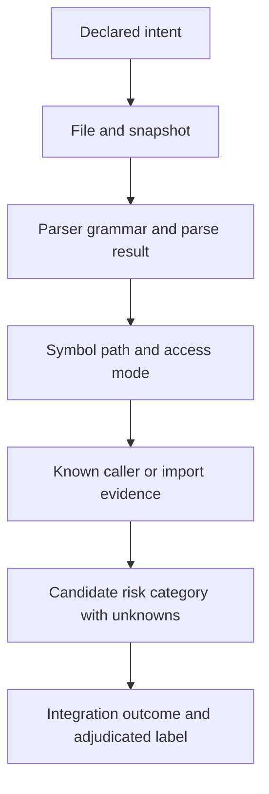

# S10 — Candidate claims have an evidence path (ASCII conversion)

```mermaid
flowchart TD
  I[Declared intent] --> F[File and snapshot]
  F --> P[Parser grammar and parse result]
  P --> S[Symbol path and access mode]
  S --> E[Known caller or import evidence]
  E --> Q[Candidate risk category with unknowns]
  Q --> H[Integration outcome and adjudicated label]
```
