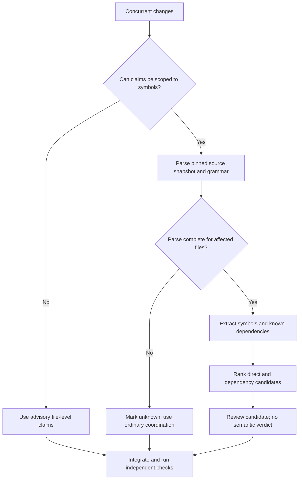

# S11 — Conflict overview with UNKNOWN path (rewrites existing Mermaid)

```mermaid
flowchart TD
  A[Concurrent changes] --> B{Can claims be scoped to symbols?}
  B -->|No| F[Use advisory file-level claims]
  B -->|Yes| P[Parse pinned source snapshot and grammar]
  P --> E{Parse complete for affected files?}
  E -->|No| U[Mark unknown; use ordinary coordination]
  E -->|Yes| C[Extract symbols and known dependencies]
  C --> R[Rank direct and dependency candidates]
  R --> H[Review candidate; no semantic verdict]
  F --> I[Integrate and run independent checks]
  U --> I
  H --> I
```
