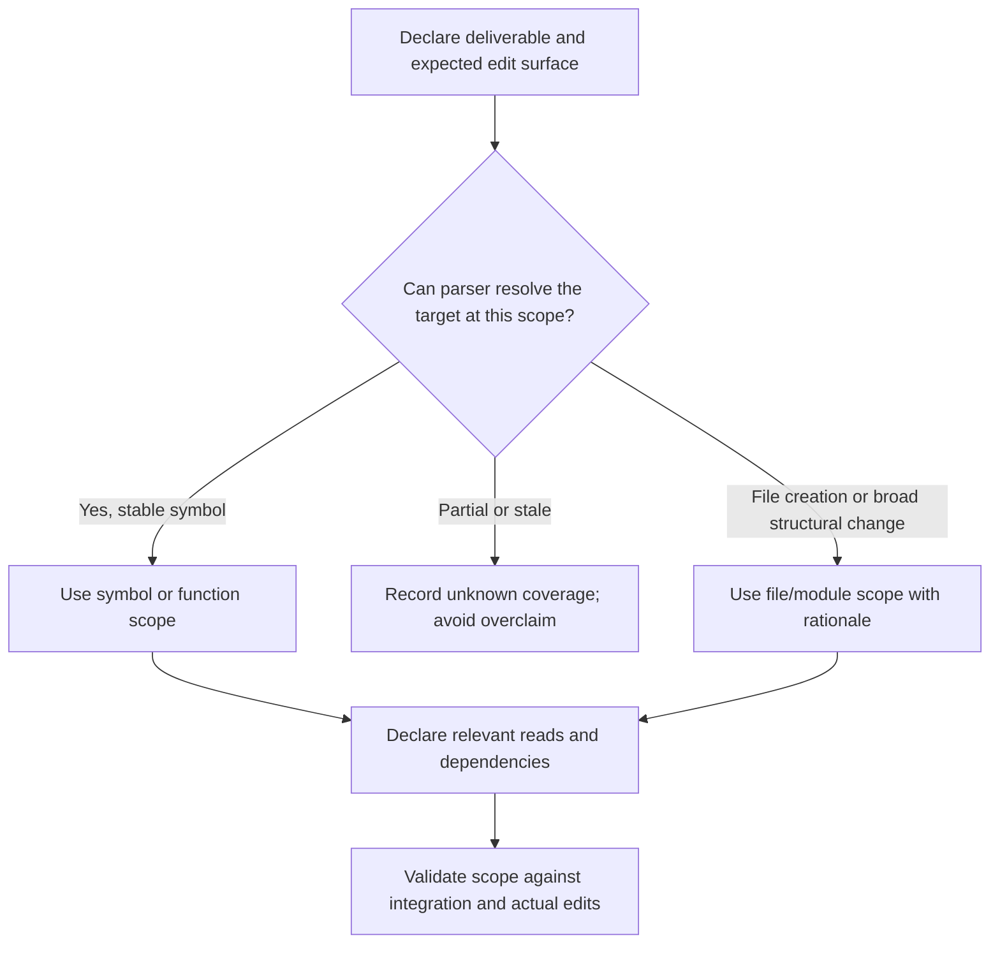

# Claim granularity follows the declared edit surface

```mermaid
flowchart TD
  Task[Declare deliverable and expected edit surface] --> Evidence{Can parser resolve the target at this scope?}
  Evidence -->|Yes, stable symbol| Symbol[Use symbol or function scope]
  Evidence -->|Partial or stale| Unknown[Record unknown coverage; avoid overclaim]
  Evidence -->|File creation or broad structural change| File[Use file/module scope with rationale]
  Symbol --> Dependencies[Declare relevant reads and dependencies]
  File --> Dependencies
  Dependencies --> Review[Validate scope against integration and actual edits]
```
