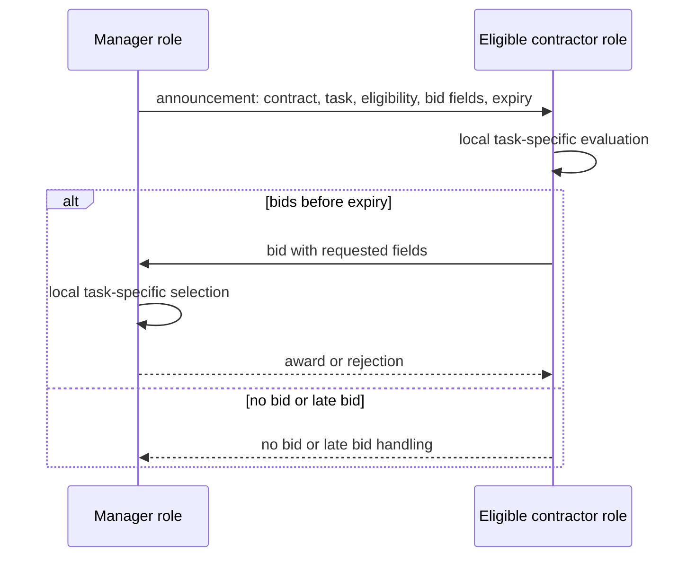
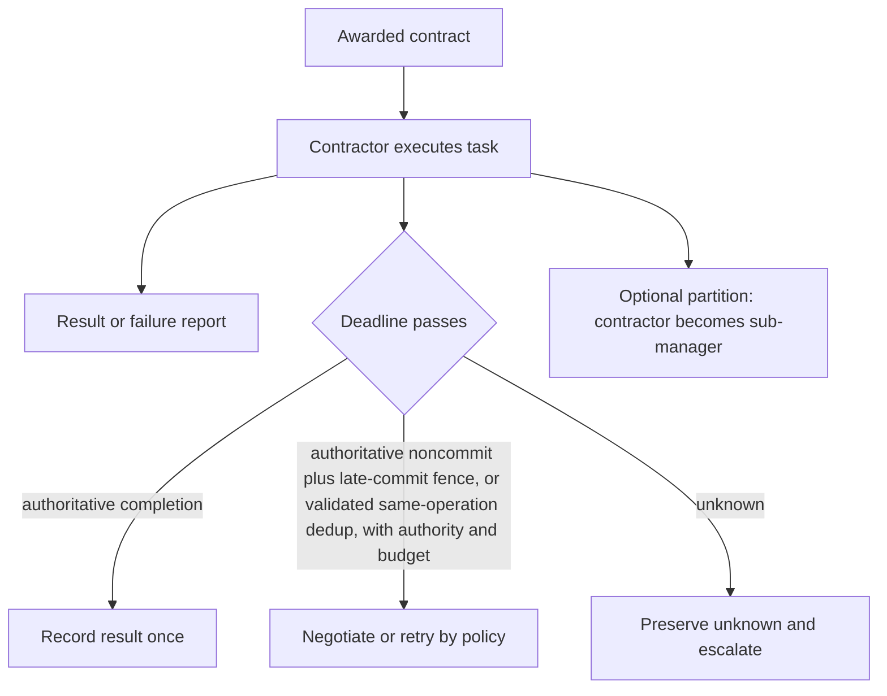

# Smith 1980 Contract Net Protocol

This entry corrects a catalog collision: the archived original bundle taught unrelated epistemic logic. Smith’s 1980 paper describes local manager/contractor roles in an asynchronous, loosely coupled distributed problem solver and assumes a lower-level reliable transport. It does not define FIPA Contract Net performatives, authorization, modern transaction semantics, or a universal bid objective.

## 1. Announce a task with comparable bid information

A manager prepares a contract ID, task abstraction, eligibility specification, bid specification, and expiration time. A contractor locally filters eligibility, ranks candidate announcements using its own task-specific criteria, and may bid. The manager evaluates bids using its own task-specific criteria and sends awards; no bid and late bid are real outcomes.

## 2. Execute and report without inventing delivery guarantees

After award, record the contract ID, selected task details, result/failure report, and any application-specific idempotency or recovery policy. A contractor may partition its task and become a manager for subcontracts. A missing result is unknown unless the assumed lower layer or authoritative execution record establishes otherwise.

## 3. Worked source-bounded trace

A sensing manager announces `22-3-1` with required sensor and area, asks bidders for position and sensor type, and sets an expiration. A nearby eligible sensor bids; the manager selects a set that covers its area and awards named sensors. The paper’s example assumes synchronized clocks for expiration but says time is not critical; a modern deployment must separately specify clock, delivery, and authorization policy.

## Sources and identity limit

[Smith 1980](https://www.reidgsmith.com/The_Contract_Net_Protocol_Dec-1980.pdf) was directly opened and read: it defines the task announcement slots, local mutual selection, dynamic manager/contractor roles, and lower-level reliable-transport assumption. [FIPA Contract Net SC00029H](http://www.fipa.org/specs/fipa00029/SC00029H.html) is a separate inaccessible canonical pointer and must not be substituted for Smith’s protocol.

## 4. Selection worksheet

For a constructed `22-3-1` sensing task, manager input is: task abstraction `SIGNAL`, eligibility `sensor in AREA A`, bid fields `{position, sensor names/types}`, expiry. Contractor worksheet: first test eligibility, then rank announcements from its own view (for example, distance to manager) and submit only its requested fields. Manager worksheet: compare received bids from its own view (for example, coverage and sensor variety), award selected contractor(s), reject/record remaining bids, and process no-bid/late-bid outcomes. Contractor ranking and manager selection are separate local functions; neither is a universal scalar priority.

If an award’s result is absent, “not observed complete” is not proof that it cannot still commit. Retry only after a noncommit proof plus a fence, or a validated same-operation deduplication key and authority. Compensation is a separately authorized action and does not erase uncertainty about the original operation.
