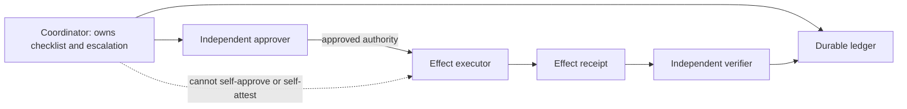
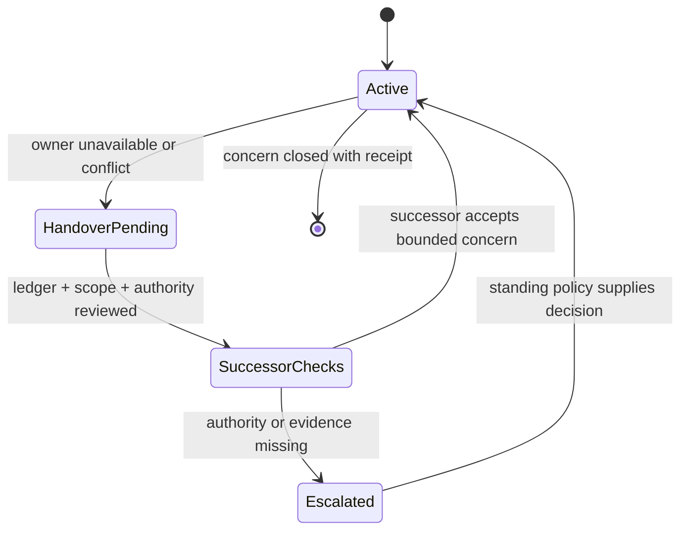

# Solely responsible agent: accountability without sole authority

Give one coordinator clear accountability for a bounded concern: it maintains the ledger, detects omissions, chooses an allowed next step, and escalates. This is a design heuristic for legibility and failover. It does **not** give that coordinator unilateral authority to approve, execute, or verify a consequential effect.

The directly relevant literature and controls provide context, not an empirical proof of this local pattern: [Responsibility of AI Systems](https://link.springer.com/article/10.1007/s00146-022-01481-4) analyzes collective responsibility; [NIST SP 800-53 AC-5](https://csrc.nist.gov/pubs/sp/800/53/r5/upd1/final) describes separation-of-duties control context.

## Design a bounded responsibility

1. Name the concern and observable success/failure signal.
2. Assign one accountable coordinator and durable state home.
3. State its permission ceiling and prohibited effects.
4. Assign independent approval, execution, and outcome verification where the risk calls for it.
5. Define a successor, handover record, and recovery path for unavailable ownership.

## Worked release fixture

A release coordinator owns the checklist and escalation record. A separate signer evaluates the standing approval policy; a deployment controller performs the effect; an observer verifies the deployment receipt. If the coordinator disappears mid-flight, the successor receives its ledger and scope but does not inherit a previously absent approval. Pending effects remain blocked until the applicable approval boundary is satisfied.

## Quality gates

- Exactly one accountable coordinator is named for this concern; related concerns may have different owners.
- The ledger contains current status, dependencies, last observation, next permitted action, and successor.
- The authority ceiling states what the coordinator cannot do.
- At least one independent route checks each consequential effect's receipt.
- A handover test removes the owner and demonstrates recovery without invented approval.
- Ownership does not claim exclusive access to shared systems unless a real concurrency contract establishes it.

## Source-grounded navigation

- [Responsibility patterns and limits](references/sole-responsibility-patterns.md)
- [Role promotion and handover](references/role-expansion-playbook.md)
- [Local state-surface historical inventory](references/port-daddy-state-surfaces.md)

## Boundaries

This skill is not a mandate for a single privileged controller, a substitute for standing authorization, or a claim that an individual agent is responsible for the behavior of an entire sociotechnical system.