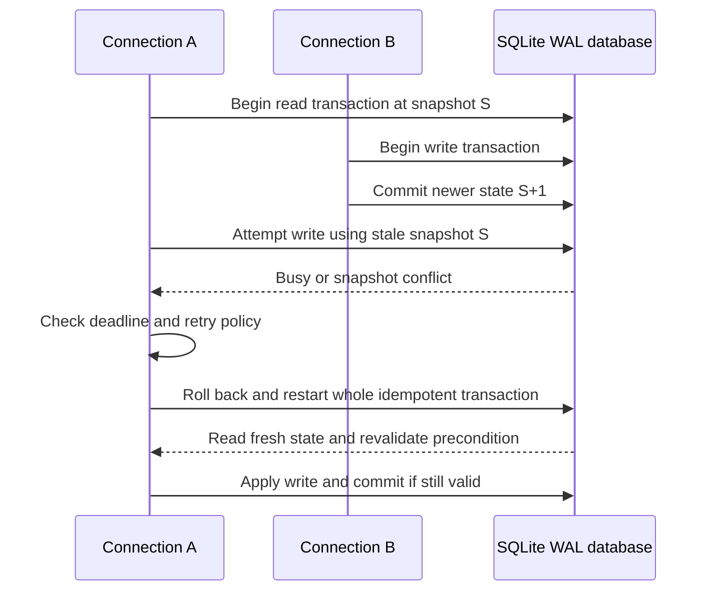

# SQL01 — WAL reader/writer schedule and safe retry

```mermaid
sequenceDiagram
  participant A as Connection A
  participant B as Connection B
  participant DB as SQLite WAL database
  A->>DB: Begin read transaction at snapshot S
  B->>DB: Begin write transaction
  B->>DB: Commit newer state S+1
  A->>DB: Attempt write using stale snapshot S
  DB-->>A: Busy or snapshot conflict
  A->>A: Check deadline and retry policy
  A->>DB: Roll back and restart whole idempotent transaction
  DB-->>A: Read fresh state and revalidate precondition
  A->>DB: Apply write and commit if still valid
```
