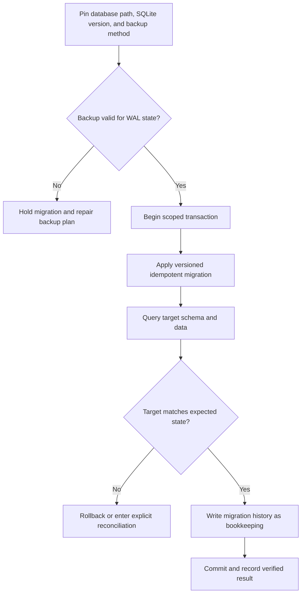

# SQL02 — Migration verification and history separation

```mermaid
flowchart TD
  P[Pin database path, SQLite version, and backup method] --> B{Backup valid for WAL state?}
  B -->|No| H[Hold migration and repair backup plan]
  B -->|Yes| T[Begin scoped transaction]
  T --> A[Apply versioned idempotent migration]
  A --> V[Query target schema and data]
  V --> C{Target matches expected state?}
  C -->|No| R[Rollback or enter explicit reconciliation]
  C -->|Yes| M[Write migration history as bookkeeping]
  M --> D[Commit and record verified result]
```
