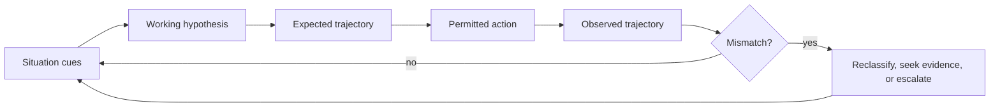
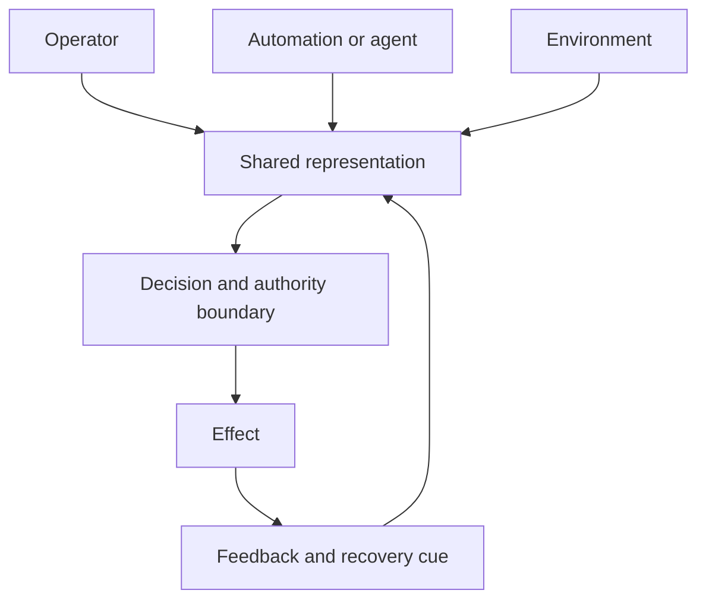

# Cognitive systems engineering for agent operations

CSE treats people, automation, representations, environment, and control authority as a work system. It is not a theorem that fixed pipelines fail or that interviews reproduce expertise.

For each critical decision record cues, competing hypotheses, expected evolution, permitted action, authority, observable effect, and escalation. Test one familiar scenario and one novel disturbance with similar aggregate metrics. Measure cue coverage and safe recovery; a timeout, summary, or success does not prove hidden cause.

See [recognition-primed decisions](references/recognition-primed-decision-making-for-agents.md), [automation surprises](references/automation-surprises-and-coordination-failure.md), and [work-as-done](references/true-work-vs-prescribed-work-gap.md). The 2002 IEEE record was abstract-only; the detailed workflow is an engineering proposal.