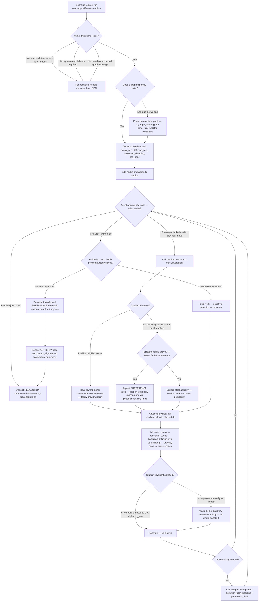

# Diagram 1: flowchart

```mermaid
flowchart TD
  A[Incoming request for stigmergic-diffusion-medium] --> B{Within this skill's scope?}
  B -->|No: hard real-time sub-ms sync needed| C[Redirect: use reliable message bus / RPC]
  B -->|No: guaranteed delivery required| C
  B -->|No: data has no natural graph topology| C
  B -->|Yes| D{Does a graph topology exist?}

  D -->|No: must derive one| E[Parse domain into graph — e.g. repo_parser.py for code, task DAG for workflows]
  D -->|Yes| F[Construct Medium with decay_rate, diffusion_rate, resolution_damping, rng_seed]
  E --> F

  F --> G[Add nodes and edges to Medium]
  G --> H{Agent arriving at a node — what action?}

  H -->|First visit / work to do| I{Antibody check: is this problem already solved?}
  H -->|Sensing neighborhood to pick next move| J[Call medium.sense and medium.gradient]
  H -->|Problem just solved| K[Deposit RESOLUTION trace — anti-inflammatory, prevents pile-on]

  I -->|Antibody match found| L[Skip work — negative selection — move on]
  I -->|No antibody match| M[Do work, then deposit PHEROMONE trace with optional deadline / urgency]
  M --> N[Deposit ANTIBODY trace with pattern_signature to block future duplicates]
  N --> K

  J --> O{Gradient direction?}
  O -->|Positive neighbor exists| P[Move toward higher pheromone concentration — follow crowd wisdom]
  O -->|No positive gradient — flat or all resolved| Q{Epistemic drive active? — Week 2+ Active Inference}
  Q -->|Yes| R[Deposit PREFERENCE trace — teleport to globally unseen node via global_uncertainty_map]
  Q -->|No| S[Explore stochastically — random walk with small probability]

  P --> T[Advance physics: call medium.tick with elapsed dt]
  R --> T
  S --> T
  L --> T

  T --> U[tick order: decay → resolution decay → Laplacian diffusion with dt_eff clamp → urgency boost → prune epsilon]
  U --> V{Stability invariant satisfied?}
  V -->|dt_eff auto-clamped to 0.9 / alpha * d_max| W[Continue — no blowup]
  V -->|dt bypassed manually — danger| X[Warn: do not pass tiny manual dt in loop — let clamp handle it]
  X --> W

  W --> Y{Observability needed?}
  Y -->|Yes| Z[Call hotspots / snapshot / deviation_from_baseline / preference_field]
  Y -->|No| H

  Z --> H
```
