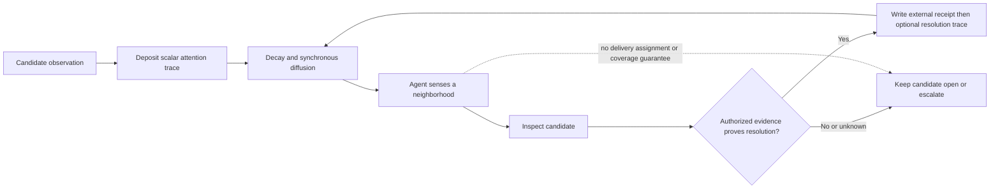

# Trace lifecycle and its authority boundary

```mermaid
flowchart LR
  C[Candidate observation] --> D[Deposit scalar attention trace]
  D --> T[Decay and synchronous diffusion]
  T --> S[Agent senses a neighborhood]
  S --> I[Inspect candidate]
  I --> A{Authorized evidence proves resolution?}
  A -->|Yes| R[Write external receipt then optional resolution trace]
  A -->|No or unknown| H[Keep candidate open or escalate]
  R --> T
  S -. no delivery assignment or coverage guarantee .-> H
```
