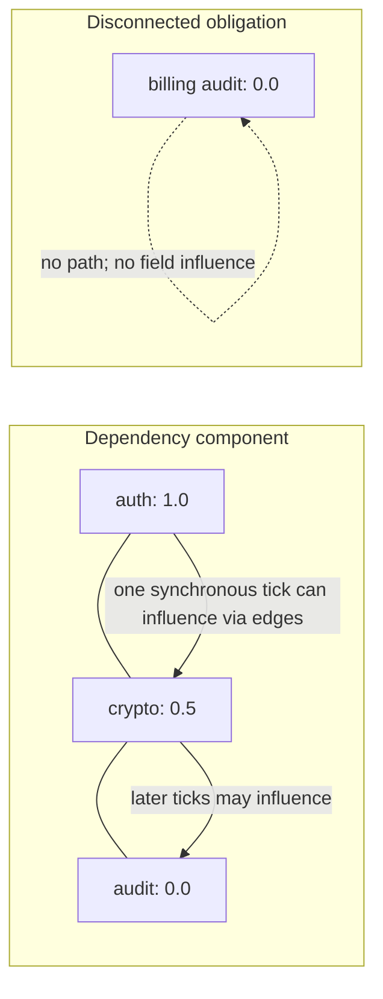

# Connected components bound diffusion reach

```mermaid
flowchart LR
  subgraph Component_A[Dependency component]
    A[auth: 1.0] --- C[crypto: 0.5]
    C --- U[audit: 0.0]
  end
  subgraph Component_B[Disconnected obligation]
    B[billing audit: 0.0]
  end
  A -->|one synchronous tick can influence via edges| C
  C -->|later ticks may influence| U
  B -. no path; no field influence .-> B
```
