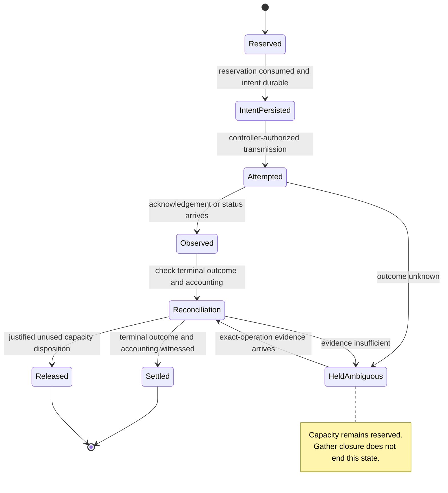

# Reservation disposition is separate from semantic closure

```mermaid
stateDiagram-v2
  [*] --> Reserved
  Reserved --> IntentPersisted: reservation consumed and intent durable
  IntentPersisted --> Attempted: controller-authorized transmission
  Attempted --> Observed: acknowledgement or status arrives
  Attempted --> HeldAmbiguous: outcome unknown
  Observed --> Reconciliation: check terminal outcome and accounting
  HeldAmbiguous --> Reconciliation: exact-operation evidence arrives
  Reconciliation --> HeldAmbiguous: evidence insufficient
  Reconciliation --> Settled: terminal outcome and accounting witnessed
  Reconciliation --> Released: justified unused capacity disposition
  Settled --> [*]
  Released --> [*]
  note right of HeldAmbiguous
    Capacity remains reserved.
    Gather closure does not end this state.
  end note
```
