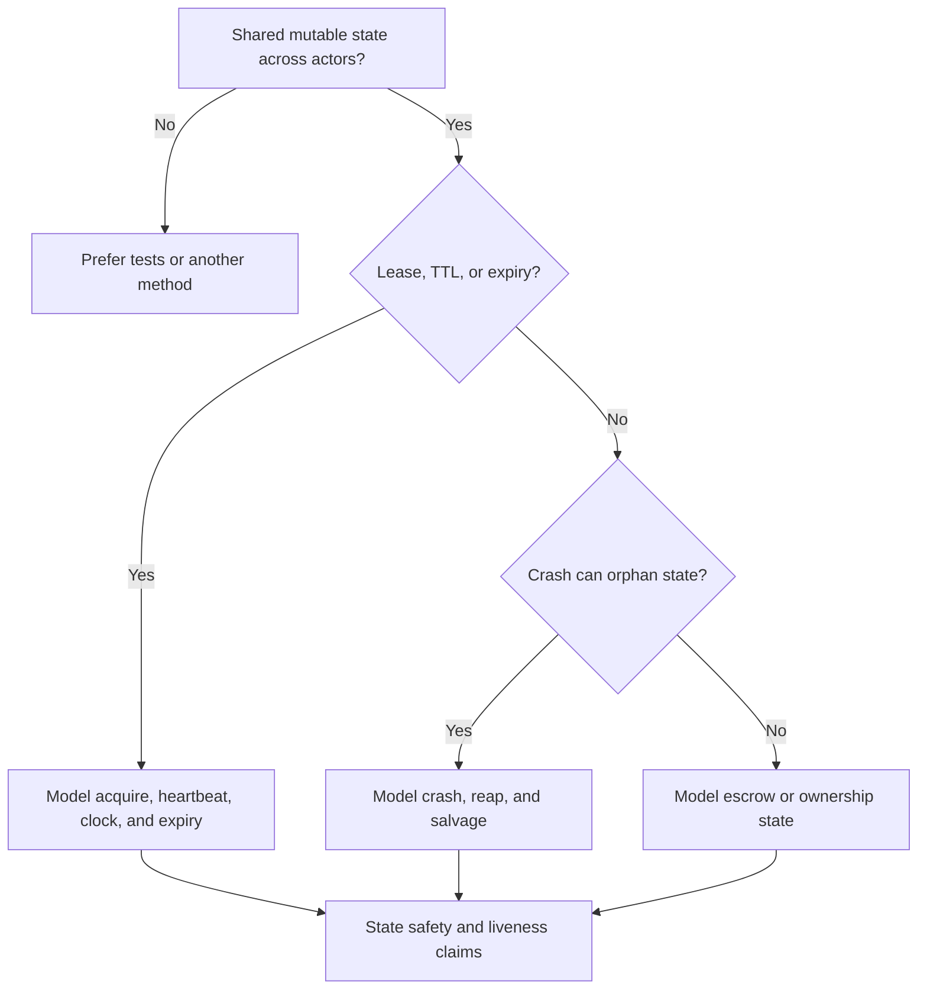

# T01 — Decide whether a finite state model helps (ASCII conversion)

```mermaid
flowchart TD
  A[Shared mutable state across actors?] -->|No| U[Prefer tests or another method]
  A -->|Yes| B{Lease, TTL, or expiry?}
  B -->|Yes| L[Model acquire, heartbeat, clock, and expiry]
  B -->|No| C{Crash can orphan state?}
  C -->|Yes| R[Model crash, reap, and salvage]
  C -->|No| E[Model escrow or ownership state]
  L --> P[State safety and liveness claims]
  R --> P
  E --> P
```
