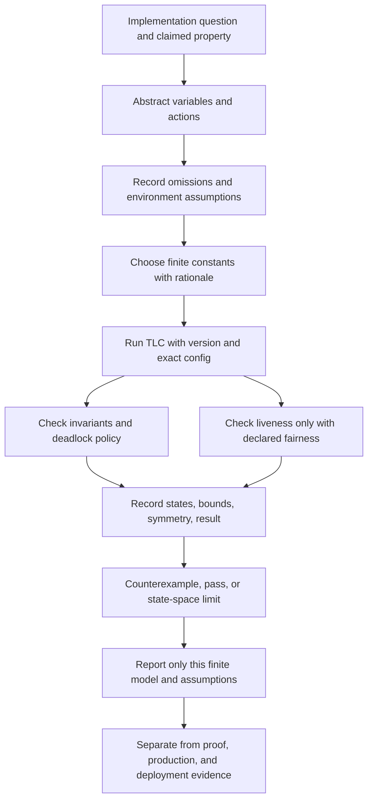

# T02 — Bounded TLC workflow and claim limits (rewrites existing Mermaid)

```mermaid
flowchart TD
  I[Implementation question and claimed property] --> A[Abstract variables and actions]
  A --> O[Record omissions and environment assumptions]
  O --> K[Choose finite constants with rationale]
  K --> T[Run TLC with version and exact config]
  T --> S[Check invariants and deadlock policy]
  T --> L[Check liveness only with declared fairness]
  S --> R[Record states, bounds, symmetry, result]
  L --> R
  R --> C[Counterexample, pass, or state-space limit]
  C --> W[Report only this finite model and assumptions]
  W --> P[Separate from proof, production, and deployment evidence]
```
