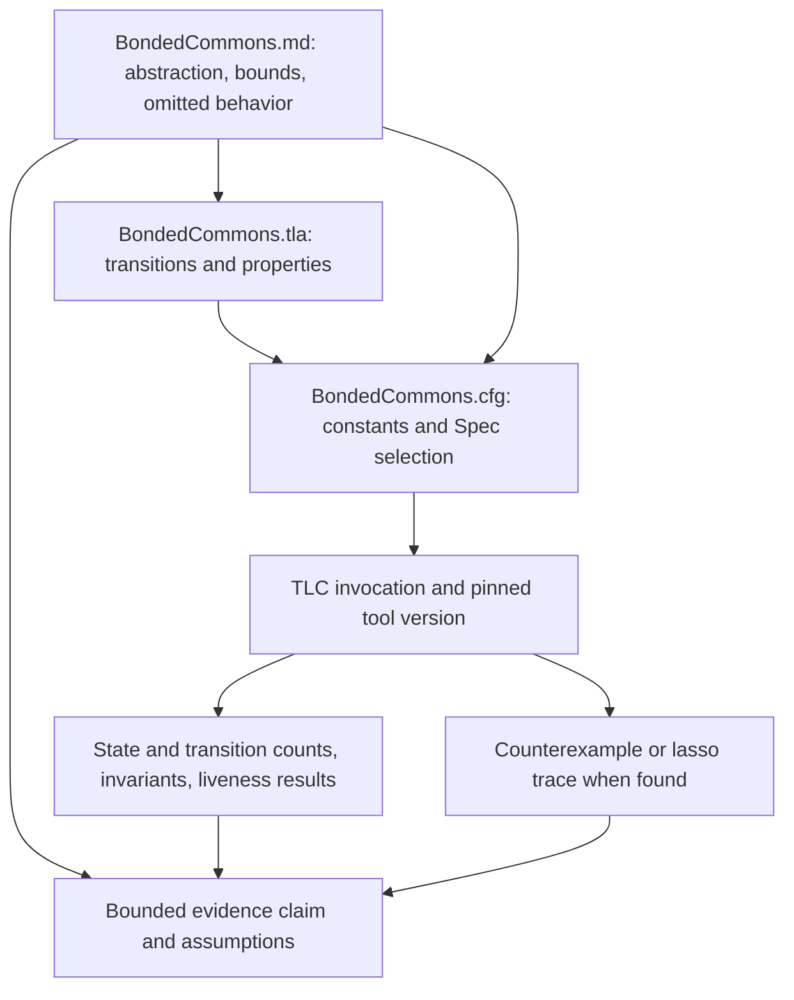

# Spec, config, and report artifacts

```mermaid
flowchart TD
  Spec[BondedCommons.tla: transitions and properties] --> Config[BondedCommons.cfg: constants and Spec selection]
  Config --> Run[TLC invocation and pinned tool version]
  Run --> Output[State and transition counts, invariants, liveness results]
  Run --> Trace[Counterexample or lasso trace when found]
  Notes[BondedCommons.md: abstraction, bounds, omitted behavior] --> Spec
  Notes --> Config
  Notes --> Report[Bounded evidence claim and assumptions]
  Output --> Report
  Trace --> Report
```
