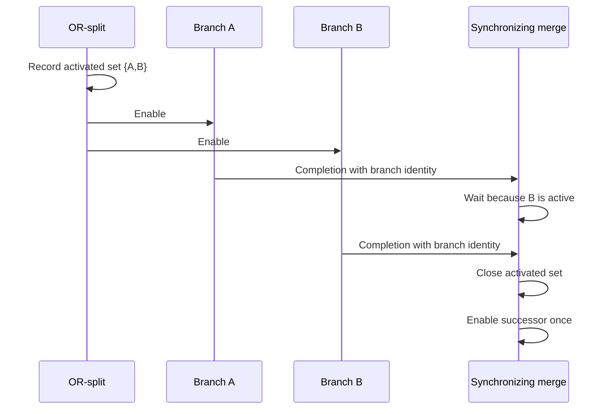

# Pattern interaction trace to test

```mermaid
sequenceDiagram
  participant Split as OR-split
  participant A as Branch A
  participant B as Branch B
  participant Merge as Synchronizing merge
  Split->>Split: Record activated set {A,B}
  Split->>A: Enable
  Split->>B: Enable
  A->>Merge: Completion with branch identity
  Merge->>Merge: Wait because B is active
  B->>Merge: Completion with branch identity
  Merge->>Merge: Close activated set
  Merge->>Merge: Enable successor once
```
