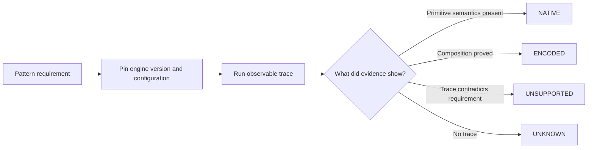

# Evidence-backed support classification

This is a worksheet, not a benchmark or comparison of named products.

```mermaid
flowchart LR
  P[Pattern requirement] --> V[Pin engine version and configuration]
  V --> T[Run observable trace]
  T --> S{What did evidence show?}
  S -->|Primitive semantics present| N[NATIVE]
  S -->|Composition proved| E[ENCODED]
  S -->|Trace contradicts requirement| U[UNSUPPORTED]
  S -->|No trace| X[UNKNOWN]
```
