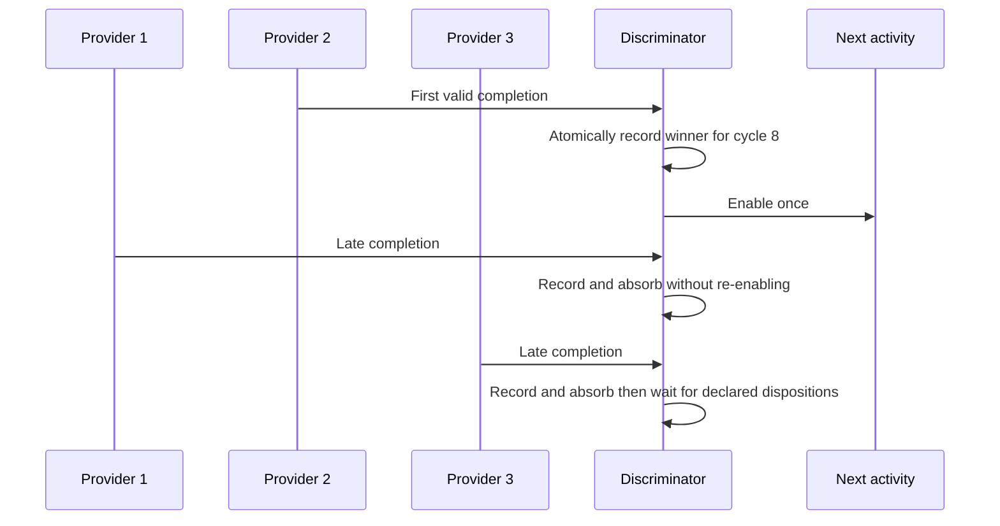

# Discriminator: first trigger, later arrivals absorbed

```mermaid
sequenceDiagram
  participant P1 as Provider 1
  participant P2 as Provider 2
  participant P3 as Provider 3
  participant D as Discriminator
  participant N as Next activity
  P2->>D: First valid completion
  D->>D: Atomically record winner for cycle 8
  D->>N: Enable once
  P1->>D: Late completion
  D->>D: Record and absorb without re-enabling
  P3->>D: Late completion
  D->>D: Record and absorb then wait for declared dispositions
```
