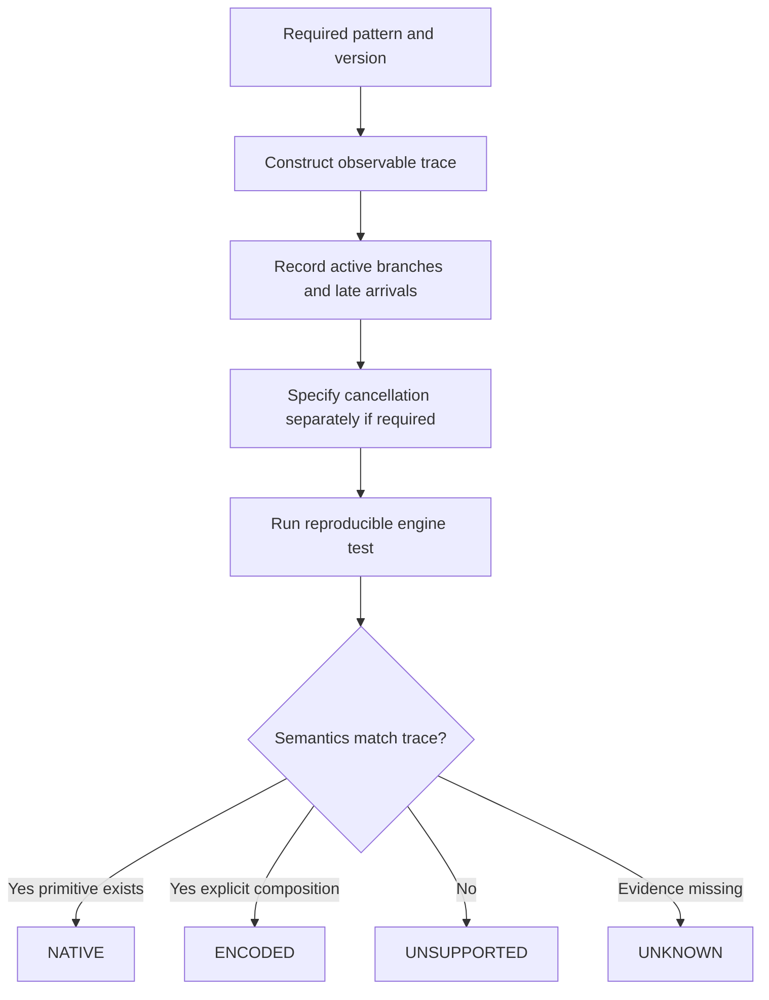

# Pattern conformance evidence flow

```mermaid
flowchart TD
  R[Required pattern and version] --> T[Construct observable trace]
  T --> B[Record active branches and late arrivals]
  B --> C[Specify cancellation separately if required]
  C --> E[Run reproducible engine test]
  E --> Q{Semantics match trace?}
  Q -->|Yes primitive exists| N[NATIVE]
  Q -->|Yes explicit composition| D[ENCODED]
  Q -->|No| U[UNSUPPORTED]
  Q -->|Evidence missing| X[UNKNOWN]
```
