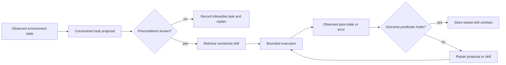
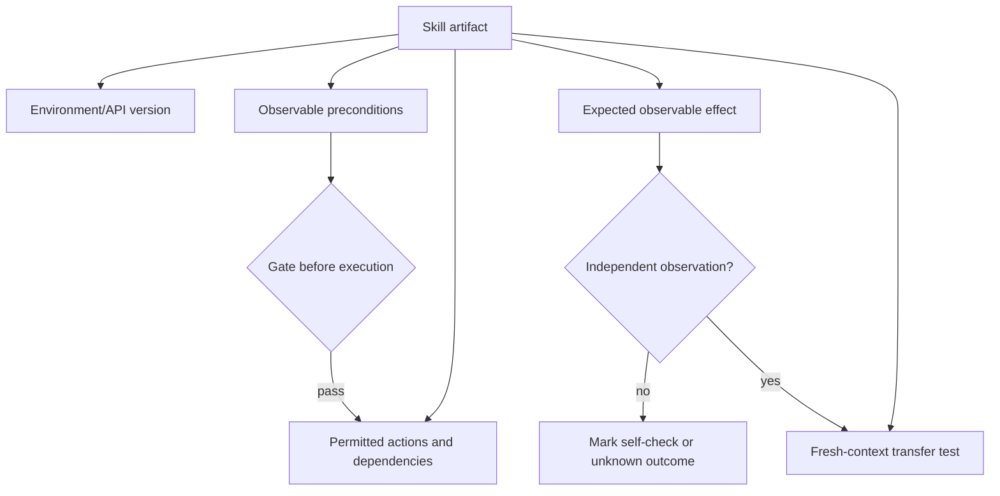

# Voyager: executable skills under environment feedback

Wang et al.'s [Voyager paper](https://arxiv.org/html/2305.16291v2) describes a Minecraft/MineDojo case study using GPT-4, an automatic curriculum, code generation, an executable skill library, execution feedback, and self-verification. It is a useful architecture pattern, not evidence that all agents learn continuously or that a library transfers across runtimes.

Use it when a bounded environment exposes observable state, a task can be attempted safely, and an artifact can carry its own preconditions and outcome check. Do not use it to authorize an effect, infer completion from generated text, or claim independent verification where the generator judges itself.

## A bounded learning loop

1. Propose a task from observed state, prior attempts, and a local policy. Reject an infeasible proposal before it becomes an effect.
2. Retrieve the smallest relevant skill set. Treat retrieval as a suggestion until its contract matches the present environment.
3. Execute in a sandbox or otherwise bounded environment. Capture a minimal result: input version, allowed effect, returned error, and observed post-state.
4. Verify against an external state observation when available. A model self-check is useful diagnostic feedback but is not an independent oracle.
5. Store or revise a skill only with its version, preconditions, dependencies, effect scope, and transfer result.





## Worked contract: craft a wooden pickaxe

This is a constructed fixture, not Voyager source code.

```yaml
skill: craft_wooden_pickaxe
environment: minecraft-test-fixture@2026-09
preconditions:
  inventory: {planks: ">=3", sticks: ">=2"}
permitted_effect: "craft one wooden_pickaxe"
outcome: "inventory.wooden_pickaxe increased by 1"
dependencies: [obtain_planks, obtain_sticks]
```

In a fresh world without planks, the precondition gate fails and records the missing dependency; it does not attempt craft. After the dependency succeeds, run one bounded craft and compare inventory before and after. A successful replay in that fixture is transfer evidence only for that recorded runtime and state class.

## Failure handling

- A proposed task may be impossible, even when it is syntactically plausible. Keep the rejection reason and replan from state.
- Code is an action representation, not an automatically portable memory. Pin runtime/API versions and permitted capabilities.
- Repeated repair needs a local budget chosen by the application. Stop with an unknown outcome when it is exhausted; do not invent a universal retry count.
- A persisted artifact is not proof of a completed external effect. Store the observed receipt separately from the skill text.

## Source-grounded navigation

- [Curriculum and frontier constraints](references/automatic-curriculum-as-frontier-discovery.md)
- [Skill contracts and composition](references/skill-library-as-compositional-memory.md)
- [Execution, feedback, and verification limits](references/curriculum-skill-verification-trinity.md)
- [Code-action tradeoffs](references/code-as-action-space-advantages.md)
- [Failure recovery](references/failure-modes-in-llm-agents.md)

## Boundaries

The paper's benchmark results are specific to its Minecraft tasks, models, prompts, and experimental setup. It does not establish a platform-independent memory, security, cost, or success-rate guarantee.