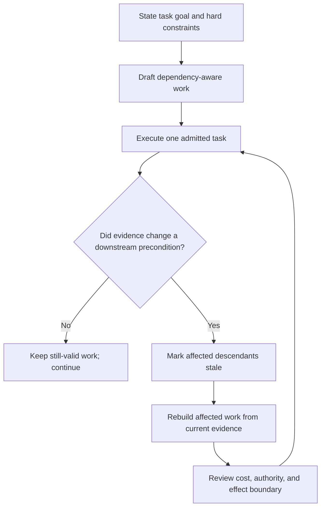
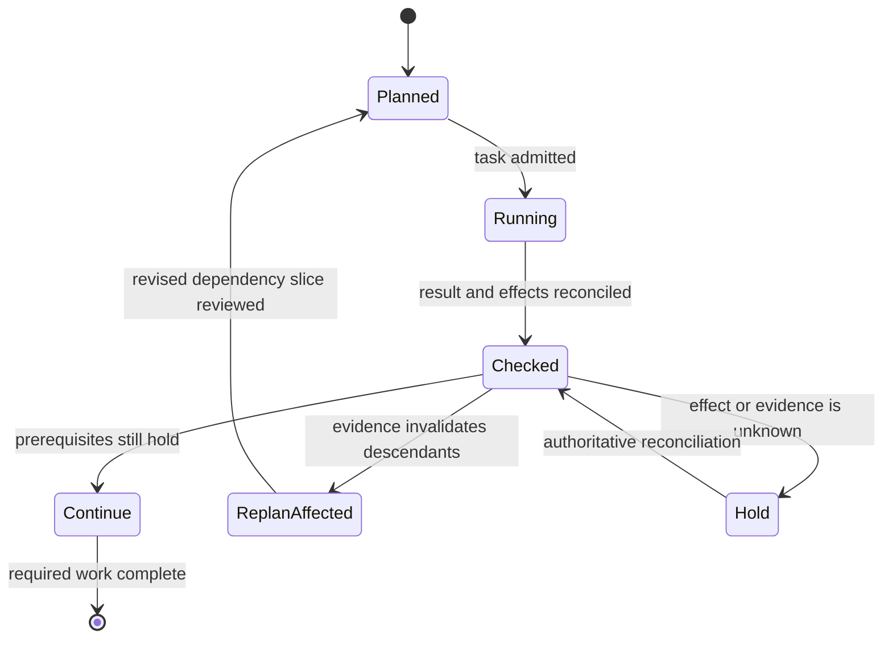
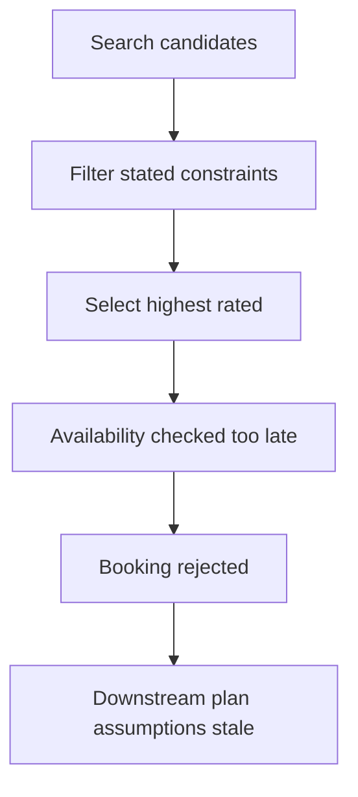
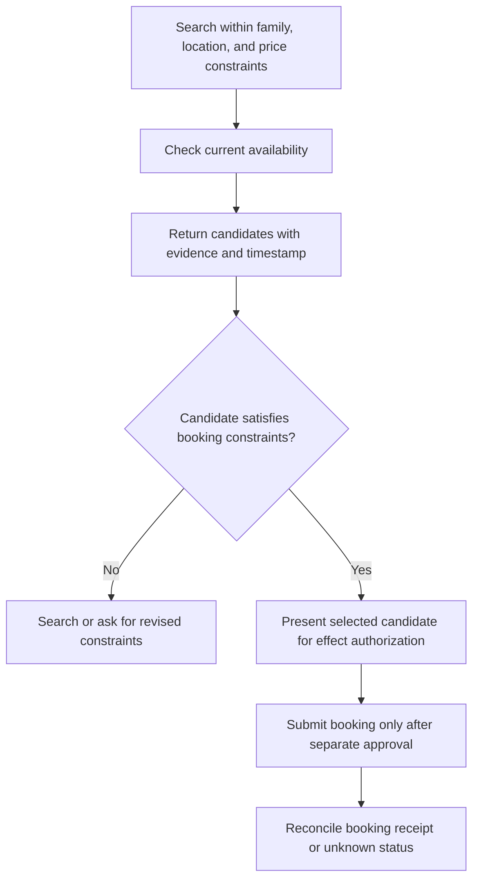
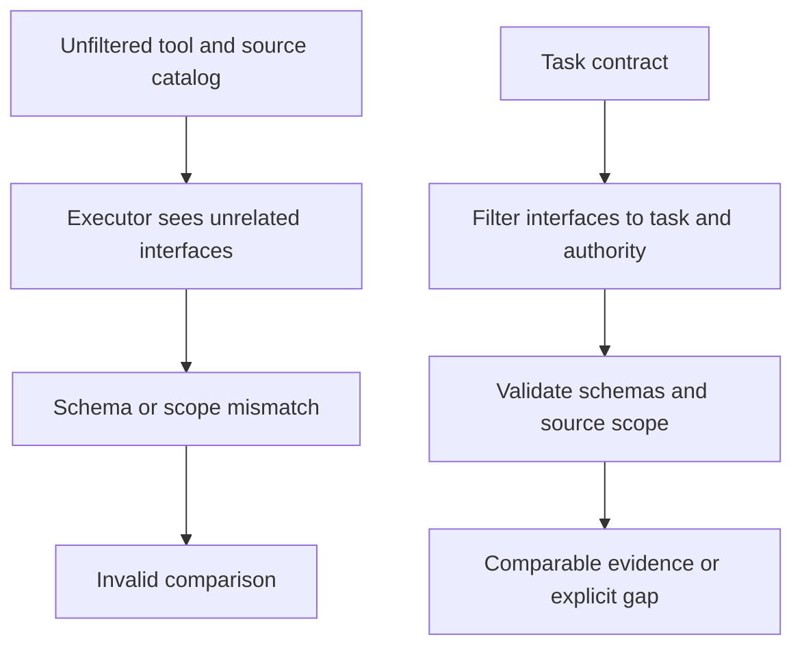
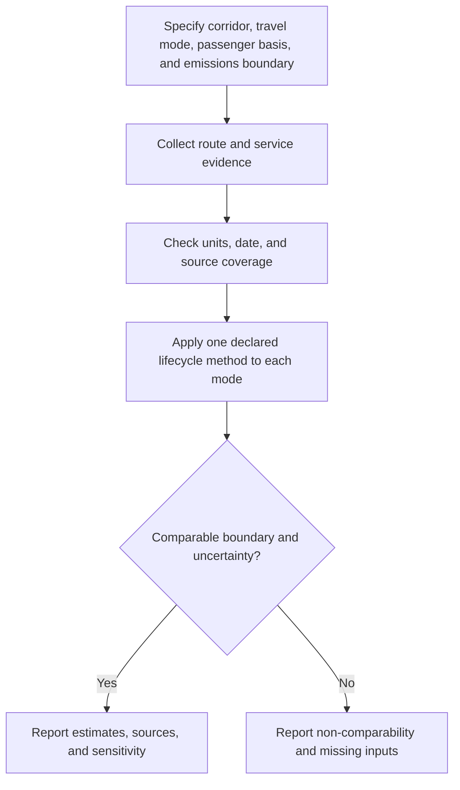

# SKILL: TDAG Dynamic Task Decomposition Framework

**Source identity**: Yaoxiang Wang, Zhiyong Wu, Junfeng Yao, and Jinsong Su, “TDAG: A Multi-Agent Framework based on Dynamic Task Decomposition and Agent Generation,” arXiv:2402.10178v2, 21 Jan 2025 (https://arxiv.org/abs/2402.10178).

**Description**: Architectural patterns for building agent systems that dynamically decompose complex tasks, generate specialized subagents just-in-time, and prevent cascading failures through adaptive replanning.

**Activate when**: Designing multi-agent systems, debugging cascading failures, evaluating complex task performance, managing agent context, or building systems with unpredictable subtask dependencies.

---

## DECISION POINTS

Choose the lightest planning loop that preserves task invariants. Step count, tool count, completion rate, and latency are measurements to collect, not universal switching cutoffs. A sequential plan remains appropriate when prerequisites are stable and each action can check its preconditions. Replan when a new observation changes feasibility, a user constraint, an accepted result, or a downstream assumption. Keep completed results only when their source, scope, and freshness remain valid.

### Failure recovery strategy

| Signal | Check | Response |
|---|---|---|
| Downstream assumption contradicted | Which unfinished outputs depend on the changed fact? | Hold those descendants; preserve unrelated verified work; replan the dependent slice |
| Capability or evidence gap | Is the operation unsupported, or merely missing an input? | Return the exact gap; narrow the task or request an authorized reviewer |
| Tool/parameter mismatch | Is the schema wrong, and is prior effect status known? | Validate the interface; retry only when bounded and no effect is unresolved |
| Constraint conflict | Which hard requirement cannot be met? | Reject the candidate; ask for a permitted alternative or report infeasibility |

A repeated error or elapsed-time estimate can trigger diagnosis, but is not proof the plan is invalid. A timeout does not prove an external action had no effect.

## FAILURE MODES

### Rubber Stamp Decomposition
**Detection**: Planning agent generates same fixed step template regardless of task specifics
**Symptom**: high downstream invalidation (measure in the target task set) because generic plans don't match actual task constraints
**Root Cause**: Static decomposition treats all tasks in domain as identical structure
**Fix**: Generate decomposition after analyzing current task's unique constraints and dependencies

### Irrelevant context and interface mismatch
**Signal**: A task has more tools or source material than its stated output requires, or traces show recurring interface confusion.
**Diagnosis**: Inspect traces and tool contracts; do not infer a universal tool-count cause.
**Response**: Give the executor only interfaces it is authorized and expected to use, with schemas, constraints, and necessary provenance. Compare against an equal-budget baseline before claiming a quality advantage. See `references/context-precision-vs-context-bloat.md`.

### Binary evaluation blindness
**Signal**: Pass/fail conceals which constraints or verified subtasks were completed.
**Response**: Report end-to-end success alongside a predeclared rubric for valid actions, constraint satisfaction, and solution quality. Preserve denominators and adjudication rules; do not equate partial credit with task success. See `references/fine-grained-evaluation-reveals-hidden-progress.md`.

### Premature Skill Crystallization
**Detection**: Agent executes cached "successful" approaches that fail in current context
**Symptom**: High confidence execution of invalid solutions because they worked previously
**Root Cause**: Treating real-world skills like deterministic game strategies that work universally
**Fix**: Store skills with rich contextual metadata; validate preconditions before execution

### Agent Role Prison
**Detection**: System frequently hits "no suitable agent for this subtask" errors
**Symptom**: Forcing subtasks into predefined agent roles creates capability gaps
**Root Cause**: Pre-defining agent roles assumes complete knowledge of task space
**Response**: Derive role scope from the current task contract. Agent generation is optional; compare reusable and generated roles with equal resources. See `references/just-in-time-agent-generation.md`.

---

## WORKED EXAMPLES

### Example 1: Hotel Booking Decomposition (constructed; live availability and authorization are not represented)

**Initial Task**: "Book 3-night hotel in Tokyo for family of 4, budget $200/night, near Shibuya, check-in March 15"

**Static plan's failure path (constructed)**:

**Why it failed (constructed)**: Steps 4-5 assumed Hotel A availability, but selection did not check it. This example illustrates a dependency defect, not a paper experiment.

**Outcome-updated approach (constructed; effects require separate authorization)**:

**Key Differences**:
- Static: Step 3 selection without availability check → cascade failure
- Dynamic: Availability verified before selection → no invalid assumptions
- Static: 5 predefined steps → rigid execution
- Dynamic: 2 state-dependent decompositions → adaptive to reality

### Example 2: Research Task with Context Management (constructed values, not benchmark results)

**Task**: "Compare carbon footprint of train vs flight for Shanghai-Beijing route, including lifecycle emissions"

**Unfiltered context approach (constructed failure case)**:

**Failure Mode**: External Information Misalignment - correct tools, wrong parameters due to cognitive overload.

**Task-scoped context approach (constructed alternative)**:

**Trade-off Analysis (qualitative teaching contrast; not benchmark data)**:
| Factor | Universal Agent | TDAG Context Precision |
|--------|-----------------|----------------------|
| Tool choice | Match tool and schema to task | Match filtered tools and schemas to task |
| Context | Inspect relevance and source scope | Keep only required task context |
| Completion time | Measure retries and work | Measure decomposition overhead too |
| Result | Validate scope, units, and source | Validate scope, units, and source |

---

## QUALITY GATES

Task decomposition is complete when:

- [ ] **Replan Trigger Validation**: Each planned subtask includes explicit conditions that would trigger replanning (availability changes, constraint violations, assumption breaks)
- [ ] **Context Precision Check**: Each subagent receives ≤10 tools and all provided context directly relates to their specific subtask
- [ ] **State Dependency Mapping**: Later subtasks explicitly depend on actual outcomes (not predicted outcomes) of earlier subtasks
- [ ] **Failure Containment Design**: Single subtask failure cannot invalidate more than 1 downstream subtask without triggering decomposition reassessment
- [ ] **Progress Measurement**: System tracks subtask completion rates, not just binary task success, enabling partial progress visibility
- [ ] **Agent Role Justification**: Each generated agent's role and capabilities derive from specific current subtask needs, not generic organizational structure
- [ ] **Cascading Failure Prevention**: No subtask execution proceeds based on assumptions about previous subtasks that haven't been validated against actual results
- [ ] **Dynamic Adaptation Verification**: System demonstrates ability to change planned approach mid-execution when current state differs from initial assumptions
- [ ] **Error Category Classification**: Failures are categorized (CTF, LLM, EIM, ISC) to enable architectural improvement rather than just retry logic
- [ ] **Context Validation**: All information provided to agents has been verified as relevant and current for their immediate decision-making needs

Systems that run many tasks over time can improve subtask success by storing past solutions as reusable skills; see `references/skill-libraries-as-learned-institutional-memory.md` for the retrieval-based design (SentenceBERT embeddings, similarity threshold and retrieval depth as task-specific evaluated settings).

---

## NOT-FOR BOUNDARIES

**Do NOT use TDAG patterns for**:
- **Single-step tasks**: Simple queries, direct API calls, straightforward transformations → Use basic ReAct instead
- **Deterministic workflows**: Code compilation, mathematical computation, rule-based validation → Static planning works fine
- **Real-time systems**: Live trading, autonomous vehicle control, emergency response → Latency of decomposition planning unacceptable
- **Highly stable domains**: Payroll processing, regulatory compliance, established manufacturing → Process optimization more valuable than flexibility
- **Resource-constrained environments**: Edge devices, strict API limits, minimal compute → Multiple agent overhead too expensive

**Delegate to other skills**:
- For **simple tool usage**: Use `function-calling-best-practices` instead
- For **prompt optimization**: Use `prompt-engineering-fundamentals` instead  
- For **single-agent debugging**: Use `llm-reasoning-optimization` instead
- For **deterministic planning**: Use `workflow-automation-patterns` instead
- For **real-time decision making**: Use `streaming-decision-systems` instead

**TDAG is a design pattern to consider for** tasks where observations can change later-work feasibility or preconditions. The paper does not establish universal superiority, cost savings, or real-time suitability. Hotel and travel examples in this skill are constructed teaching scenarios, not paper results.

---

## Bundled Assets

Deep-dive references are indexed at [`references/INDEX.md`](references/INDEX.md).
