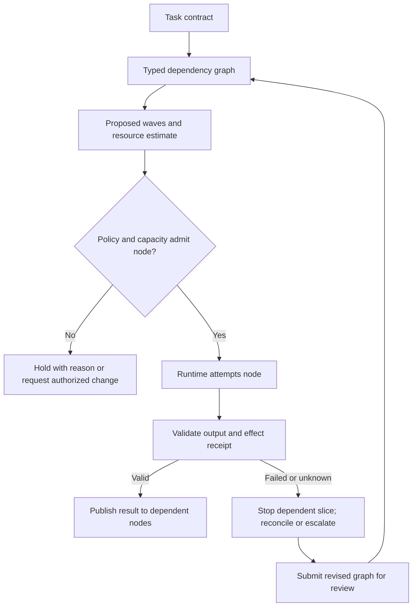
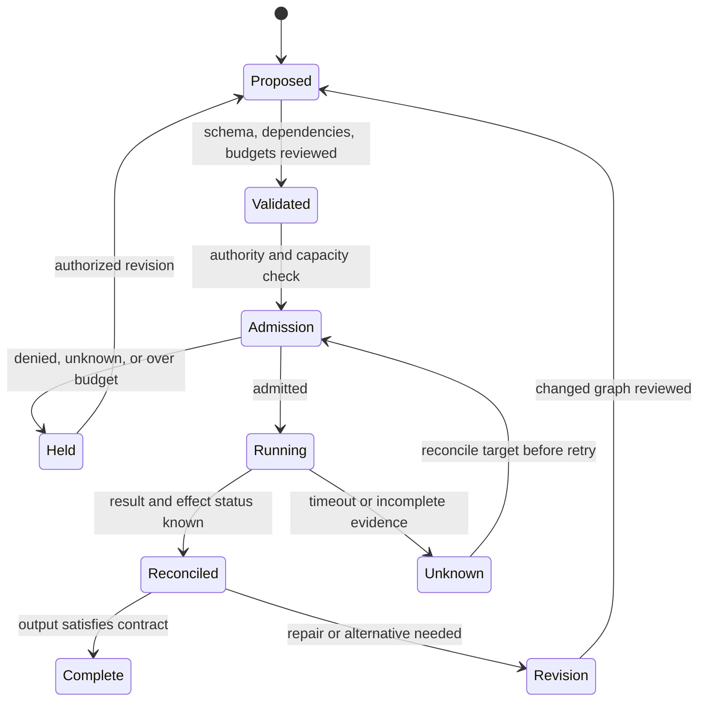
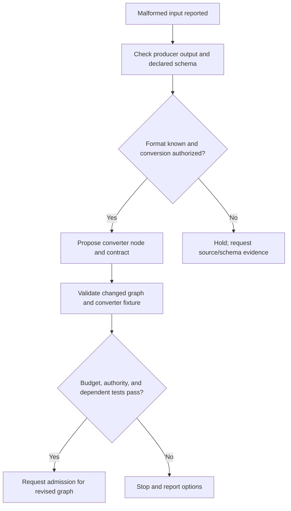

# WinDAGs Architect — V3

Build WinDAGs: directed acyclic graphs of skillful agents that accumulate genuine expertise. Each node is an agent with curated skills; each edge is a typed dependency. The system builds DAGs, executes them in waves, mutates them at runtime, evaluates quality across four layers, and crystallizes reusable skills from execution data.

## DECISION POINTS

Treat node counts, score cutoffs, retry limits, provider tiers, latency, and cost values as local policy parameters. Derive them from the user task, resource budget, effect risk, baseline, and observed evaluation. No threshold in an example is a general WinDAGs guarantee.

### Design a reviewable workflow

1. **State the task contract.** Name the goal clauses, required outputs, hard constraints, evidence, deadline/budget, and disallowed effects.
2. **Build typed dependencies.** Use a data dependency when one node consumes a named output; a control dependency when a gate must resolve; a provenance edge when evidence lineage must be retained. Add an edge only when it expresses a real prerequisite.
3. **Mark uncertainty.** A tentative node can return options and assumptions. It cannot silently perform the irreversible step that resolves the choice.
4. **Compute waves from the dependency graph.** Nodes may be proposed in parallel only when input, resource, and authority constraints allow it. A runtime scheduler may serialize or refuse them.
5. **Specify node I/O and failure states.** Define accepted, rejected, partial, blocked, and unknown results. Downstream tasks consume validated output, not prose asserting success.
6. **Define evaluation before execution.** Preserve the exact task set, comparator, budgets, rubric, adjudicator, and held-out split. A planner score is not runtime correctness.
7. **Plan recovery explicitly.** Identify safe retry conditions, effect reconciliation, compensation, and human escalation. A graph mutation is a new proposal requiring validation.



### Select topology by dependency shape

| Shape | Suitable when | Check before using |
|---|---|---|
| Chain | Each result supplies the next task’s required input | Failed or unknown result blocks the dependent suffix |
| Fan-out and join | Branches use independent inputs and outputs can be reconciled | Shared mutable resources, duplicated evidence, and join criteria |
| Review gate | A decision owner checks a defined acceptance rule | Gate has explicit authority, evidence, and reject/hold path |
| Iteration | A measured defect can be repaired and retested | Fresh held-out evidence is preserved after tuning |

For uncertain work, propose alternatives with an explicit decision owner and evidence needed. Do not label generic placeholders as runtime-ready nodes.

### Configure retries, mutation, and escalation

Set node, provider, time, and cost limits from measured workload distributions and a declared risk tolerance. Record attempts, elapsed time, billed/estimated cost, and stop reason. Retry only when the failure class is retryable and effect status is known. A provider fallback changes model and often behavior; preserve its identity in results and evaluate it separately. A topology mutation must pass graph validation, preserve required outputs, and re-run affected checks on fresh evidence where tuning could contaminate a held-out set. Escalate when authority, evidence, feasibility, or budget is unknown or exhausted.



### Evaluation and observability

Measure task-level outcome, node contract validity, dependency violations, effect status, cost, latency, retries, and intervention. Report counts and denominators per stage. Use a baseline under an equal resource budget and held-out task set. Display the proposed graph separately from admitted work and observed execution; if capacity serializes two independent nodes, show both planned concurrency and actual schedule. A dashboard is a view of receipts, not proof of correctness.

## FAILURE MODES

### 1. Shared Failure Domain Coupling
**Detection**: Multiple nodes fail simultaneously with correlated error patterns
**Symptoms**: Multiple dependent nodes fail after one result becomes invalid. Measure the cascade rate on the target workload.
**Fix**: Implement failure domain isolation (BC-PLAN-003). Separate nodes using same provider/model/skill into different waves. Add circuit breakers at provider level.

### 2. Over-Vague Node Paralysis
**Detection**: unresolved nodes or planning overhead exceed the task-specific budget; define both from baseline measurements.
**Symptoms**: "Analysis paralysis" in Wave 1; Decomposer creates vague nodes instead of commitments
**Response**: State which evidence is missing, whether an option-generation step can reduce uncertainty, and who can decide. A confidence score is not sufficient grounds for automatic commitment.

### 3. Thompson Sampling Cold Start Bias
**Detection**: New skills selected despite poor performance; selection algorithm ignores obvious quality signals
**Symptoms**: Repeatedly selecting untested skills over proven ones; ignoring Haiku ranking confidence
**Fix**: Implement warm-start Beta priors from skill signature similarity. Treat cold-start rankings as hypotheses; evaluate selection after collecting a predeclared evidence set.

### 4. Meta-DAG Recursion Loops
**Detection**: Mutator creates mutations that trigger more mutations; execution never stabilizes
**Symptoms**: Repeated graph mutations in single DAG; Mutator modifies its own topology
**Fix**: Implement mutation depth limits (within a task-specific revision budget). Prevent meta-agent self-modification. Add "mutation storm" detection with automatic escalation.

### 5. Quality Evaluation Overhead Spiral
**Detection**: Stage 2 (Ceiling) evaluation costs exceed node execution costs; evaluation time a predeclared share of total runtime
**Symptoms**: Expensive quality checks on trivial nodes; Ceiling evaluation triggered inappropriately
**Fix**: Tune conditional trigger: `failureProbability × downstreamWaste > reviewCost`. Apply costly evaluation only where expected decision value justifies its measured cost. Use Haiku for Ceiling evaluation on low-stakes nodes.

### 6. Skill Selection Cascade Shortcuts
**Detection**: Embedding narrowing bypassed; Thompson sampling applied to full 191-skill library
**Symptoms**: Selection latency exceeds the task-specific latency budget; poor skill matches despite good library coverage
**Fix**: Enforce 3-step cascade: embeddings → Haiku → Thompson. Do not skip a retrieval stage without evaluation evidence for the relevant library and workload. Log cascade timing and enforce budget limits per step.

### 7. Wave Planning Dependency Violations
**Detection**: Nodes in Wave N depend on incomplete nodes from Wave N+1; topological sort failures
**Symptoms**: Deadlock during wave execution; "circular dependency" errors in scheduler
**Fix**: Validate wave assignments with strict topological ordering. Prevent vague nodes from creating forward dependencies. Use Kahn's algorithm validation before wave execution starts.

## WORKED EXAMPLES

### Example 1: Simple Code Review DAG

**Problem**: "Review this pull request for security issues and code quality"

**Decision Process**:
1. **Mode selection**: Local (private code) → Use local execution mode
2. **Architecture**: Sequential with validation → A→B→C pattern with approval gate
3. **Commitment levels**: All COMMITTED (standard templates available)

**DAG Construction**:
```typescript
const dag = builder('code-review-pr')
  .skillNode('security-scan', 'security-auditor')  // Wave 0
  .skillNode('quality-check', 'code-reviewer')     // Wave 1
    .dependsOn('security-scan')
  .skillNode('summary', 'review-synthesizer')      // Wave 2
    .dependsOn('quality-check')
  .approvalGate('human-review', {                  // Wave 3
    prompt: 'Approve changes?',
    options: [
      { id: 'approve', label: 'LGTM', action: 'approve' },
      { id: 'revise', label: 'Needs work', action: 'revise', branchTo: 'quality-check' }
    ]
  }).dependsOn('summary')
```

**Execution Flow**:
- Wave 0: security-auditor scans code (Floor: pass, Wall: pass) → 3 vulnerabilities found
- Wave 1: code-reviewer analyzes quality (Floor: pass, Wall: pass) → 2 style issues found
- Wave 2: review-synthesizer creates summary (Floor: pass, Ceiling triggered due to human dependency)
- Wave 3: Human approves with minor revisions → triggers loop_back to quality-check

**Expert vs Novice**: Expert catches that security scan should use Sonnet (complex reasoning), while quality-check can use Haiku (pattern matching). Novice uses same model for all nodes.

### Example 2: Vague Node Resolution with Trade-offs

**Problem**: "Design and implement a caching layer for our API"

**Decision Process**:
1. **Mode selection**: Medium complexity + team collaboration → Use web mode
2. **Architecture**: Fan-out with convergence → Research→[Design,Impl]→Integration
3. **Commitment levels**: Mixed (COMMITTED research, TENTATIVE design choices)

**Initial DAG** (with vague nodes):
```typescript
const dag = builder('api-caching-layer')
  .skillNode('requirements', 'system-analyst')                    // Wave 0 - COMMITTED
  .vagueNode('cache-strategy', {                                  // Wave 1 - TENTATIVE
    role_description: 'Choose caching strategy (Redis/Memcached/in-memory)',
    dependency_list: ['requirements']
  })
  .vagueNode('implementation', {                                  // Wave 2 - EXPLORATORY
    role_description: 'Implement chosen caching solution',
    dependency_list: ['cache-strategy']
  })
  .skillNode('integration', 'integration-tester')                 // Wave 3 - COMMITTED
    .dependsOn('implementation')
```

**Wave-by-Wave Resolution**:

**Wave 0**: system-analyst produces requirements (recognition = 0.95 → plan Wave 1 immediately)

**Wave 1**: cache-strategy node needs resolution
- Domain recognition: "distributed systems" → use `distributed-systems-architect` skill
- Trade-off analysis reveals 3 options: Redis (high performance), Memcached (simple), in-memory (low latency)
- Decision: Redis for distributed setup
- Node becomes COMMITTED with skill assignment

**Wave 2**: implementation node needs resolution  
- Previous results show Redis choice → use `redis-implementation` skill
- Parallel approach detected → split into [config-setup, client-integration]
- Apply split_parallel mutation to create 2 nodes

**Expert vs Novice**: Expert recognizes that cache-strategy requires trade-off analysis and uses expensive model (Sonnet) for decision quality. Novice assigns cheap model and gets poor architectural decisions. Expert also anticipates implementation complexity and pre-plans for split_parallel mutation.

### Example 3: Mutation Trigger with Circuit Breaker

**Problem**: "Analyze customer churn data and recommend retention strategies"

**Scenario**: Mid-execution, data-analyzer node fails repeatedly due to malformed data

**Initial Failure**:
- Node: data-analyzer (skill: statistical-analyzer, model: Sonnet)
- Error: "Cannot parse CSV format" (3 attempts, all Floor failures)
- Circuit breaker: Node-level breaker trips after 3 attempts

**Mutation Decision Tree**:



**Mutation Applied**: replace_node
- Old: data-analyzer using statistical-analyzer
- New: data-analyzer using data-preprocessing-pipeline  
- Result: Floor pass (data parsed), Wall pass (format correct)
- Continue with original DAG topology

**Quality Check**: Stage 2 evaluation triggered (high downstream impact)
- Ceiling evaluation: Good (proper statistical methods applied)
- Envelope stress: Normal (no resource strain)
- Continue to next wave

**Expert vs Novice**: Expert recognizes data format issues early and chooses data-preprocessing skill. Expert also sets appropriate circuit breaker thresholds (3 attempts for data issues, 1 attempt for API issues). Novice doesn't differentiate error types and applies wrong mutation.

## QUALITY GATES

- [ ] DAG has valid topological ordering (no cycles detected)
- [ ] All nodes have skill assignments or vague node specifications
- [ ] Wave assignments respect failure domain isolation (no shared providers in same batch)
- [ ] Circuit breakers configured for all expensive operations (>$0.05 per call)
- [ ] Stage 1 evaluation (Floor+Wall) enabled for all nodes
- [ ] Stage 2 evaluation (Ceiling) conditional trigger properly configured
- [ ] Mutation depth limits set (max 3 mutations per DAG execution)
- [ ] Human escalation triggers defined for ladder exhaustion
- [ ] Cost budgets and time limits configured per execution mode
- [ ] Meta-DAG agents properly isolated (no self-modification paths)

## NOT-FOR BOUNDARIES

**Do NOT use windags-architect for**:

- **Understanding constitutional decisions** → Use `windags-avatar` for ADR provenance, tradition attribution, and constitutional details
- **Creating individual skills** → Use `skill-architect` for YAML skill creation, L3 procedural content, and skill validation
- **Managing skill libraries** → Use `windags-librarian` for skill discovery, curation, and library organization
- **Rendering static diagrams** → Use `mermaid-graph-renderer` for flowcharts and visual documentation
- **Debugging specific skill failures** → Use `cognitive-debugger` for task analysis and error diagnosis
- **Cost optimization alone** → Use `llm-cost-optimizer` for model selection and provider routing
- **Real-time monitoring** → Use `windags-observer` for execution monitoring and alerting

**Delegate instead when**:
- User asks "why was this decision made?" → `windags-avatar`
- User wants to create a new skill → `skill-architect`  
- User needs skill recommendations → `windags-librarian`
- User wants execution insights → `windags-observer`
## Imported bundle navigation

These preserved source files add depth when their stated topic is needed.

- [references/business-model.md](references/business-model.md) — winDAGs Business Model & Network Effects.
- [references/execution-engines.md](references/execution-engines.md) — Execution Engine Design.
- [references/llm-routing.md](references/llm-routing.md) — LLM Routing: Choosing the Right Model Per DAG Node.
- [references/observability-and-testing.md](references/observability-and-testing.md) — winDAGs Observability, Testing, and Debugging.
- [references/progressive-revelation.md](references/progressive-revelation.md) — Progressive DAG Revelation: Controlled Ignorance and Domain Meta-Skills.
- [references/sdk-implementation.md](references/sdk-implementation.md) — SDK Implementation: Claude and LLM-Agnostic Patterns.
- [references/skill-gap-analysis.md](references/skill-gap-analysis.md) — Skill Gap Analysis for winDAGs.
- [references/skill-lifecycle.md](references/skill-lifecycle.md) — Skill Lifecycle: Self-Evaluation, Ranking, and Kuhnian Revolution.
- [references/skills-vs-research.md](references/skills-vs-research.md) — Skills vs. On-the-Fly Research Agents.
- [references/user-experience.md](references/user-experience.md) — winDAGs User Experience: The Lovely Niceties.
- [references/visualization-research.md](references/visualization-research.md) — DAG Visualization Research.
