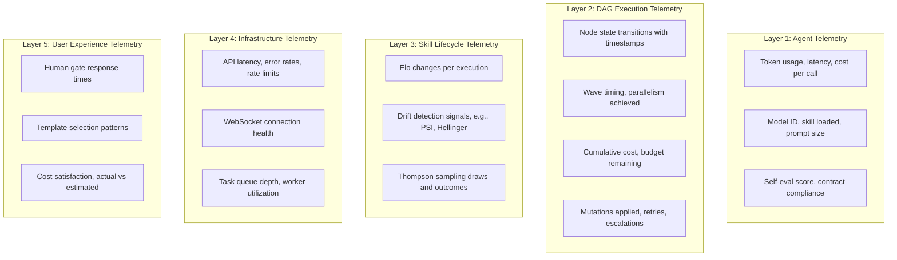
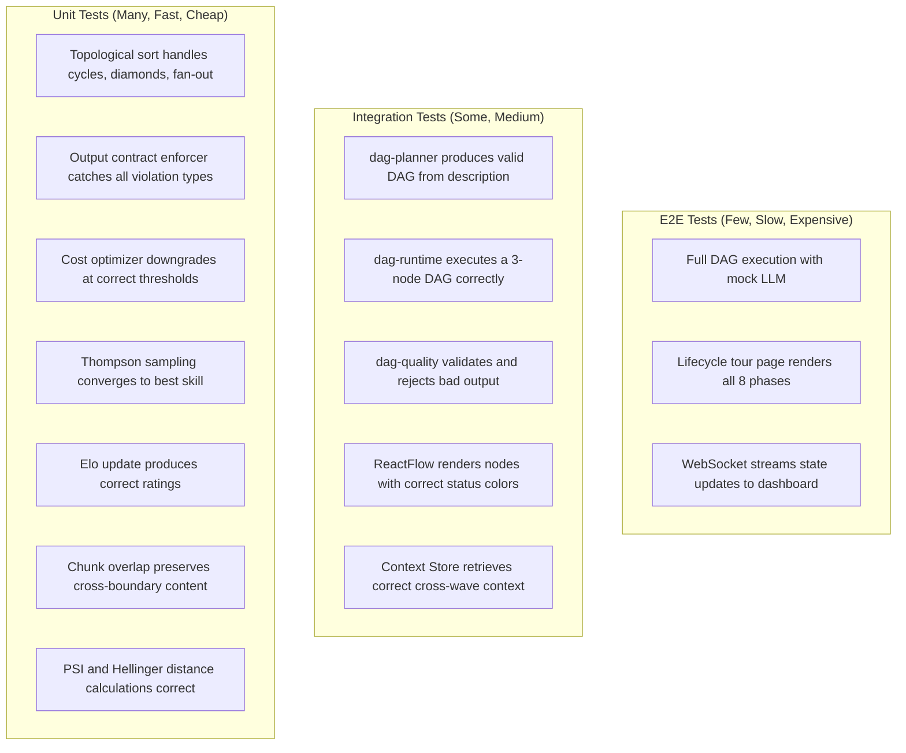
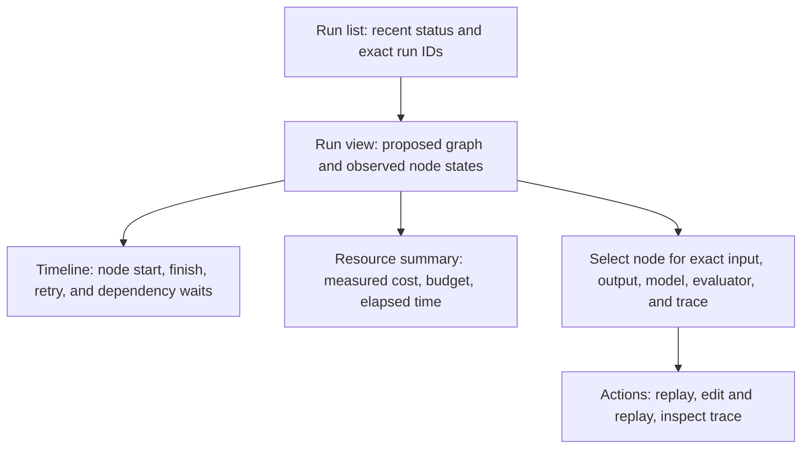
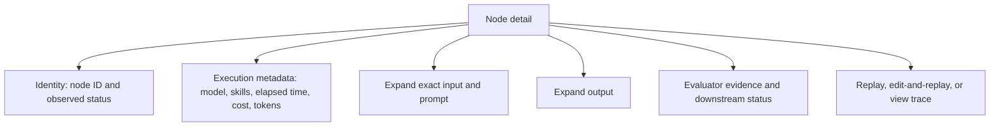
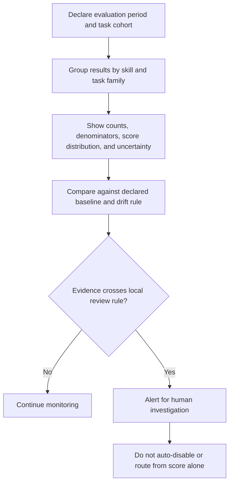
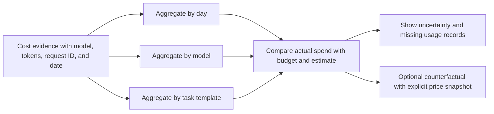

# winDAGs Observability, Testing, and Debugging

This reference is a proposed measurement design, not evidence that the product implements these surfaces. Tests and telemetry support specific claims; they do not prove all runtime correctness.

---

## Design Philosophy

The distill.py bug — errors silently swallowed, wrong model IDs unreported — is the exact failure mode this plan prevents. The core principle:

**Every operation must be observable, every failure must be loud, and every assumption must be tested.**

Three rules:
1. **No silent failures.** Every error prints immediately, with context. Suppressed errors are bugs in the infrastructure, not features.
2. **Telemetry before features.** Instrument first, build second. If you can't measure it, you can't trust it.
3. **Tests prove contracts.** Every interface between components has tests that prove inputs and outputs match their schemas.

---

## The Five Layers of Observability



---

## Layer 1: Agent Telemetry

Every LLM call produces a structured trace event:

```typescript
interface AgentTraceEvent {
  // Identity
  dag_id: string;
  node_id: string;
  execution_id: string;
  timestamp: number;
  
  // Model
  model_requested: string;   // What we asked for
  model_actual: string;      // What the API returned (may differ)
  model_tier: 1 | 2 | 3;
  
  // Skill
  skills_loaded: string[];
  skill_tokens: number;      // How many tokens the skill consumed
  
  // Performance
  input_tokens: number;
  output_tokens: number;
  thinking_tokens: number;   // Extended thinking, if used
  latency_ms: number;
  time_to_first_token_ms: number;
  
  // Cost
  cost_usd: number;
  cost_breakdown: {
    input: number;
    output: number;
    thinking: number;
  };
  
  // Quality
  output_contract_valid: boolean;
  self_eval_score: number | null;
  
  // Errors
  error: string | null;
  error_type: 'none' | 'timeout' | 'rate_limit' | 'model_refused' | 
              'contract_violation' | 'api_error' | 'unknown';
  retry_count: number;
}
```

### What to alert on

| Signal | Threshold | Action |
|--------|-----------|--------|
| Error-rate alert | Warning | Define by task/provider baseline and minimum sample; inspect model and rate-limit evidence |
| Latency alert | Warning | Define from user-facing SLO and observed distribution; inspect before fallback |
| Contract violations | Critical | Predeclare acceptance bound and denominator; inspect failed output contracts |
| Cost anomaly | Warning | Compare receipts with a versioned baseline and price snapshot |
| Evaluator disagreement | Info | Report disagreement; it does not establish sycophancy without validation |

---

## Layer 2: DAG Execution Telemetry

```typescript
interface DAGExecutionTrace {
  dag_id: string;
  template_name: string;
  template_version: string;
  execution_id: string;
  
  // Timeline
  started_at: number;
  completed_at: number | null;
  wall_clock_ms: number;
  
  // Nodes
  total_nodes: number;
  completed_nodes: number;
  failed_nodes: number;
  skipped_nodes: number;
  
  // Waves
  waves: {
    wave_number: number;
    nodes: string[];
    parallelism: number;       // How many ran concurrently
    max_parallelism: number;   // How many could have
    duration_ms: number;
  }[];
  
  // Cost
  total_cost_usd: number;
  budget_usd: number;
  cost_by_tier: { tier1: number; tier2: number; tier3: number };
  
  // Mutations
  mutations_applied: number;
  mutation_log: { type: string; node_id: string; reason: string; timestamp: number }[];
  
  // Quality
  overall_quality_score: number;
  human_gates_passed: number;
  human_gates_rejected: number;
  
  // Outcome
  status: 'completed' | 'failed' | 'cancelled' | 'timeout';
  final_error: string | null;
}
```

### DAG-Level Dashboard Widgets

**Execution Timeline (Gantt)**
- X-axis: wall-clock time
- Rows: one per node
- Colors: pending (gray) → running (blue, animated) → completed (green) → failed (red)
- Shows parallelism visually: concurrent nodes overlap horizontally
- Shows where time is spent: long bars = bottlenecks

**Cost Waterfall**
- Stacked bar per node showing cost contribution
- Color by model tier (Haiku=light, Sonnet=medium, Opus=dark)
- Running total line overlay
- Budget line with "remaining" annotation

**Quality Funnel**
- Shows how many nodes passed each quality gate:
  Schema validation → Content validation → Confidence threshold → Downstream acceptance
- Drop-off at each stage reveals where quality degrades

---

## Layer 3: Skill Lifecycle Telemetry

```typescript
interface SkillMetricsSnapshot {
  skill_name: string;
  domain: string;
  period: 'hourly' | 'daily' | 'weekly';
  timestamp: number;
  
  // Volume
  executions: number;
  
  // Quality
  avg_quality_score: number;
  downstream_acceptance_rate: number;
  contract_compliance_rate: number;
  
  // Efficiency
  avg_tokens_used: number;
  avg_cost_per_use: number;
  pct_haiku_success: number;  // Can it work on cheap models?
  
  // Ranking
  elo: number;
  elo_delta: number;          // Change since last period
  thompson_alpha: number;
  thompson_beta: number;
  
  // Drift
  psi_score: number;          // Population Stability Index
  hellinger_distance: number;
  drift_status: 'stable' | 'warning' | 'crisis';
}
```

### Skill Health Dashboard

**Leaderboard View**
```
Domain: Code Review                        Period: Last 30 days
━━━━━━━━━━━━━━━━━━━━━━━━━━━━━━━━━━━━━━━━━━━━━━━━━━━━━━━━━━━
#  Skill                    Elo    Δ    Accept%  Haiku%  Cost
| # | Skill | Score | Trend | Accept | Drift | Cost |
|---:|---|---:|---:|---:|---:|---:|
| 1 | example-skill-a | 1847 | +12 | 94% | 62% | $0.008 |
| 2 | example-skill-b | 1723 | +5 | 89% | 31% | $0.012 |
| 3 | example-skill-c | 1698 | -3 | 85% | 78% | $0.004 |
| 4 | example-skill-d | 1612 | -18 | 72% | 45% | $0.009 |
━━━━━━━━━━━━━━━━━━━━━━━━━━━━━━━━━━━━━━━━━━━━━━━━━━━━━━━━━━━
```

**Drift Monitor**
- Sparkline per skill showing Elo trend (last 90 days)
- PSI heatmap: green (stable) → yellow (warning) → red (crisis)
- Alert badges for skills entering "Declining" or "Challenged" lifecycle states

---

## Layer 4: Infrastructure Telemetry

### API Health

| Metric | Source | Alert |
|--------|--------|-------|
| Claude API latency p50/p95/p99 | Each call's `latency_ms` | p95 exceeds the locally declared latency budget |
| Rate limit hits | 429 response codes | Any in 5-minute window |
| API error rate | 5xx responses | exceeds a predeclared task-specific error budget |
| WebSocket disconnection rate | `onclose` events | crosses a predeclared disconnect alert rule |
| Task queue depth | Queue size metric | crosses the capacity bound established for the measured workload |
| Worker utilization | Active/total workers | exceeds a measured worker saturation alert bound |

### Health Check Endpoints

```
GET /health              → {"status": "ok", "uptime": 3600}
GET /health/api          → {"claude": "ok", "openai": "ok", "latency_ms": 234}
GET /health/queue        → {"depth": 12, "workers": 4, "active": 3}
GET /health/websocket    → {"connections": 47, "rooms": 12}
```

---

## Layer 5: User Experience Telemetry

| Metric | What It Reveals |
|--------|----------------|
| Time from problem input to first node completion | Is decomposition too slow? |
| Human gate response time | Are we presenting too much/little info? |
| Human gate rejection rate | Are agents producing bad output? |
| Cost actual vs. estimated | Are our estimates calibrated? |
| Template re-use rate | Which templates are sticky? |
| Session abandonment point | Where do users give up? |

---

## Testing Strategy

### Test Pyramid



### Contract Tests (The Glue)

Every interface between components has a contract test:

```typescript
// dag-planner output → dag-runtime input
test('planner output satisfies runtime input contract', () => {
  const dag = dagPlanner.plan("Build a portfolio website");
  
  // Structure
  expect(dag.nodes).toBeInstanceOf(Map);
  expect(dag.edges).toBeInstanceOf(Map);
  expect(dag.config).toBeDefined();
  
  // Every node has required fields
  for (const [id, node] of dag.nodes) {
    expect(node.id).toBeTruthy();
    expect(node.type).toMatch(/^(agent|vague|human-gate)$/);
    expect(node.dependencies).toBeInstanceOf(Array);
  }
  
  // DAG is acyclic
  expect(() => topologicalSort(dag)).not.toThrow();
  
  // Edges reference existing nodes
  for (const [from, tos] of dag.edges) {
    expect(dag.nodes.has(from)).toBe(true);
    for (const to of tos) {
      expect(dag.nodes.has(to)).toBe(true);
    }
  }
});

// Node output → downstream node input
test('node output satisfies downstream input contract', () => {
  const output = { status: 'pass', summary: 'Analysis complete', data: { ... } };
  const schema = downstreamNode.inputSchema;
  
  const validation = outputContractEnforcer.validate(output, schema);
  expect(validation.valid).toBe(true);
  expect(validation.errors).toHaveLength(0);
});
```

### Mock LLM for Testing

Don't call real APIs in tests. Use a deterministic mock:

```typescript
class MockLLMProvider implements LLMProvider {
  private responses: Map<string, string> = new Map();
  
  // Pre-program responses by prompt substring
  whenPromptContains(substring: string, response: string) {
    this.responses.set(substring, response);
  }
  
  async complete(system, messages, model, maxTokens) {
    const prompt = messages.map(m => m.content).join(' ');
    
    for (const [substring, response] of this.responses) {
      if (prompt.includes(substring)) {
        return {
          content: response,
          model,
          input_tokens: prompt.length / 4,
          output_tokens: response.length / 4,
          cost_usd: 0,
        };
      }
    }
    
    // Default: return a valid but minimal response
    return {
      content: JSON.stringify({ status: 'pass', summary: 'Mock response' }),
      model,
      input_tokens: 100,
      output_tokens: 50,
      cost_usd: 0,
    };
  }
}
```

### Playwright E2E Tests for the Dashboard

```typescript
// Lifecycle tour renders all phases
test('lifecycle tour shows all 8 phases', async ({ page }) => {
  await page.goto('/dag/lifecycle');
  
  // All phase buttons visible
  for (let i = 1; i <= 8; i++) {
    await expect(page.locator(`button:has-text("${i}.")`)).toBeVisible();
  }
  
  // Click through each phase
  for (let i = 1; i <= 8; i++) {
    await page.click(`button:has-text("${i}.")`);
    await page.waitForTimeout(500);
    
    // DAG canvas rendered
    await expect(page.locator('canvas')).toBeVisible();
    
    // Cost ticker updated
    const cost = await page.locator('text=$').textContent();
    expect(cost).toBeTruthy();
  }
});

// WebSocket state updates reach the dashboard
test('node state changes reflect in visualization', async ({ page }) => {
  await page.goto('/dag/monitor');
  
  // Simulate a WebSocket message
  await page.evaluate(() => {
    window.postMessage({
      type: 'node_state',
      node_id: 'research',
      status: 'completed',
    }, '*');
  });
  
  // Verify the node visually changed
  // (specific assertion depends on rendering implementation)
});
```

---

## Debugging Tools

### 1. DAG Replay Debugger (Skill: dag-replay-debugger)

Time-travel through any completed execution:
- Inspect any node's full state (inputs, system prompt, output, evaluator scores)
- Replay from any checkpoint with modified inputs, skills, or models
- Execution diff: compare two traces side-by-side to find where they diverged

### 2. Agent Trace Inspector

For live debugging during development:

```typescript
// Enable verbose tracing
const tracer = new AgentTracer({ verbose: true });

tracer.on('call_start', (event) => {
  console.log(`🔵 ${event.node_id} → ${event.model} (${event.skills_loaded.join(', ')})`);
  console.log(`   Prompt: ${event.input_tokens} tokens`);
});

tracer.on('call_complete', (event) => {
  console.log(`🟢 ${event.node_id} completed in ${event.latency_ms}ms ($${event.cost_usd.toFixed(4)})`);
  console.log(`   Contract valid: ${event.output_contract_valid}`);
});

tracer.on('call_error', (event) => {
  console.error(`🔴 ${event.node_id} FAILED: ${event.error}`);
  console.error(`   Type: ${event.error_type}, Retry: ${event.retry_count}`);
  // ALWAYS print errors immediately. Never swallow them.
});
```

### 3. Cost Audit Trail

A cost ledger should reconcile provider receipts, retry attempts, and missing records. The following constructed example illustrates columns only; its model names, prices, and savings are not current quotes:

Constructed ledger example (values are illustrative, not price evidence):

| Node | Model label | Tokens | Receipt cost |
|---|---|---:|---:|
| interview | model-A | 3,421 | $0.020 |
| research | model-B | 812 | $0.001 |
| content | model-A | 2,876 | $0.018 |
| design | model-A | 3,102 | $0.020 |
| build | model-A | 5,448 | $0.040 |
| review | human gate | 0 | $0.000 |
| deploy | model-B | 345 | $0.001 |
| **Total** | | **16,004** | **$0.100** |

Illustrative budget: $0.250. Any “savings” comparison requires current prices, equal quality, equal workload, and all retry/evaluation costs.

---

## Dashboard Wireframes

### Main Dashboard: DAG Execution Monitor




Legend: ✓ = completed (green), ●●● = running (blue pulse), ░ = pending, ✗ = failed (red)

### Node Detail Panel (Click on a node)




### Skill Health Dashboard




### Cost Explorer




---

## Data Visualization Design Principles

Drawing from `data-viz-2025`, `reactive-dashboard-performance`, and Tufte:

### 1. Maximize Data-Ink Ratio

Every pixel should encode information. No chartjunk, no decorative borders, no 3D effects on 2D data. The Win31 aesthetic helps here — it's naturally low-decoration.

### 2. Small Multiples Over Complex Charts

Instead of one overcrowded DAG visualization for 20 nodes, show small multiples: one per wave, each clean and simple. Let the user drill into detail.

### 3. Color Encodes Status, Not Decoration

The 9-color status vocabulary (pending=gray, running=blue, completed=green, failed=red, retrying=orange, paused=purple, skipped=dimgray, mutated=yellow, scheduled=light blue) is the ONLY color language. Everything else is grayscale.

### 4. Animation Encodes Liveness

- Pulsing = running (the system is actively working)
- Dashed animation = data flowing along an edge
- Glow fade-in = just completed
- Shake = just failed

Animation means "something is happening now." Static means "this is settled."

### 5. Progressive Disclosure in Dashboards Too

- **Overview**: DAG graph with colored nodes (status at a glance)
- **Click node**: Detail panel (model, skills, timing, cost)
- **Expand section**: Full inputs/outputs, system prompt, evaluator scores
- **Replay**: Time-travel into the execution

Don't show everything at once. Let curiosity pull the user deeper.

### 6. Sparklines for Trends

Elo trends, cost trends, quality trends — all as inline sparklines in tables. Edward Tufte's invention. Maximum information in minimum space. No axis labels needed; the trend direction and shape are what matter.

### 7. Honest Axes

- Cost axes start at $0.00, not at the minimum value
- Percentage axes go 0-100%, not 70-100% (which would exaggerate small differences)
- Time axes are linear, not compressed

Dashboards that lie about scale create false confidence.
