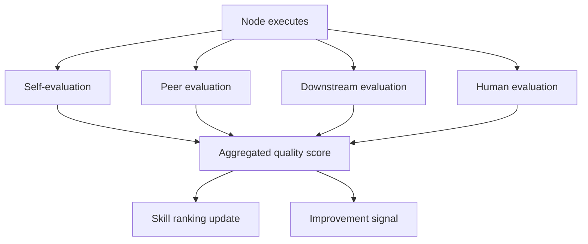
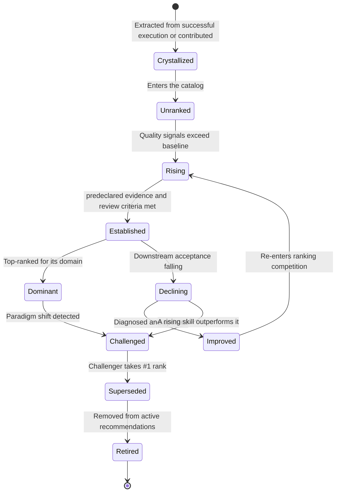
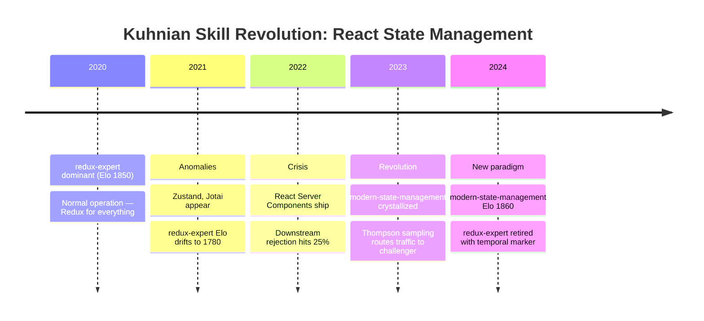
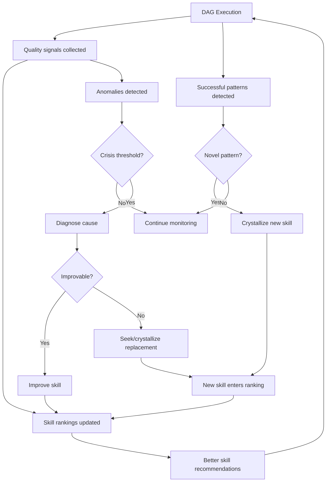

# Skill Lifecycle: Evaluation, Ranking, and Revision

This is a proposed lifecycle design. Scores may support review, but they do not automatically prove skill quality or authorize publication. Separate self, peer, downstream, and human evidence; record which were actually collected.

---

## The Four Evaluators

The following are candidate evidence channels, not interchangeable ground truth. Their usefulness depends on the task rubric, evaluator independence, and observable outcomes; record missing channels rather than imputing a score.



### Evaluator 1: Self-Evaluation (The Agent Grades Itself)

**How**: After producing output, the agent runs a self-check against the skill's QA checklist and output contract.

**Model**: Use the SAME model that produced the output (no extra cost for a separate call — just append "Now evaluate your output against these criteria" to the same conversation). Or, for cheaper self-eval, use a Haiku call with the output + checklist.

```python
SELF_EVAL_PROMPT = """
You just produced the following output for the task "{task}".

Output:
{output}

Evaluate your own work on these dimensions (0.0 to 1.0):
1. Completeness: Does the output address all parts of the task?
2. Contract compliance: Does it match the required output schema?
3. Confidence: How confident are you in the correctness?
4. Skill adherence: Did you follow the skill's steps in order?

Return JSON: {{"completeness": 0.X, "contract": 0.X, "confidence": 0.X, "adherence": 0.X, "overall": 0.X, "concerns": ["..."]}}
"""
```

**What it catches**: Contract violations, obvious omissions, cases where the agent knows it's uncertain.

**What it misses**: Self-evaluation has a **sycophancy bias** — models systematically overrate their own output. Self-evaluation can share failure modes with the producing model. Measure its calibration on held-out examples instead of assuming independence or a fixed bias value. Do not use a fixed weight without calibration; report self-score separately and compare with independent, task-relevant evidence.

**Cost**: Depends on the chosen model, token use, and billing terms. A self-check in the same conversation still consumes context and may share the producer's failure modes.

### Evaluator 2: Peer Evaluation (A Different Agent Grades It)

**How**: A separate, dedicated evaluator agent (a "judge node") reviews the output using the skill-grader skill. The judge should be a different model or at least a different conversation to avoid self-serving bias.

```python
async def peer_evaluate(output: dict, task: str, skill_used: str) -> dict:
    """Dedicated judge agent evaluates output quality."""
    return await execute_with_model(
        model='<configured-evaluator-model-id>',  # Cheap judge
        system=load_skill('skill-grader'),
        prompt=f"""
        Task: {task}
        Skill used: {skill_used}
        Output to evaluate:
        {json.dumps(output)}
        
        Grade this output on the 10 axes. Return the grading report.
        """,
    )
```

**What it catches**: Logical errors the producing agent can't see, skill misapplication, quality issues that require a fresh perspective.

**What it misses**: May not understand domain context as well as the producing agent. Can be fooled by confident-sounding but incorrect output.

**Cost**: Measure the selected evaluator's actual usage and current pricing. Add a judge only when the decision value justifies its latency, cost, and correlated-error risk.

A rubric can make criteria explicit, but does not make a judge reliable by itself. Validate agreement and error modes on a held-out, task-relevant sample; report disagreements and confidence separately.

**Order effects**: If a comparison presents candidates in an order, randomize or counterbalance that order and measure sensitivity. Repeating a judgment with swapped positions can reveal order sensitivity, but agreement is not proof of validity and does not neutralize all bias. Do not import rates from another model/task without checking its evaluation setup.

**Multiple judges**: Distinct models may still share training data, rubrics, or blind spots. If using an ensemble, report each judgment and its aggregation rule; measure agreement against independent task evidence instead of assuming diversity improves validity.

### Evaluator 3: Downstream Evaluation (The Next Node Grades It)

**How**: The downstream node, when it receives input from upstream, evaluates whether that input is usable before starting its own work. This is the most natural evaluation because it happens automatically as part of DAG execution.

```python
DOWNSTREAM_EVAL_PROMPT = """
You are about to begin your task: {downstream_task}

You received this input from the upstream node ({upstream_role}):
{upstream_output}

Before starting, evaluate the input:
1. Is it structurally valid? (matches expected schema)
2. Is it complete? (has all fields you need)
3. Is it plausible? (no obvious errors or contradictions)
4. Is it useful? (does it actually help with your task)

Return JSON: {{"valid": true/false, "complete": true/false, "plausible": true/false, "useful": true/false, "issues": ["..."]}}

If all four are true, proceed with your task.
If any is false, report the issue and request re-execution.
"""
```

**What it catches**: Contract mismatches, incomplete data, and outputs unusable for this consumer. This is evidence of task-specific usability, not general quality.

**Limits**: A downstream consumer may tolerate or compensate for defects. Capture which checks it applied and what it could not assess.

**Cost**: It still consumes context and inference. Measure incremental use where material.

### Evaluator 4: Human Evaluation (The Gold Standard)

**How**: At human-in-the-loop gates, the human's decision (approve / reject / modify) is the highest-fidelity quality signal.

**What it catches**: A reviewer may assess user intent, context, and consequences unavailable to automated checks. Human review is still fallible and should be scoped to a decision and evidence record.

**Limits**: Reviewers can miss defects or disagree. Record the reviewer, decision scope, evidence, and unresolved disagreement; do not treat approval as proof of correctness.

**Cost**: Human time. Only use at gates where it matters (final deliverables, irreversible actions, high-stakes decisions).

### Aggregating the Four Scores

```python
def aggregate_quality(
    self_score: float | None,
    peer_score: float | None,
    downstream_accepted: bool | None,
    human_approved: bool | None,
) -> float:
    """Weighted aggregate of all available quality signals."""
    scores = []
    
    if self_score is not None:
        scores.append((self_score, 0.15))       # Low weight: sycophancy bias
    if peer_score is not None:
        scores.append((peer_score, 0.25))        # Medium weight: fresh perspective
    if downstream_accepted is not None:
        scores.append((1.0 if downstream_accepted else 0.3, 0.35))  # High weight: real utility
    if human_approved is not None:
        scores.append((1.0 if human_approved else 0.0, 0.50))       # Highest weight: gold standard
    
    if not scores:
        return 0.5  # No signal
    
    # Normalize weights to sum to 1.0
    total_weight = sum(w for _, w in scores)
    return sum(s * w for s, w in scores) / total_weight
```

Weights reflect trust hierarchy: **human > downstream > peer > self**.

---

## Skill Ranking System

### Elo-Based Skill Ranking

An Elo-style update can summarize pairwise outcomes only when the comparison population, task matching, adjudication, and update policy are explicit. It is a relative score, not a calibrated measure of absolute skill quality.

```python
def update_skill_elo(skill_name: str, quality_score: float, domain: str):
    """Update skill's Elo rating based on execution outcome."""
    current_elo = get_skill_elo(skill_name, domain)
    
    # Expected score based on current rating
    expected = 1.0 / (1.0 + 10 ** ((1500 - current_elo) / 400))
    
    # Actual score (continuous, not binary)
    actual = quality_score
    
    # K-factor: higher for new skills (more volatile), lower for established
    executions = get_execution_count(skill_name, domain)
    k = 32 if executions < 50 else 16 if executions < 200 else 8
    
    new_elo = current_elo + k * (actual - expected)
    set_skill_elo(skill_name, domain, new_elo)
```

### Multi-Dimensional Ranking

A single Elo isn't enough. Rank skills on multiple axes:

| Axis | Signal | Weight |
|------|--------|--------|
| Axis | Example evidence | Local weight |
|---|---|---:|
| Effectiveness | Downstream acceptance with task denominator | Define during evaluation |
| Efficiency | Quality at measured resource cost | Define during evaluation |
| Reliability | Contract compliance and unknowns | Define during evaluation |
| Cost | Measured usage and current pricing basis | Define during evaluation |
| Freshness | Source revision and validity | Define during evaluation |

### Skill Leaderboard (constructed display)

```
Illustrative synthetic display only; these rows are not observed product data.

Domain: Code Review
━━━━━━━━━━━━━━━━━━━━━━━━━━━━━━━━━━━━━━━━━━━━━━
#1  code-review-skill         Elo: 1847  ▲  Executions: 2,341
#2  react-server-components   Elo: 1723  ▲  Executions: 891  
#3  typescript-strict-mode    Elo: 1698  ─  Executions: 456
#4  testing-patterns          Elo: 1612  ▼  Executions: 234
#5  legacy-code-reviewer      Elo: 1489  ▼  Executions: 89   ⚠️ DECLINING
```

---

## Skill Lifecycle States



### Crystallized (Birth)

A new skill enters existence. It has no execution history and no ranking.

- **Triggers**: A research agent discovers a repeatable process. A user contributes domain expertise. The meta-DAG's evaluator detects a recurring successful pattern across multiple executions that had no pre-built skill.
- **Mechanism**: A maintainer can draft a skill from a trace using authoring conventions. A trace is evidence about one execution, not proof of a reusable procedure; redact it, test the generalization on separate tasks, and review before catalog entry.
- **Exit condition**: Metadata and links validate, the procedure has source or test evidence where needed, and a reviewer accepts its scoped use. A grader score is advisory, not authorization.

### Unranked (Catalog Entry)

The skill exists in the catalog but has no performance data. It appears in search results but is not recommended by default.

- **Illustrative algorithm setting**: This code uses 1500 as an arbitrary initial rating, not a calibrated quality baseline.
- **Illustrative algorithm setting**: The sample uses a larger update factor with few observations; evaluate any factor per workload.
- **Visibility**: Available if explicitly requested or if Thompson sampling selects it for exploration (see below).
- **Exit condition**: Require enough comparable evidence for the intended decision; there is no universal count.

### Rising (Gaining Confidence)

Quality signals are net positive. The skill's Elo is climbing. It begins appearing in recommendations.

- **Elo**: Trending upward from 1500.
- **K-factor**: 32 (still volatile — the system is still learning about this skill).
- **Visibility**: Included in recommendations when Thompson sampling draws a high sample.
- **Exit condition**: Apply a predeclared uncertainty and materiality rule on a comparable cohort; choose its sample design, interval, and review period locally.

### Established (Proven)

The skill has enough execution history for its ranking to be statistically meaningful. It is a standard recommendation for its domain.

- **Elo**: No universal rating range implies established quality; interpret only against the defined comparison population.
- **K-factor**: 16 (moderate — updates are dampened to prevent noise).
- **Visibility**: Recommendation eligibility is a separate policy decision; do not follow a score alone.
- **Monitoring**: Drift detection runs on a rolling 30-day window (see Anomaly Detection below).
- **Exit condition (up)**: Reaches #1 rank in its domain → Dominant.
- **Exit condition (down)**: A predeclared, statistically meaningful decline on a comparable task cohort triggers review; the window and bound depend on sample size and change cost.

### Dominant (Top-Ranked)

The skill is the best-performing option for its domain. It is the default selection.

- **Elo**: Rank is relative to candidates and sampled tasks; it does not establish the best choice for every task.
- **K-factor**: 8 (low — established skills resist noise).
- **Visibility**: If selected as a comparator, preserve the choice and evaluation protocol; rank alone is not a safe default.
- **Risk**: Complacency. The skill may become stale if the underlying domain evolves (framework changes, model capability shifts, new anti-patterns emerge).
- **Exit condition**: A challenger's Elo overtakes it, or anomaly detection flags a paradigm shift.

### Declining (Quality Dropping)

Something changed — the domain evolved, a dependency shifted, or the skill's advice became subtly wrong. Downstream acceptance is falling but no single failure is dramatic.

- **Signals**: Downstream rejection rate increasing. Self-score diverging from peer/downstream scores (sycophancy drift). Contract violations increasing on specific output fields.
- **Diagnosis**: Review a stratified failure sample and rubric to investigate change. A score shift alone does not identify its cause.
- **Actions**: Generate specific improvement recommendations. Flag for human review if urgency is high.
- **Exit condition (up)**: Improvements applied → Improved state.
- **Exit condition (lateral)**: A rising skill outperforms it → Challenged state.

### Improved (Updated)

The skill has been diagnosed and updated — either automatically (Sonnet + skill-architect) or by a human maintainer. It re-enters the ranking competition as if newly rising.

- **Elo**: Keep version-specific evidence separate. Do not carry an old version rating to materially changed instructions without an explicit comparability rule.
- **K-factor**: 16 (moderate — needs to re-prove itself but isn't starting from scratch).
- **Changelog**: A new version entry documents what changed and why.
- **Exit condition**: Elo stabilizes above its domain median → back to Established.

### Challenged (Competitor Emerging)

A newer skill is outperforming this one on the same domain. Both are being served (Thompson sampling allocates traffic between them) while the system gathers comparative data.

- **Mechanism**: A bandit policy may allocate observations under stated reward and stationarity assumptions. Do not expose production tasks to exploration without approved risk policy and evaluation design.
- **Duration**: Depends on effect size, variance, task mix, and decision cost; derive a design rather than prescribing a count.
- **Exit condition**: Retire a version only after comparable evidence and an explicit maintainer decision; preserve rollback and provenance.

### Superseded (Replaced)

The challenger has won. The old skill is no longer the default recommendation.

- **Visibility**: Demoted from recommendations. Still available if explicitly requested.
- **Temporal marker**: The skill's SKILL.md receives a deprecation notice: "As of [date], use [new-skill] instead. This skill covers the pre-[paradigm] approach."
- **Retention**: Set retention according to actual catalog policy and obligations; no period is implied here.
- **Exit condition**: low use over a declared review interval can prompt manual review; it does not prove obsolescence.

### Retired (Removed)

The skill is archived. It no longer appears in the catalog or search results.

- **Archived**: Stored with full execution history for analysis.
- **Recoverable**: Can be un-retired if the paradigm shifts back (rare but possible — e.g., a framework reverts a breaking change).

---

## Thompson Sampling for Skill Exploration

A deterministic highest-score policy can starve alternatives of evaluation opportunities. Thompson sampling is one possible exploration policy; its behavior depends on the reward model, candidate set, priors, and deployment constraints.

### The Intuition

Instead of always picking the skill with the highest Elo (exploitation), model each skill's true quality as a **probability distribution** (Beta distribution parameterized by successes and failures). On each execution, sample from each skill's distribution and pick the one with the highest sample. Skills with high expected quality get picked most often (exploitation), but skills with high uncertainty occasionally draw lucky samples (exploration).

```python
import numpy as np

class ThompsonSkillSelector:
    """Select skills using Thompson sampling for explore/exploit balance."""
    
    def __init__(self):
        # Beta distribution parameters per (skill, domain)
        # alpha = successes + 1, beta = failures + 1 (prior: Beta(1,1) = uniform)
        self.params: dict[tuple[str, str], tuple[float, float]] = {}
    
    def select(self, candidates: list[str], domain: str) -> str:
        """Sample from each candidate's posterior, pick the highest draw."""
        samples = {}
        for skill in candidates:
            alpha, beta = self.params.get((skill, domain), (1.0, 1.0))
            samples[skill] = np.random.beta(alpha, beta)
        return max(samples, key=samples.get)
    
    def update(self, skill: str, domain: str, quality_score: float):
        """Update posterior after observing an execution outcome."""
        alpha, beta = self.params.get((skill, domain), (1.0, 1.0))
        # Treat quality_score as a continuous reward in [0, 1]
        alpha += quality_score
        beta += (1.0 - quality_score)
        self.params[(skill, domain)] = (alpha, beta)
```

### Why This Matters for the Lifecycle

- New candidates may receive exploratory assignments, but that does not replace a predeclared comparison design or human authorization.
- Posterior concentration depends on the model and observed data; it does not establish task coverage or external validity.
- Selection rate is not generally a calibrated probability of being best; convergence requires assumptions about rewards, feedback, and candidate exposure.
- Version comparisons still need task assignment, version pinning, contamination controls, and a defined outcome. Do not allocate traffic automatically without approved policy.

### Competing candidate example (constructed)

Thompson sampling also enables **competitive evaluation of alternative approaches** to the same problem:

```
Task: "Review this TypeScript PR"

Candidate skills, each a different heuristic:
  - code-review-skill (structured rubric approach)
  - pair-programming-reviewer (conversational approach)
  - security-first-reviewer (security-centric approach)

Thompson sampling routes traffic across all three.
After 200 executions: code-review-skill Elo 1820, security-first 1740, pair-programming 1650.
A learned policy’s allocation is workload- and reward-dependent; measure it rather than expecting a fixed share.
```

The system doesn't need to know in advance which approach is best. It discovers it through competitive execution.

---

## Anomaly Detection for Kuhnian Revolution

This is a maintenance analogy, not an empirical law that skill catalogs follow Kuhn's stages. Distribution monitoring can flag change; it does not establish a paradigm shift or its cause.

### A maintenance analogy (illustrative)

**Normal operation**: The skill works within a stable paradigm. Rankings are stable. Downstream acceptance is high. No anomalies.

**Anomaly accumulation**: The world changes (new framework version, new model capabilities, new anti-patterns emerge). The skill's advice is subtly wrong more often. Downstream rejection rate creeps upward. But no single failure is dramatic enough to trigger replacement.

**Review trigger**: A predeclared change signal crosses a local bound. This signals a distribution difference, not necessarily degraded effectiveness; inspect task mix and outcomes before acting.

**Revision**: A maintainer may propose an alternative. Compare it under a versioned, task-matched evaluation and review evidence before adoption.

**New paradigm**: The new skill becomes dominant. The old skill is deprecated with a temporal marker.



### Statistical Drift Detection

A distribution comparison is one possible monitoring signal. Select a method appropriate to the metric, define missing-data and sample-size handling, and validate with known shifts and stable controls. The example code requires real implementations for its placeholders and is not a production monitor:

- **Baseline**: A versioned reference cohort chosen for comparability; time windows alone do not control task-mix shifts.
- **Current window**: A declared interval with sufficient observations for the chosen method; calendar duration does not guarantee adequate sample size.
- **Detection method**: Population Stability Index (PSI) on the distribution of downstream acceptance scores. PSI thresholds are local alert choices. Define bins, reference distribution, sample minimum, and action in advance; drift indicates distribution change, not its cause or severity by itself.
- **Complementary signal**: A second distribution metric may provide another view, but no metric is inherently robust to small samples without uncertainty analysis.

```python
def detect_paradigm_shift(domain: str) -> list[dict]:
    """Detect skills undergoing Kuhnian crisis using drift detection."""
    skills = get_skills_for_domain(domain)
    crises = []
    
    for skill in skills:
        baseline = get_quality_distribution(skill, days=180)
        current = get_quality_distribution(skill, days=30)
        
        # PSI: Population Stability Index
        psi = compute_psi(baseline, current)
        
        # Hellinger distance for robustness
        hellinger = compute_hellinger(baseline, current)
        
        # Two-tier alerting
        if psi >= configured_crisis_bound or hellinger >= configured_crisis_bound:
            severity = "crisis"
        elif psi >= configured_watch_bound or hellinger >= configured_watch_bound:
            severity = "warning"
        else:
            continue
        
        challengers = find_rising_skills(domain, min_elo_delta=50, days=30)
        
        crises.append({
            "skill": skill.name,
            "domain": domain,
            "severity": severity,
            "psi": psi,
            "hellinger": hellinger,
            "challengers": [c.name for c in challengers],
            "recommendation": (
                "SUPERSEDE" if challengers and severity == "crisis" else
                "IMPROVE" if severity == "warning" else
                "RETIRE"
            ),
        })
    
    return crises
```

### Crystallization from Successful Improvisation

When a DAG node succeeds without a pre-built skill, and that pattern repeats 3+ times, the system extracts a new skill:

```python
async def crystallize_skill(node_id: str, traces: list[dict]) -> str:
    """Extract a new skill from repeated successful improvisation."""
    return await execute_with_model(
        model='<configured-author-model-id>',
        system=load_skill('skill-architect'),
        prompt=f"""
        These {len(traces)} DAG executions succeeded on similar tasks without
        a pre-built skill. Extract the common process into a reusable skill.
        
        Execution traces:
        {json.dumps(traces, indent=2)}
        
        Create a SKILL.md following the skill-architect template.
        Include: When to Use, NOT for, Core Process (numbered steps),
        Anti-Patterns (at least 1), Output Contract.
        """,
    )
```

---

## The Feedback Loop: DAG Execution → Skill Evolution

Every DAG execution contributes to skill evolution:



### What This Means for winDAGs as a Product

The skill lifecycle is the **core differentiator**:
- Every execution makes the system smarter (data network effect)
- Skills self-improve or get replaced (quality ratchet)
- The marketplace surfaces the best skills automatically (curation at scale)
- Temporal knowledge stays current because stale skills get detected and flagged (anomaly detection)
- Users don't need to be skill experts — the system tells them which skills are working

This is an unvalidated product hypothesis, not a competitor fact or shipped capability. Any comparison needs current sourced evidence and an apples-to-apples evaluation. The lifecycle is a design proposal, not evidence that executions automatically improve a library.

---

## Evaluation Architecture Recommendations

### Optional Evaluation Channels (configure per task)
- Self-check against the output contract; note shared producer context and usage.
- Downstream consumer checks the fields it needs; acceptance establishes only task-specific usability.

### For Higher-Consequence Decisions
- Independent evaluation may add evidence after its error profile is checked on held-out examples.
- Add a judge only when evidence value justifies cost and latency; it does not replace an authorized reviewer.

### For Human Gates (Expensive, High-Fidelity)
- Human review can inform scoped decisions and remains fallible; preserve rationale and unresolved concerns.
- Require review where policy assigns it; review does not prove execution or correctness.

### For Skill Ranking (Batch, Background)
- Aggregate all signals across executions
- Update versioned comparisons only after outcomes are adjudicated and the cohort is fixed.
- Choose monitoring cadence from data and operational need; alerts are not diagnoses.
- Flag skills in crisis for review

### Research That Would Improve This

| Topic | Value | Suggested Query |
|-------|-------|----------------|
| LLM-as-judge calibration | High | "How do LLM-as-judge systems calibrate self-evaluation scores? What are the biases? How do LMSYS, AlpacaEval, and MT-Bench handle judge reliability?" |
| Skill marketplace economics | Medium | "What are the business models for developer tool marketplaces? How do VS Code extensions, npm packages, and Terraform modules achieve network effects?" |
| Anomaly detection for model drift | Medium | "How do ML monitoring systems detect concept drift and model degradation in production? Patterns from Evidently AI, WhyLabs, Arize." |
