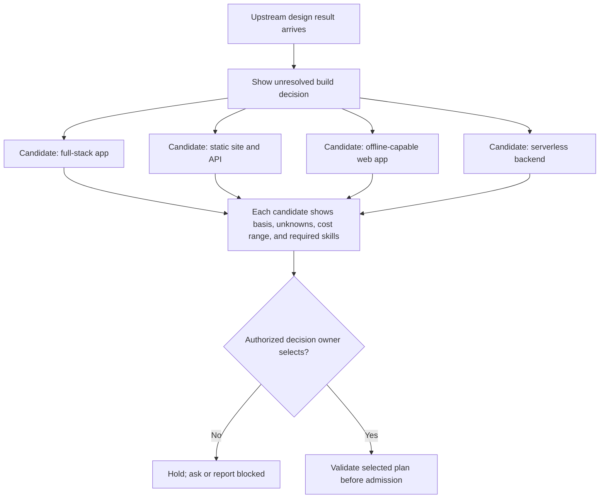
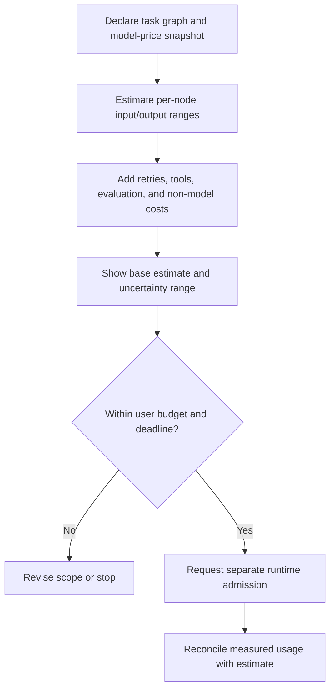

# winDAGs User Experience: The Lovely Niceties

This reference sketches possible workflow-product affordances. It does not establish that the WinDAGs implementation contains them.

---

## Persistence and Recovery

### Save State on Failure or Pause

A product may checkpoint completed nodes, but safe resume requires durable output identity, revision-bound input, and reconciliation of in-flight effects. A stored “completed” bit alone is not enough.

- **Workflow engine**: If using an external engine, verify its documented replay and activity semantics; replay is not evidence that an external effect did not repeat.
- **Local mode**: A local checkpoint store can retain node outputs, but the executor must validate source revisions and reconcile unknown effects before skipping or repeating work.
- **Pause/resume**: The user can pause a running DAG at any point. Human-gate nodes are natural pause points, but the user can also force-pause between any two waves.
- **Cost on failure**: Report observed usage for completed and failed attempts. Prior work is reusable only if its inputs and scope remain valid.

### Saved DAG Runs

Every completed (or partially completed) DAG run is saved with:
- Full execution trace (inputs, outputs, skills used, costs per node)
- The DAG definition as it was at execution time (including any mutations)
- Quality scores from all four evaluators
- Total cost, duration, and model mix

Users can browse, search, and compare past runs. This history feeds the skill ranking system and lets users re-run successful DAGs on new inputs.

---

## Pluripotent Nodes (Not "Vague" — "Full of Potential")

When the system presents a node it can't yet fully specify, don't show a gray question mark. Show **3-4 exciting potential paths** the node could expand into.

### Example proposal preview (constructed)

The preview communicates uncertainty without representing a proposal as an accepted plan.

### Implementation

A planner could generate candidate expansions from an upstream result. Label them hypotheses, show the basis and missing evidence, and require explicit selection before making executable nodes. Model choice and number of candidates are evaluated local settings, not requirements.

---

## Cost Projections

### Before Execution

A proposed interface can show a cost estimate before admission. State the price snapshot, token assumptions, uncertain node ranges, and non-model costs; the estimate is not a spend guarantee:

### During Execution

During execution, display measured usage only when backed by a provider receipt; separate estimates from billed amounts and surface missing records.

### After Execution

After execution, compare receipts with estimates using a dated pricing source. Suggestions are counterfactuals requiring quality and capability validation, not guaranteed savings.

---

## Output Export

DAG outputs should port to the formats users actually want:

| Output Format | Use Case | How |
|--------------|----------|-----|
| Markdown | Documentation, reports | Default — all node outputs are markdown-compatible |
| PDF | Formal deliverables, printable reports | Pandoc conversion from markdown |
| JSON | API integration, data pipelines | Structured output contracts already produce JSON |
| ZIP | Complete project archives | All artifacts (code, docs, images) in one package |
| GitHub PR | Code changes | Commit changes to a branch, open PR |
| Notion/Confluence | Team wikis | API integration for pushing content |
| HTML | Standalone web pages | Render markdown to styled HTML |

The export system reads the DAG's output contracts and transforms them. Each node already declares its output schema, so the exporter knows what it's working with.

---

## Versioned Skills with SLA

### The Problem

Skills evolve. Version 2 of `code-review-skill` may produce different (hopefully better) output than version 1. But users running production DAGs need stability.

### The Solution: Version Pinning with Upgrade Nudges

- **DAG templates pin skill versions**: `skills: [code-review-skill@v2.1]`
- **SLA on pinned versions**: "This skill version will be supported for 6 months from release. After that, it remains available but receives no bug fixes."
- **Upgrade notification**: When a newer version exists, the dashboard shows: "v2.2 available. 15% higher downstream acceptance in testing. [Preview upgrade] [Pin current]"
- **Preview upgrade**: Run the DAG with the new skill version side-by-side. Show diff of outputs. Let the user decide.
- **Backprop to Elo**: When a user upgrades and the DAG succeeds, the new version's Elo gets a positive signal. When they preview and reject, it gets a negative signal. Organic upgrade data feeds the ranking system.

---

## Pre-Filled DAG Templates

### The Template Gallery

The first thing a new user sees. Organized by domain, each template is a ready-to-run DAG with sensible defaults:

**Software Engineering**

| Template | Nodes | Est. Cost | Time |
|----------|-------|-----------|------|
| Portfolio Website Builder | 7 | $0.12 | 5 min |
| Codebase Refactor | 6 | $0.15 | 8 min |
| PR Review Pipeline | 4 | $0.04 | 2 min |
| Technical Documentation | 5 | $0.08 | 4 min |
| Bug Investigation | 4 | $0.06 | 3 min |
| API Design + Implementation | 8 | $0.25 | 12 min |

**Research & Writing**

| Template | Nodes | Est. Cost | Time |
|----------|-------|-----------|------|
| Research Synthesis Report | 5 | $0.10 | 5 min |
| Competitive Analysis | 6 | $0.12 | 6 min |
| Blog Post from Topic | 4 | $0.06 | 3 min |
| Grant Proposal Draft | 7 | $0.20 | 10 min |

**Business & Product**

| Template | Nodes | Est. Cost | Time |
|----------|-------|-----------|------|
| Product Requirements Doc | 5 | $0.08 | 4 min |
| Go-to-Market Strategy | 6 | $0.15 | 7 min |
| User Interview Analysis | 4 | $0.06 | 3 min |
| Quarterly Business Review | 5 | $0.10 | 5 min |

**Personal Productivity**

| Template | Nodes | Est. Cost | Time |
|----------|-------|-----------|------|
| Vibe Code Project Triage | 5 | $0.04 | 2 min |
| Resume + Cover Letter | 4 | $0.06 | 3 min |
| Learning Plan for New Skill | 5 | $0.08 | 4 min |
| Decision Framework | 4 | $0.05 | 2 min |

Each template has a "Preview DAG" button showing the full graph with node descriptions, skills used, and expected cost before the user commits.

---

## Anti-Pattern: Exposing Raw Decomposition

**Wrong**: Let users query the API to get their own decompositions for free, extracting the meta-DAG's intelligence without paying for execution.

**Right**: The decomposition is part of the execution. Users see the DAG structure (it's the product), but the detailed decomposition logic (which skills, which models, which contracts) is generated fresh for each execution. Pluripotent node previews are cheap Haiku calls that show potential, not the actual optimized plan.

**The business boundary**: Viewing templates and pluripotent previews is free (it's the sales pitch). Executing the DAG and getting real outputs is where value is delivered and cost is incurred.

---

## Delightful Details

- **Animated node execution**: Nodes pulse when running, glow green on completion, flash red on failure
- **Sound design**: Optional subtle audio cues for node completion (satisfying "ding"), failure (gentle alert), and DAG completion (achievement sound)
- **Progress estimation**: "Node 4/7 • ~2 minutes remaining • $0.06 so far"
- **Celebration on completion**: Confetti or subtle animation when a DAG succeeds on first try
- **Failure empathy**: When a node fails, don't just show red — show what it tried, why it failed, and what the system will do next (retry, mutate, escalate)
- **Cost savings badge**: "This DAG saved $0.82 compared to All-Opus routing" — reinforces the value of intelligent routing
- **Skill credits**: "Powered by: code-review-skill (by @username, Elo 1847)" — credits skill creators, reinforces marketplace
