# B07 remaining eight: method deepening for Terra

**Scope and source state.** This continues, and does not replace, `orchestration-B07.md` and `dag-algorithms-deepening.md`. I read the complete eight assigned `SKILL.md` files, confidence input/output JSON Schemas, and the complete seven cycle-analysis reference notes, their index, three diagrams, and book identity sidecar. No source code was executed and no skill was edited. The four cycle classes are the source paper’s structural classification, defined by its cycle-basis/orientation/metadata procedure; claims about runtime or organizational function are proposed interpretations, not standard graph-theoretic theorems. All hand calculations below are illustrative, not benchmark results. Primary source access and limits are recorded in `B07-eight-source-evidence/README.md`.

## Shared design decision

Keep each useful method unit as a procedure with named input, invariant, output, counterexample, and stop condition. Remove unsupported cutoffs, score multipliers, and automatic “fixes.” A rank score is ordering evidence, confidence may be a prospective probability forecast; call it empirically calibrated only when event-specific, version-appropriate outcome evidence supports calibration, while uncertainty describes lack of knowledge about the forecast, and evidence coverage is a description of what was observed. None grants authority. Apply repository authority/privacy constraints before retrieval or ranking; compare vectors only when their immutable logical `spaceId` agrees. A topological ready set is not a schedule and neither is evidence that effects ran.

## 1. `dag-capability-ranker`

**Keep and repair.** Preserve the current decomposition into candidate eligibility, preference ranking, explanation, and tie handling. Remove candidate-count branches (1/2–3/4+), score-distance cutoffs, fixed reliability/speed/accuracy weights, recent-five failure rule, `execution_count/50` penalty, and bonus caps. The current worked “reliability” arithmetic sums to .87, .84, .85, .84; adding .05 pairing to the first yields .92, but the underlying arbitrary scales make that ordering unsupported. In the current example security-auditor's write authority is unspecified, so it cannot be ranked as eligible for a protected action.

**Procedure.** (1) Define required capabilities, forbidden effects, inputs, tools, data class, resource ceiling, and evidence requirement. (2) Filter candidates by authorization, privacy, safety, actual tool/backend availability, and hard resource constraints; return “none eligible” if empty. (3) Compare unstructured descriptions only with the approved lexical+dense retriever and rank fusion; enforce corpus policy, sanitization, and exact vector-space identity before dense use. (4) Rank feasible candidates using a declared objective (for example lexicographic hard constraints then an empirically evaluated preference model); keep missing metrics “unknown,” report provenance/cohort/sample size and uncertainty separately, and explain each trade-off. (5) Return ties/abstention if evidence cannot distinguish candidates. Evaluate ranking against labeled task/capability judgments (e.g. NDCG for graded relevance plus constraint-violation rate); do not call RRF's score a probability.

**Worked case.** Request: inspect a production schema without writes. A has excellent past task scores but requests migration write access; filter A out. B has read-only permission, schema-migration expertise, and matching current environment; B is eligible. C is a semantic text match but its declared tools are stale; mark unavailable pending verification. B wins among the eligible set; this is not an authorization grant beyond the scoped read task. **Negative case:** a single candidate missing required authority is not returned with “100% confidence”; result is no eligible candidate.

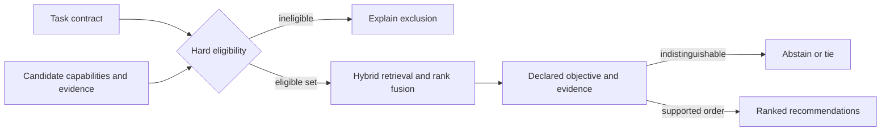

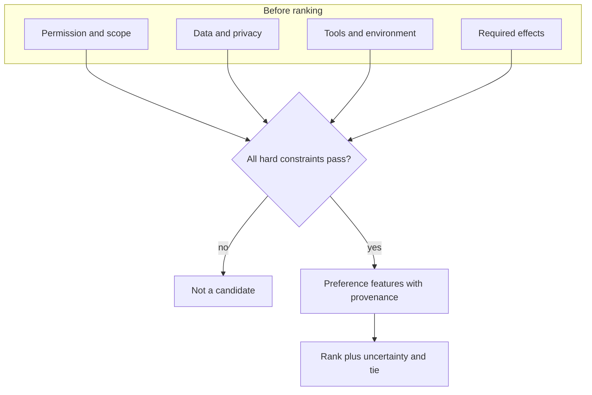

## 2. `dag-confidence-scorer`

**Keep and repair.** Retain factorized evidence observations, weakness reporting, and the useful boundary with validator/hallucination skills. Replace the five hand-scored factors and hand-chosen task weights as “confidence”; remove bias multipliers, `±.05` intervals, sample-count thresholds, conflict penalties, and accept/review/iterate/reject cutoffs. Internal consistency, completeness and reasoning depth may be rubric observations, not probabilities. An explicit uncertainty statement does not make an answer more correct. Calibration, discrimination/ranking accuracy, evidence coverage, and decision policy are different outputs.

**Procedure.** Define a binary event at prediction time, such as “the artifact will pass validator V at version v on input digest d,” plus its resolution source and horizon. A prospective probability forecast can be made before a calibration corpus exists, but label it `uncalibrated` and do not use that numeric forecast as an automatic acceptance threshold. Keep rubric observations and evidence coverage separate. Once comparable outcomes resolve, evaluate proper score (Brier for binary outcomes: `(p-y)^2`; log loss is another choice), reliability and discrimination, with sample uncertainty and cohort/task/model/evaluator versions. If fitting a recalibrator, separate its calibration data from its evaluation data or use an appropriate cross-validation design; account for temporal/deployment shift. No universal sample count guarantees calibration. With no relevant outcome evidence, `unknown` is a valid forecast status. Choose any decision gate from local false-accept/review costs, and keep hard policy gates separate.

**Hand check.** Forecasts `.8,.8,.2`, labels `1,0,0` give Brier losses `.04,.64,.04`, mean `.24`; the two forecasts at `.8` have one success in two cases, with enormous finite-sample uncertainty. Positive: forecast `.7` prospectively and report it as uncalibrated; after outcomes accrue, compare it against suitable independent, version-matched forecasts and labels, show reliability and proper-score uncertainty, and only then evaluate a recalibration/policy. Negative: neither 100 outcomes nor a reliable aggregate bin automatically guarantees subgroup calibration or transport to a shifted deployment population. “Three sources + coherent rationale” is not evidence for `.85`, and must not authorize deployment.

**Existing API/schema.** `schemas/input.json` accepts only required object `output`, `taskType` in analysis/research/creative/code/unknown (default unknown), `historicalAccuracy` 0–1, and `isSafetyCritical`; it cannot identify target event, evaluator/version, prediction time, cohort, outcome horizon, or scoring history. `schemas/output.json` requires numeric `confidence` 0–1 and `recommendation` from accept/review/iterate/reject; it permits factors reasoning/sources/consistency/completeness/uncertainty and weaknesses. Recommended schema change: make `probability` nullable; add `targetEvent`, `predictionTime`, `resolutionRule`, `evidenceCoverage`, `calibrationStatus`, `calibrationModelId`, `cohort`, `n`, `properScore`, and `decisionPolicyId`; no generic recommendation until a validated local decision policy is supplied.

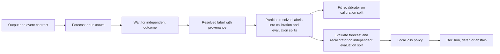

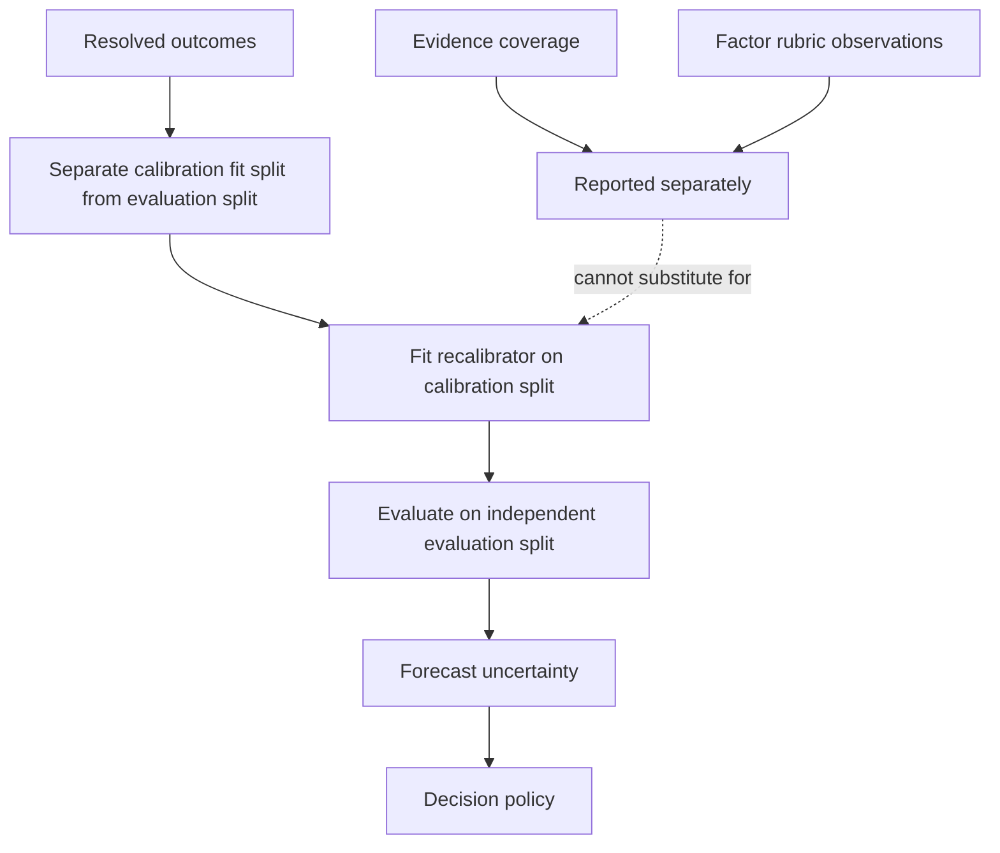

## 3. `dag-context-bridger`

**Keep and repair.** Preserve full/selective/output-only/progressive delivery as choices based on recipient need and capability. Remove token-count tiers, `>0.7` relevance threshold, `>3` dependency duplicate rule, depth-5 forced compression and “break circular context” fallback. Hash identity can detect byte-equal material only; it does not detect semantic duplication. Do not silently drop inherited constraints or use context similarity as authority.

**Procedure.** Build a versioned packet manifest: task/run and graph revision; intended recipient and scope; required facts/constraints; entity IDs plus immutable artifact hashes/URI and schema version; producer/activity provenance; source authority and disclosure labels; freshness/expiry; unresolved questions; omitted-material manifest; token estimate under the receiving model's tokenizer. Filter authority and data class before retrieval; fetch only within allowed scope. Use lexical+dense fusion only under corpus policy and matching `spaceId`; summarize with source pointers and preserve exact constraints, numbers, negative findings, and contradictions verbatim where needed. The receiver acknowledges receipt and reads back critical contract/version/hash. If stale, unauthorized, or contradictory, stop dependent work and request a refreshed packet. The packet is a view, never the source of truth.

**Hand check.** Producer offers approved schema v3 (`sha256:a1`), decision “read-only,” and an open migration question. Receiver fetches v3, verifies digest and scope, acknowledges the read-only constraint, and marks migration unresolved. Negative: producer summary refers to schema v2 while current manifest says v3; do not use last-clean-state, reject packet and fetch source. A 2,000-token budget is no guarantee across model tokenizers.

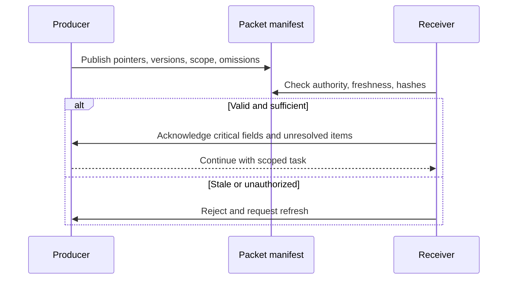

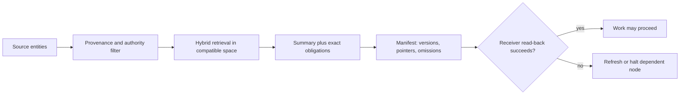

## 4. `dag-convergence-monitor`

**Keep and repair.** Keep target/acceptable quality, budget awareness, trend, plateau, degradation and oscillation as monitoring dimensions. Replace fixed 3-iteration / `.01` variance / `.05` slope rules and median window prescriptions with a declared, locally calibrated stopping policy. Do not assume a noisy quality scalar is commensurate between evaluators. The current “validation failing → continue” row is unsafe when the budget is exhausted or the validation gate is mandatory.

**Procedure.** First label the object: (a) iterative numeric algorithm, (b) replicated state, (c) repeated agent judgment, or (d) DAG execution completion. Define state, distance/objective, admissible update, evaluator/version, budget and termination guarantee for (a); for (b), define messages and merge semantics and only claim eventual/strong eventual convergence if its assumptions hold; for (c), track disagreement and evidence resolution, never vote similarity as proof; for (d), check terminal receipts and blocked/unknown nodes, not iteration convergence. Compare like-for-like scores, preserve per-iteration artifact IDs, quantify measurement noise, detect cycles/repeated states, and stop only when a policy predicate or hard budget/authority gate fires. Return continue, stop, defer, or escalate plus reason.

**Hand check.** A fixed-point process `x[n+1]=(x[n]+2)/2`, start 0: values 1, 1.5, 1.75 approach 2, but a numeric tolerance/iteration count is a chosen policy, not proof of exact equality in finite steps. Negative: two agents repeat “deploy” while the approval receipt is missing; their agreement does not satisfy the decision gate. A bounded execution can be complete while outputs are low quality; convergence doesn't mean acceptable.

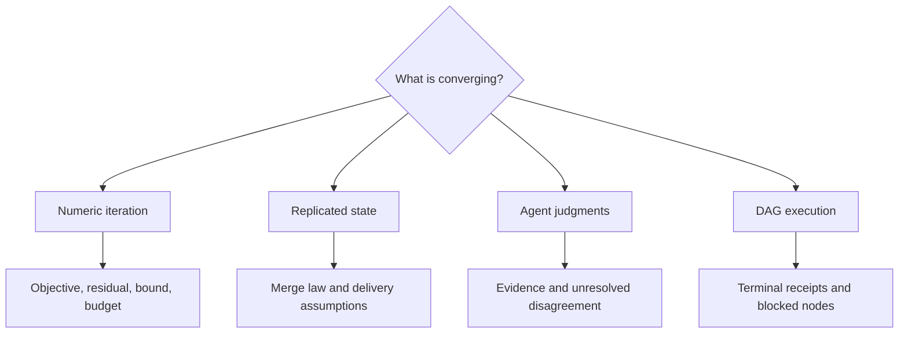

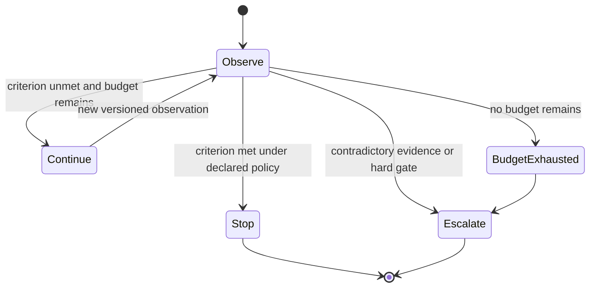

## 5. `dag-cycle-analysis`

**Keep its central method.** This skill is specifically about Vasiliauskaite, Evans & Expert's cycle-basis/orientation method for DAGs. Do not replace that method with SCC diagnosis. Use SCCs only as an input-validity branch if a purported DAG actually contains a directed cycle. The paper models a simple undirected substrate `G` plus pairwise ordering metadata `O`; `F_dir(G,O)` orients each existing edge, while `F_undir(D)` forgets direction. This representation does not mean all undirected cycles are execution defects. It assumes a consistent partial order, simple graph, and no self-loops/multiedges.

**Procedure.** (1) Record what edge direction means and the ordering metadata; validate acyclicity. If cyclic, report SCCs and a directed witness, then stop DAG-specific classification pending domain repair. (2) Choose whether the analytic question concerns original `D` or its transitive reduction `D_TR`; TR preserves reachability/poset but removes shortcut edges and changes the underlying undirected cycle space, so keep both graphs and label which is analyzed. (3) Compute circuit rank `d=E−N+n_c` on the selected undirected graph. Obtain an MCB (minimum total cycle length among cycle-space bases); the paper uses De Pina and a fundamental MCB. Record algorithm/library/version, tie-breaking or seed, and selected cycles. MCB need not be unique; a given implementation/run is one representative, not the canonical set. (4) For each undirected simple cycle, apply the stored edge orientations. Mark each cycle node source (both incident cycle edges outward), sink (both inward), or neutral (one each). Iteratively contract a neutral wedge only when at most one boundary node is a source/sink, preserving non-neutral nodes and source/sink-pair structure. Classify its contracted form by source/sink pairs, their direct/indirect connection, and maximal antichain structure. (5) Report class, cycle witness, contraction, metadata, and interpretation separately. Compare multiple MCB runs or equivalent descriptor distributions when cycle selection can change results. The paper reports measured stability after TR on selected generated graph families, not uniqueness in every DAG.

**Four paper classes with minimal oriented cycle examples.** `A→B→C→A` is *feedback*: all three nodes neutral, zero source/sink pairs; it is a directed-cycle violation and cannot occur in a valid DAG. `S→A, A→T, S→T` is a *shortcut*: one source/sink pair connected by direct edge; it is acyclic but the direct edge is transitively reducible. `S→A→T` and `S→B→T` on underlying cycle `S-A-T-B-S` is a *diamond*: one source/sink pair with indirect alternative paths and contracted non-unitary antichain `{A,B}`; it can remain after TR. For a *mixer*, take the underlying cycle `S1-K1-S2-K2-S1` and orient `S1→K1, S2→K1, S2→K2, S1→K2`: there are two source/sink pairs and source antichain `{S1,S2}` plus sink antichain `{K1,K2}`; it can remain after TR. For longer cycles the paper's edge-wedge contraction maps to these same generalized-cycle classes; “four” refers to that defined class after contraction, not every graph motif taxonomy. In a transitively reduced DAG, feedback is excluded by acyclicity and shortcuts are removed, leaving diamond/mixer cycle images.

**Invariance and limits.** Pairwise orientation of fixed substrate edges is determined by the supplied order; a cycle's generalized orientation can change if that metadata changes. Transitive reduction is unique for a DAG and preserves its reachability order, but it can remove cycle-space generators; it does not preserve the original MCB as a set. The cited paper reports low variability of selected MCB statistics over repeated runs on its generated ER/Price models and notes some reduced-graph cases have a unique MCB; it also explicitly says algorithms are run-dependent and MCB is generally non-unique. So label this a graph-structural descriptor method. The paper's “resilience” and “information mixing” language is an interpretation, not runtime proof of independent failure paths, actual payload fusion, synchronization, or safe coordination.

**Hand check.** On the diamond, `G` has 4 vertices, 4 edges, one connected component, so `d=4−4+1=1`: its sole cycle is in the MCB. Orienting `S-A-T-B-S` produces sources `{S}`, sink `{T}`, neutral `{A,B}`; wedge contraction gives a diamond with intermediate antichain `{A,B}`. On the mixer square, `d=1`; orienting both source vertices outward and both sinks inward gives two source/sink pairs and two non-unitary antichains. Negative: if an apparent MCB cycle yields a directed feedback loop in the source graph, do not reinterpret it as a valid “feedback class” and continue a DAG analysis; the graph violates the DAG premise. Also do not infer that a diamond provides fault tolerance until path failures are independent and outputs/merge semantics are validated.

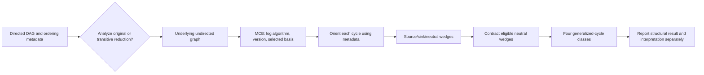

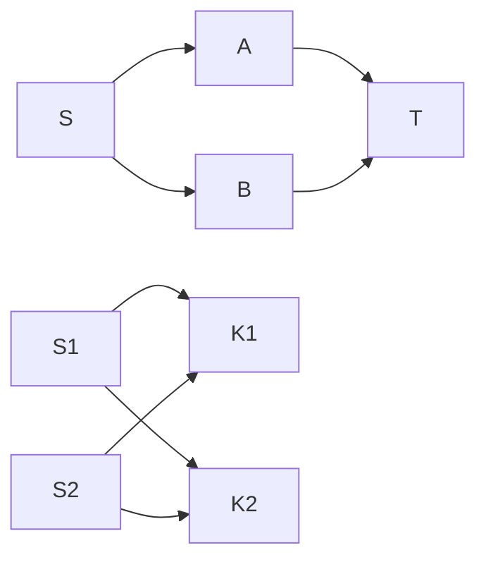

**Cycle example reading guide.** The left four edges in the second sketch (`S→A→T` and `S→B→T`) form a one-source/one-sink diamond; the right four edges form a two-source/two-sink mixer. The paper's cycle basis chooses undirected edge sets first, then maps orientation/metadata. A single MCB may omit some other cycles, so this procedure describes its selected basis and should not be presented as enumerating all cycles.

## 6. `dag-dependency-resolver`

**Keep and repair.** Keep reference integrity, Kahn topological ordering, explicit cycle reporting, and clear handoff to scheduler. Remove graph-size/density algorithm switches, “minimum feedback arc set” as default repair, automatic node merge, buffer insertion, self-edge removal, wave-size (>5) parallelization, critical-path ratio, and automatic serialization. The skill's worked example has a cycle `transform-A↔summarize` and GPU/memory/database resource conflicts; graph resolution must not silently rewrite those. “Optimal execution ordering” is inaccurate: Kahn returns one valid linear extension, not an optimal schedule.

**Procedure.** Validate node IDs, edge endpoints, edge-type schema and edge evidence. Type edges at minimum as artifact/data prerequisite, authority/approval, decision, resource exclusion, or preference/order; only prerequisite-like edges determine DAG readiness, while resources and soft preferences are scheduling constraints. For data edges require exact artifact/version/schema and completion predicate. Run Kahn; for each emitted node, decrement successor indegrees and record ready antichains (the order within a set is arbitrary). If nodes remain, run SCC/witness diagnostics and ask the owner to repair semantics; preserve safety/authority prerequisites. Declare edge direction `producer → consumer`. For a changed producer, traverse a reverse-dependency index from that producer to its downstream consumers (equivalently compute its forward-reachable descendants in the producer→consumer graph) and invalidate only those affected nodes whose declared input/version changed. This is a graph invalidation pass, not a runtime schedule or receipt.

**Hand check.** For `fetch→parse→report` and `lookup→report`, synchronous topological generations are `{fetch,lookup}`, `{parse}`, `{report}`. If using a streaming Kahn queue and emitting `fetch` before `lookup`, `parse` may be enqueued while `lookup` is still ready; that is an implementation queue state, not the same as a generation barrier. A test receipt does not satisfy deploy approval. Negative: adding `report→parse` yields a cycle witness; don't drop it without semantic review.

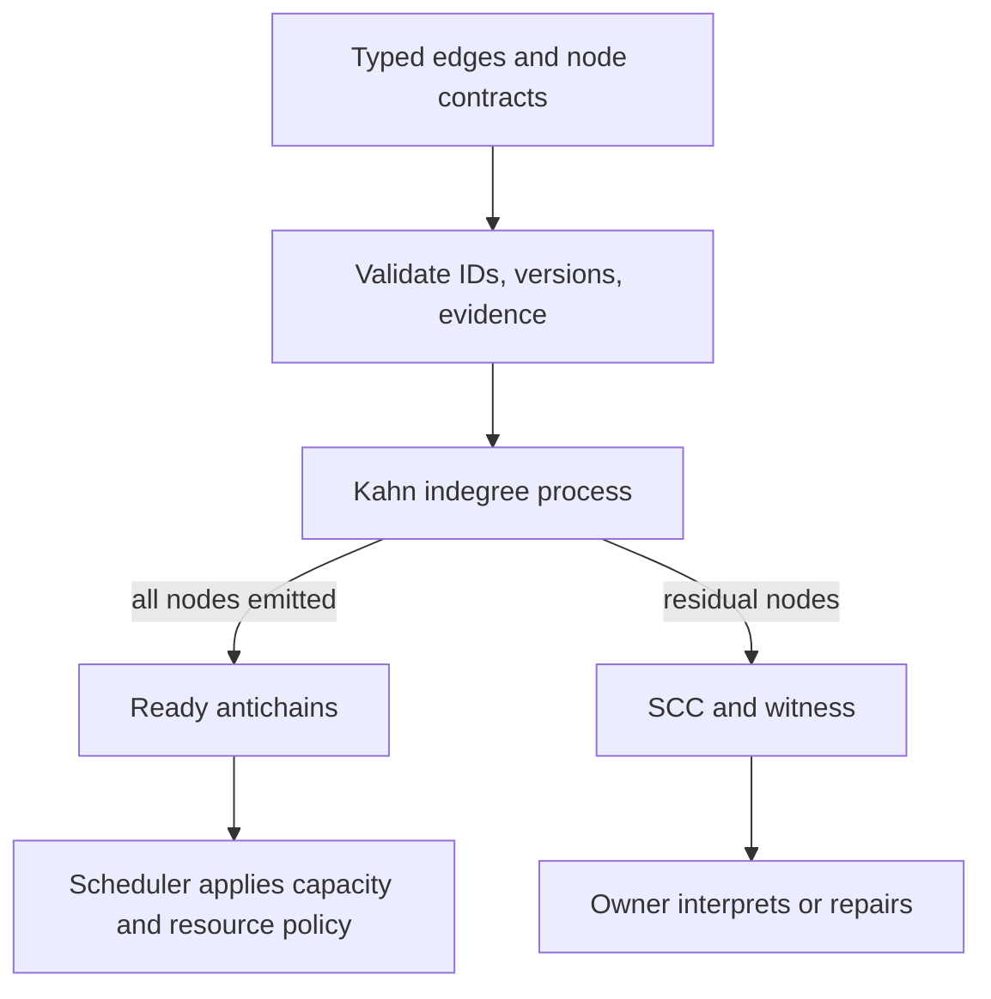

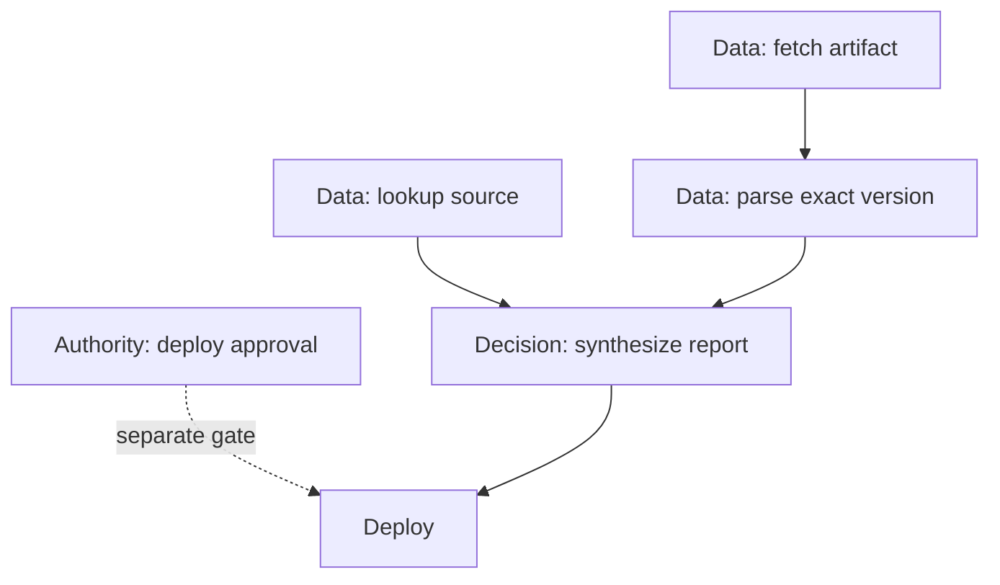

## 7. `dag-execution-tracer`

**Keep and repair.** Keep trace granularity choices, partial traces, retry history, cancellation visibility, and bounded payload capture. Replace fixed 2KB/50KB/200B estimates, DAG/node-count sampling, “every third span,” 2/5/10% overhead thresholds, 50 active trace/10MB caps, and the assertion that span count must equal node count. Model retries and child tool operations as their own spans/attempts. Sampling makes a trace incomplete; state that explicitly. Wall-clock order across machines is not causality; represent causal links and clock source/uncertainty.

**Procedure.** Assign workflow run ID + immutable graph revision; node ID; attempt ID; span/trace IDs; parent or link; event sequence and wall/monotonic clock source; lifecycle state (scheduled, started, yielded, retry, success, fail, cancel-requested, cancellation-confirmed, unknown); input/output digest/schema and redacted evidence pointer; actor/tool/model/config revision; and sampling/export/drop counters. End every span in `finally`; preserve failed attempts and cancellation request vs terminal confirmation. Use parent for nested work; use span links for fan-in/scatter-gather and cross-trace causal relations. Query causal paths and mark gaps; do not infer missing work as success. Measure overhead on representative workloads and choose sampling/retention by local policy.

**Hand check.** Run `r7`, node C attempt 1 times out at 12:04Z. Before any retry, determine whether attempt 1 could have produced an external effect: query its receipt/status or reconcile with the target system. If effect state remains unknown, hold attempt 2 unless the operation has a proven idempotency key/deduplication contract or authorized compensation. Only after that gate does attempt 2 succeed at 12:06Z; aggregator links accepted digest to attempt 2 and retains attempt 1. Negative: sampled span absence cannot prove node skipped or never ran; query the receipt store / report trace gap. A cancellation request with no acknowledgment remains `unknown`, not `cancelled`.

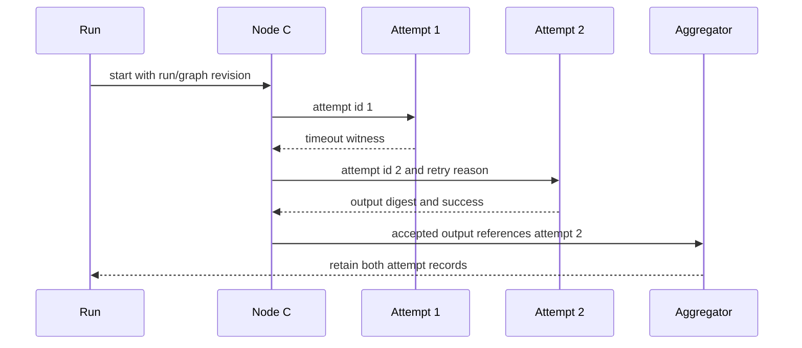

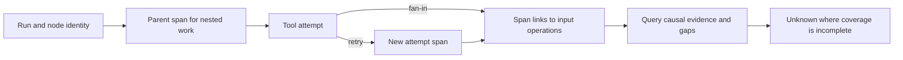

## 8. `dag-failure-analyzer`

**Keep and repair.** Retain severity/impact, propagation, competing failure types, recoverability and remediation. Remove regex as root-cause classifier, timestamp-first “earliest is origin,” arbitrary evidence count ≥3, confidence .6, affected-node buckets 2/3–5/>5, default three retries, and timeout >2× normal. Regex can identify candidate signals but cannot establish cause. Distinguish initiating event, latent condition, barrier/control failure, propagation, symptom, and contributing cause. A retry requires transient evidence, idempotency/deduplication or compensation, safe budget, and operator policy; permission/policy failures are not transient by default.

**Procedure.** Freeze execution revision and incident window. Establish top event precisely and compile an evidence timeline with clock source and confidence; query node dependencies, attempt records, external status, resource metrics, and changes. Build a causal-factor graph with evidence pointer and counterfactual test per edge; maintain competing hypotheses and mark unknowns. Use DAG reachability to distinguish prerequisite propagation from temporal coincidence, but do not infer cause from dependency alone. Identify barrier conditions and whether they operated. Classify action as retry, contain, compensate, roll forward/back, or escalate only when its assumptions and authority are met. Finish with falsifiable corrective actions, owner, and re-observation predicate; unresolved root cause is an acceptable result.

**Hand check.** C times out after queue wait 80s; dependency B completed in 3s; service returns throttling; a config rollout at 12:01 precedes the incident. Hypotheses are rate limit, queue saturation, and rollout regression. Queue metrics and comparison of unaffected workers discriminate; do not declare “resource exhaustion” by regex. Negative: permission denied receives no blind retry even if low affected-node count. Multiple failed descendants may be propagation, not multiple causes.

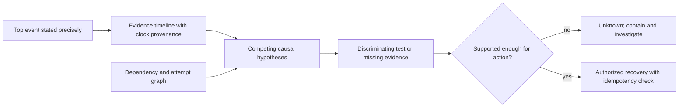

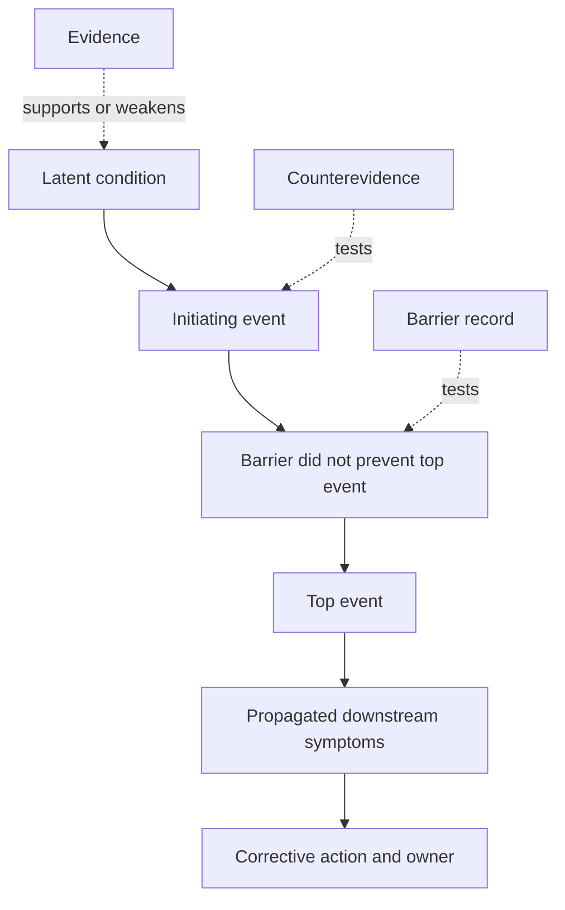

## Small Book idea flags

- A useful exposition might place *readiness*, *ranking*, *forecast*, *convergence*, and *causal diagnosis* on separate semantic layers; no novelty or manuscript presence is claimed.
- A repeated motif could be a “witness packet”: each conclusion accompanied by inputs, assumptions, counterexample, and unknowns. This is a candidate teaching device only.
- No world-first, new theorem, empirical result, or accepted new nomenclature is asserted here.

## Citation crosswalk for the method proposals

- Candidate ranking: [Cormack et al. RRF (SIGIR 2009)](https://cormack.uwaterloo.ca/cormacksigir09-rrf.pdf) demonstrates rank fusion on retrieval tasks. [Bruch, Gai & Ingber (2022)](https://arxiv.org/abs/2210.11934) shows fusion choice and parameter sensitivity vary by benchmark/domain; thus RRF is a locally evaluable method, not a universal optimum.
- Forecasting: [Gneiting & Raftery (2007)](https://stat.uw.edu/research/tech-reports/strictly-proper-scoring-rules-prediction-and-estimation) grounds proper scoring; [Werner et al. (2020)](https://proceedings.mlr.press/v128/werner20a.html) evaluates calibration choices across 33 datasets; [Podkopaev & Ramdas (2021)](https://proceedings.mlr.press/v161/podkopaev21a.html) explicitly studies label shift, which demonstrates calibration guarantees depend on the setting.
- Context and provenance: [W3C PROV-O](https://www.w3.org/TR/prov-o/) defines derivation/usage/generation/agent relations; [Cormack et al.](https://cormack.uwaterloo.ca/cormacksigir09-rrf.pdf) supports only a retrieval-fusion option.
- Convergence: [Jagadeesan & Riely (ESOP 2018)](https://link.springer.com/chapter/10.1007/978-3-319-89884-1_34) separates convergence from validity and defines strong eventual consistency; [Hellerstein & Alvaro (CACM 2020)](https://doi.org/10.1145/3369736) introduces the CALM perspective. They do not equate replicated state convergence with agent agreement.
- Cycle analysis: [Vasiliauskaite, Evans & Expert (Physica A 2022)](https://discovery.ucl.ac.uk/id/eprint/10154887/1/1-s2.0-S0378437122001340-main.pdf) is the specific cycle-basis framework already claimed by this skill; its own results are based on stated network models and MCB statistics, not a universal diagnosis of organizational function. [Tarjan (1972)](https://epubs.siam.org/doi/abs/10.1137/0201010) supports linear-time SCC diagnosis; [NetworkX 3.7 DAG docs](https://networkx.org/documentation/stable/reference/algorithms/dag.html) documents DAG-only topological, antichain, reduction and reachability procedures.
- Dependency resolution: [Bazel Skyframe](https://bazel.googlesource.com/bazel/%2B/3b9ed6e9d3570a0c67e0d59e65b3785bbc1fad99/site/en/reference/skyframe.md) supports incremental reverse-dependency invalidation; [Bazel query docs](https://docs.bazel.build/versions/main/query.html) explicitly warn cycle handling is unspecified and explain graph/order output. These do not establish agent workflow scheduling correctness.
- Execution trace: [OpenTelemetry Trace API](https://opentelemetry.io/docs/specs/otel/trace/api/) describes span context, parent-child and links; [overview](https://opentelemetry.io/docs/specs/otel/overview/) covers scatter/gather links; [CloudEvents v1.0.2](https://github.com/cloudevents/spec/blob/v1.0.2/cloudevents/spec.md) specifies event identity via source+id. These conventions are not an execution receipt or proof of completeness.
- Failure analysis: [NASA Fault Tree Handbook v1.1](https://extapps.ksc.nasa.gov/reliability/Documents/Fault_Tree_Handbook_with_Aerospace_Applications_August_2002.pdf), [NASA RCAT](https://software.nasa.gov/software/LEW-19737-1), and [NASA mishap investigation overview](https://sma.nasa.gov/sma-disciplines/mishap-investigation) ground timelines, event/causal-factor trees, barriers, and structured hypotheses. They are methods for trained investigation, not a regex lookup table.

## Cycle reference triage for authors

The cycle material contains reusable definitions and also code/prose that should not be carried into a revised skill without correction:

- Keep antichain definition by mutual non-reachability, height and stretch as different measurements, the optional MCB plus cycle-overlap metrics, and the paper's four-class scheme only with its exact generalized-cycle/path-wedge-contraction conditions.
- Qualify “nodes in an antichain are parallel”: they are incomparable under this graph's order only. Shared-resource conflicts, hidden data dependencies, external effects, and execution policy still determine whether concurrent execution is safe. Maximal antichains can overlap, so enumerating them as successive barrier waves is not generally a valid schedule.
- Replace `find_maximal_antichains` in `antichains-and-hierarchical-coordinates.md`: the greedy scan can miss maximal antichains and does not enumerate all of them. Transitive closure is also potentially quadratic in representation size; use reachability queries or an algorithm suited to the required output (one maximum antichain, all maximal antichains, or a chain cover are distinct requests).
- Correct the taxonomy statement “all cycles belong to exactly four classes”: this is the paper's defined generalized-cycle classes following path-wedge contraction and use of directed metadata. Do not turn it into a statement about all graph cycles without those definitions. Similarly, a feedback witness is a directed-cycle defect in a claimed DAG; undirected cycles are present in valid DAG substrates and are not themselves errors.
- The MCB reference correctly notes non-uniqueness, then overstates transitive reduction as deterministic/stabilizing. The paper measures variance over repeated MCB algorithm runs and reports low variance for its selected statistics on its generated graph families; it does not generally prove uniqueness or deterministic output. Preserve raw graph + algorithm/version/seed and report metric variance if the MCB selector is nondeterministic.
- Keep the paper’s “fundamental cycle basis” property (no basis cycle edge-set is a subset of another) only where the selected algorithm explicitly returns a fundamental basis, as De Pina does in this paper. It is not the definition of every cycle basis or every MCB; keep the cycle-space/XOR and minimum-total-length definitions distinct.
- Treat named “diamond=resilience,” “mixer=barrier,” and model-family diagnosis as hypotheses for analyst review. Topology alone does not show runtime redundancy, common-cause failure independence, actual information mixing, or a safe coordination primitive. Retain values only as paper-specific structural descriptors until validated against a domain's observed outcomes.
- Replace thresholds in metadata-localization and failure-mode pseudocode (`Ep < .5`, eigenvalue >50, balance <.1, and guessed path-time formulas) with descriptive metric reporting and a local evaluated policy. The paper's ER/Price comparisons do not set portable thresholds for workflow graphs.
