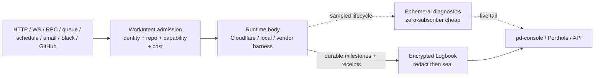

# Cloudflare Agents runtime study (2026)

> **Status:** research input, not shipped architecture.  
> **Roadmap authority:** `research-durable-agents-landscape`.  
> **Source cut:** Port Daddy `a088ab3db`; Cloudflare documentation reviewed
> 2026-08-31.  
> **Scope:** the official Cloudflare Agents and Sandbox documentation, and the
> current Port Daddy surfaces that execute or expose Cloudflare-backed agents.

This study updates, rather than replaces, the earlier
[durable-agents landscape brief](./durable-agents-landscape-2026-07.md). The
earlier brief compared vendors. This one asks a narrower question: which
Cloudflare runtime contracts should inform a provider-neutral Port Daddy agent
runtime, and what does the repository actually ship today?

## Executive conclusion

Cloudflare has assembled several unusually coherent agent-runtime primitives:
durable identities backed by Durable Objects, checkpointed fibers, workflows,
scheduled wakeups, retained subagents, non-destructive conversation compaction,
typed diagnostic channels, stable HTTP/RPC/WebSocket/SSE routing, and isolated
execution through Sandbox. Port Daddy should adopt the *contracts* that make
those primitives useful, not make Cloudflare the authority for agent identity,
plans, memory, authorization, receipts, or history.

The present repository does not use the Cloudflare Agents SDK, Think, Code Mode,
or Agent fibers. `apps/fleet-executor` is a custom queue consumer that invokes
Workers AI directly, has its own retry/circuit/checkpoint machinery, optionally
uses Sandbox SDK, and flushes best-effort transcripts when a ship finishes.
Relay and Steward are also custom Workers/Durable Object applications. That is
not a defect by itself, but it means the recovery, memory, observability, and
identity guarantees described in Cloudflare's Agents documentation do not
accrue to Port Daddy automatically.

The proposed Harbor Agent Runtime therefore has two responsibilities:

1. freeze provider-neutral contracts for identity, work admission, repo and
   resource isolation, plan-and-stash recovery, memory, compaction, approval,
   spend, attribution, all-stop, and receipts; and
2. implement a Cloudflare adapter that uses Think, fibers, Workflows, Queues,
   schedules, Code Mode, and Sandbox only where each primitive earns its cost.

Cloudflare is one backend in that design, not the constitutional agent model.
Codex, Claude Code, agy, Gemini, local/container agents, and future providers
remain first-class adapter targets with the same Agent Harbor contracts and
acceptance suite. The Cloudflare findings below are therefore research inputs
and adapter recommendations, not claims that those capabilities are shipped by
Port Daddy or required of every provider.

Cloudflare tracing and AI Gateway logging remain operational telemetry. They are
not Port Daddy's append-only evidence ledger. Traces are sampled and lossy;
payload logging creates a separate privacy boundary. Durable, encrypted,
redacted milestones belong in Logbook under Port Daddy identity and scope.

## Method and evidence standard

The official [Agents `llms.txt` index](https://developers.cloudflare.com/agents/llms.txt)
was scanned in full. Every page deep-read for this study appears in the evidence
matrix below. The official [Sandbox `llms.txt` index](https://developers.cloudflare.com/sandbox/llms.txt)
was likewise scanned in full, and the relevant security, lifecycle, network,
Git, backup, limit, and code-review pages were deep-read. Cloudflare claims cite
only Cloudflare's current primary documentation. Product claims were checked
against the source cut named above; a source file proves source state, not
deployment state.

Evidence is classified as:

- **documented platform contract**: Cloudflare documents the behavior;
- **current source truth**: the Port Daddy source cut contains the behavior;
- **runtime proof absent**: this study did not deploy or exercise that behavior;
- **proposal**: a requirement for later implementation, not a shipped claim.

## Official Cloudflare evidence matrix

### Foundations, identity, state, and memory

| Official page reviewed | Documented contract | Port Daddy applicability | Decision |
| --- | --- | --- | --- |
| [Agents overview](https://developers.cloudflare.com/agents/) | Agent identity and state are hosted on Durable Objects and can hibernate between events. | A durable `AgentNode` must survive any one runtime body. | Adapt through a provider adapter. |
| [What are agents?](https://developers.cloudflare.com/agents/concepts/what-are-agents/) | An agent is a long-lived identity, not an always-running process. | Aligns with Port Daddy's person/body split and durable roster. | Adopt as an invariant. |
| [Agentic patterns](https://developers.cloudflare.com/agents/concepts/agentic-patterns/) | Agents combine state, schedules, tools, communication, and autonomous or interactive execution. | Useful capability taxonomy, not an authority model. | Adapt. |
| [Human-in-the-loop patterns](https://developers.cloudflare.com/agents/concepts/agentic-patterns/human-in-the-loop/) | Cloudflare documents three distinct durable approval mechanisms: Workflow events, Code Mode approvals, and MCP elicitation. | Port Daddy needs one provider-neutral proposal/decision receipt across all three mechanisms. | Adopt the pause patterns; unify the authority contract. |
| [Long-running agents](https://developers.cloudflare.com/agents/concepts/agentic-patterns/long-running-agents/) | Recovery can replay history, use a persisted continuation summary, or resume from a structured plan; wake sources include HTTP, WebSocket, RPC, schedules, email, and external events. | Plan plus stash is the preferred Port Daddy recovery input; wake adapters need one authorization gate. | Adopt the recovery hierarchy and wake taxonomy. |
| [Conversation state and memory](https://developers.cloudflare.com/agents/concepts/conversation-state-and-memory/) | Messages remain in SQLite; macro-compaction uses overlays and preserves originals; boundaries avoid splitting tool call/result pairs; short-term context is writable and searchable context is separately retrievable. | Directly informs Squid compaction, Logbook audit, and hybrid long-term retrieval. | Adopt non-destructive overlays; extend search with scoped hybrid retrieval. |
| [Think overview](https://developers.cloudflare.com/agents/harnesses/think/) | Think provides a complete agent harness with turns, context, tools, channels, recovery, and lifecycle hooks. | A Cloudflare body can use Think while Agent Harbor remains authoritative. | Pilot as one adapter, not the universal runtime. |
| [Think configuration](https://developers.cloudflare.com/agents/harnesses/think/configuration/) | Models, context, memory, compaction, tools, and execution behavior are configurable. | Configuration must be derived from signed `WorkIntent` and policy, not mutable ambient settings. | Adapt behind a validated adapter config. |
| [Think lifecycle hooks](https://developers.cloudflare.com/agents/harnesses/think/lifecycle-hooks/) | Hooks expose turn and lifecycle boundaries. | Emit standardized diagnostics and Logbook milestones at those boundaries. | Adopt with payload minimization. |
| [Think recovery](https://developers.cloudflare.com/agents/harnesses/think/recovery/) | `runTurn` and fibers can recover from stalls and context overflow; plan/stash state supports focused reconstruction. | Replaces ad hoc transcript replay as the default recovery strategy. | Adopt, with Port Daddy receipts and explicit retry policy. |
| [Think scheduled tasks](https://developers.cloudflare.com/agents/harnesses/think/scheduled-tasks/) | Agent work can wake from schedules. | One of several ingress adapters; schedules need idempotency and budget policy. | Adapt. |
| [Think workflows](https://developers.cloudflare.com/agents/harnesses/think/workflows/) | Think can delegate long durable procedures to Workflows. | Good fit for multi-step approved work and delayed external results. | Adopt selectively. |
| [Think sub-agents](https://developers.cloudflare.com/agents/harnesses/think/sub-agents/) | Facets retain subagent identity/state rather than treating every delegation as disposable. | Maps to retained Port Daddy agents and explicit parent/child lineage. | Adapt; never infer authority from parentage. |
| [Think programmatic submissions](https://developers.cloudflare.com/agents/harnesses/think/programmatic-submissions/) | Work can be submitted outside an interactive chat turn. | Needed for GitHub, queue, webhook, email, and schedule wakes. | Adopt through `WorkIntent` admission. |
| [Think actions](https://developers.cloudflare.com/agents/harnesses/think/actions/) | Actions can pause for durable approval; authorization is opt-in and otherwise broadly granted. | The durable pause is useful; the default authority posture is not. | Adopt pause/resume, replace authorization with fail-closed capabilities. |
| [Think tools](https://developers.cloudflare.com/agents/harnesses/think/tools/) | Tools can be server, client, or approval-bearing operations. | Port Daddy needs tool provenance, capability binding, cost, and receipt semantics around each class. | Adapt. |
| [Think client tools](https://developers.cloudflare.com/agents/harnesses/think/client-tools/) | A turn can request execution in a connected client. | Useful for pd-console, Porthole, IDE, browser, and device-local affordances. | Adopt only with recent attributable operator authorization. |
| [Think channels](https://developers.cloudflare.com/agents/harnesses/think/channels/) | Channels normalize communication transports. | Maps to Tube/Relay adapters, but channel delivery is not work authority. | Adapt. |
| [Think messengers](https://developers.cloudflare.com/agents/harnesses/think/messengers/) | Messenger adapters translate platform messages and responses. | Useful for Slack/email/chat; raw external content remains untrusted input. | Adapt behind ingress verification. |

### Durable execution and lifecycle

| Official page reviewed | Documented contract | Port Daddy applicability | Decision |
| --- | --- | --- | --- |
| [Durable execution](https://developers.cloudflare.com/agents/runtime/execution/durable-execution/) | `runFiber` keeps work alive, stores a synchronous stash in SQLite, and invokes recovery after restart; the original closure is not replayed. `startFiber` provides durable admission, status, idempotency, and cancellation. | This is the right execution boundary for one resumable agent turn, provided the stash references a durable plan and receipt. | Adopt in the Cloudflare adapter. |
| [Retries](https://developers.cloudflare.com/agents/runtime/execution/retries/) | Fiber recovery is distinct from automatic retry; retry policy must be explicit. | Prevents hidden duplicate side effects and unbounded spend. | Adopt explicit, classified retry budgets. |
| [Queue tasks](https://developers.cloudflare.com/agents/runtime/execution/queue-tasks/) | Agent queues are sequential FIFO and durable, without priority scheduling. | Useful for per-agent serialization, insufficient for fleet priority or global scheduling. | Use only inside an address; keep fleet admission outside it. |
| [Run workflows](https://developers.cloudflare.com/agents/runtime/execution/run-workflows/) | Workflows provide durable multi-step execution and can wait on external events. | Use for hours-to-months procedures, approvals, and compensating steps. | Adopt selectively. |
| [Schedule tasks](https://developers.cloudflare.com/agents/runtime/execution/schedule-tasks/) | Scheduled callbacks are at-least-once and must be idempotent; missed occurrences are not backfilled. | Every scheduled wake needs an occurrence key, deadline, and explicit catch-up policy. | Adapt with stronger admission metadata. |
| [Sub-agents](https://developers.cloudflare.com/agents/runtime/execution/sub-agents/) | Agent-to-agent calls can retain addressable child state. | Supports stable specialist identities and resumable delegations. | Adapt to `AgentAddress` and `AgentNode` lineage. |
| [Agent tools](https://developers.cloudflare.com/agents/runtime/execution/agent-tools/) | An agent may expose methods as tools to another agent. | Useful only when capabilities and repo scope are independently checked. | Adapt; an address is never authorization. |
| [Agent skills](https://developers.cloudflare.com/agents/runtime/execution/agent-skills/) | Skills can supply reusable instructions and resources. | Skills need provenance, version, license, scope, and non-authoritative semantics. | Adapt through the existing skill layer. |
| [Agents API](https://developers.cloudflare.com/agents/runtime/agents-api/) | Base classes expose state, SQL, scheduling, routing, and lifecycle primitives. | One provider implementation of the runtime port. | Do not leak these types into provider-neutral schemas. |
| [Workflows concepts](https://developers.cloudflare.com/agents/concepts/workflows/) | Workflows separate durable orchestration from conversational turns. | Clarifies the boundary between an agent identity and a long procedure it starts. | Adopt the separation. |
| [Tools concepts](https://developers.cloudflare.com/agents/concepts/tools/) | Tools may execute on the server, client, or remote MCP boundary and can create external effects. | Each boundary needs distinct provenance, capability, approval, and receipt policy. | Adapt. |
| [Sessions](https://developers.cloudflare.com/agents/runtime/lifecycle/sessions/) | Sessions retain tree-structured messages, context blocks, overlays, and search in persistent storage. | Useful source model for branchable, auditable conversation history. | Adopt the semantics, not the provider schema. |
| [Store and sync state](https://developers.cloudflare.com/agents/runtime/lifecycle/state/) | Durable Object state survives hibernation while ordinary in-memory variables, timers, and promises do not. | Any recovery-critical Port Daddy state must be committed before yielding. | Adopt as a cross-backend invariant. |

### Routing, realtime communication, and ingress

| Official page reviewed | Documented contract | Port Daddy applicability | Decision |
| --- | --- | --- | --- |
| [Agent routing](https://developers.cloudflare.com/agents/runtime/communication/routing/) | Instances have stable routes of the form `/agents/:class/:name`. | Inspire readable Harbor URLs containing account, harbor, and agent slugs. | Adapt; use opaque IDs underneath and prevent enumeration. |
| [HTTP and SSE](https://developers.cloudflare.com/agents/runtime/communication/http-sse/) | Agent endpoints can serve HTTP and stream events over SSE. | Enables read-only tails, programmatic submissions, and pd-console streams. | Adopt with signed short-lived grants. |
| [WebSockets](https://developers.cloudflare.com/agents/runtime/communication/websockets/) | Connections can hibernate and resume, while ordinary variables/timers/promises are not preserved. | Good for interactive turns and presence, not durable evidence. | Adopt as a hot transport only. |
| [Read-only connections](https://developers.cloudflare.com/agents/runtime/communication/readonly-connections/) | Read-only mode prevents state synchronization, not arbitrary earlier side effects. | A Port Daddy observer grant must be enforced at every command/tool boundary. | Do not treat this flag as authorization. |
| [Cross-domain auth](https://developers.cloudflare.com/agents/runtime/operations/cross-domain-authentication/) | Cross-origin clients can carry signed access tokens when connecting. | Required for console/web clients, but query-string bearer tokens leak. | Use headers or secure cookies; forbid bearer tokens in URLs. |
| [Chat client SDK](https://developers.cloudflare.com/agents/communication-channels/chat/client-sdk/) | Browser and server clients can connect to addressable agents through common client primitives. | Define one verified ingress envelope for web and server adapters. | Adapt. |
| [Chat agents](https://developers.cloudflare.com/agents/communication-channels/chat/chat-agents/) | Chat agents stream turns and retain conversation state. | One presentation over the same agent/work/receipt model. | Adapt. |
| [Autonomous responses](https://developers.cloudflare.com/agents/communication-channels/chat/autonomous-responses/) | Agents can respond without a currently open user session. | Requires stronger trigger policy, spend caps, and visible attribution. | Adopt only after admission gates. |
| [Email](https://developers.cloudflare.com/agents/communication-channels/email/) | Email can route to a durable agent identity and preserve reply context. | Useful ingress/outbound adapter; sender and body must be independently authenticated/classified. | Adapt. |
| [Slack](https://developers.cloudflare.com/agents/communication-channels/slack/) | Slack events and messages can wake and interact with agents. | Enables team Parleys and approvals with mapped human identity. | Adapt after signature and membership verification. |
| [Voice](https://developers.cloudflare.com/agents/communication-channels/voice/) | Voice sessions can stream, interrupt generation, and persist transcripts. | Relevant to embodied cooperative sessions; recording consent and redaction remain separate grants. | Defer to the Porthole/privacy lane. |
| [Webhooks](https://developers.cloudflare.com/agents/communication-channels/webhooks/) | Raw bodies should be signature-verified before parsing and routed from authenticated payload data. | Every webhook needs signature, timestamp/replay defense, source-derived address, and idempotency key. | Adopt as a universal ingress rule. |
| [Browser agent example](https://developers.cloudflare.com/agents/examples/browser-agent/) | The example composes an Agent with Browser Run tools for page inspection, screenshots, and scraping. | It is not a substitute for Porthole or a durable app/browser body. | Experiment only; do not base core browser control on it. |

### Diagnostics, tracing, and observability

| Official page reviewed | Documented contract | Port Daddy applicability | Decision |
| --- | --- | --- | --- |
| [Diagnostic channels](https://developers.cloudflare.com/agents/runtime/operations/observability/diagnostics-channels/) | Lifecycle events use named channels and structured `{type, agent, name, payload, timestamp}` envelopes; tail Workers avoid hot-path writes when nobody is listening. | Ideal ephemeral debug plane and naming convention. | Adopt namespaced structured diagnostics. |
| [Tracing](https://developers.cloudflare.com/agents/runtime/operations/observability/tracing/) | Agent/AI SDK tracing is sampled and payload-limited; Think and AI SDK wrappers have different instrumentation paths. | Useful for latency, model/tool spans, tokens, and operational debugging, but not a complete transcript. | Enable everywhere with payloads off; never call it the ledger. |
| [AI Gateway logging](https://developers.cloudflare.com/ai-gateway/observability/logging/) | Gateway logging can retain request/response payloads; logging can be disabled, and `cf-aig-collect-log-payload:false` retains metadata without payload bodies. | Metadata supports cost/provider diagnosis; payloads duplicate sensitive content. | Default to metadata-only and record policy in receipts. |

### Code Mode

| Official page reviewed | Documented contract | Port Daddy applicability | Decision |
| --- | --- | --- | --- |
| [Code Mode overview](https://developers.cloudflare.com/agents/tools/codemode/) | Experimental Code Mode lets a model write a program over typed tools and runs it in an isolated interpreter. | Promising for bounded tool orchestration and fewer model round trips; experimental status forbids making it the only path. | Pilot behind capability and budget gates. |
| [How Code Mode works](https://developers.cloudflare.com/agents/tools/codemode/how-it-works/) | Generated programs cannot access Node APIs, host credentials, `process`, `require`, or unrestricted network; external effects flow through connectors. | Stronger than executing arbitrary generated shell in a Worker, but connectors remain the side-effect boundary. | Adopt the connector boundary. |
| [Durable Code Mode](https://developers.cloudflare.com/agents/tools/codemode/durable-runtime/) | Durable executions log calls, approvals, replay, rollback, and snippets; approval resumes by deterministic replay. | Good for an approved tool plan, provided every effect is idempotent and separately receipted. | Pilot for typed API tools, not repository coding. |
| [Code Mode with AI SDK](https://developers.cloudflare.com/agents/tools/codemode/ai-sdk/) | Code Mode can be exposed as an AI SDK tool. | Useful adapter path for Think/AI SDK models. | Defer until the runtime contract lands. |
| [Code Mode with MCP](https://developers.cloudflare.com/agents/tools/codemode/mcp/) | MCP tools can become typed connectors. | Attractive for reducing repeated model/tool turns; MCP server authority must not be widened. | Pilot only with an allowlisted generated tool set. |
| [Code Mode with OpenAPI](https://developers.cloudflare.com/agents/tools/codemode/openapi/) | OpenAPI operations can become connectors. | Useful for common dev-service plugins and receipts. | Adopt only from pinned, reviewed schemas. |
| [Code Mode browser tools](https://developers.cloudflare.com/agents/tools/codemode/browser/) | Browser tools can be called from Code Mode, but approval tools are excluded and tight synchronous loops cannot be interrupted. | Insufficient for cooperative embodied control or fine-grained HITL. | Do not use as the Porthole control plane. |

### Sandbox

| Official page reviewed | Documented contract | Port Daddy applicability | Decision |
| --- | --- | --- | --- |
| [Sandbox overview](https://developers.cloudflare.com/sandbox/) | Sandbox SDK runs commands and processes in isolated containers. | Appropriate for untrusted build/test execution after admission. | Adopt as one execution body. |
| [Sandbox security](https://developers.cloudflare.com/sandbox/concepts/security/) | Different sandboxes receive VM isolation; processes inside one sandbox share filesystem, process, and network namespaces. | One sandbox per work intent/repo boundary; do not co-tenant hostile jobs. | Adopt the isolation boundary. |
| [Sandbox lifecycle](https://developers.cloudflare.com/sandbox/concepts/sandboxes/) | Sandbox state disappears after sleep/restart unless explicitly backed up; stable SDK defaults to an idle sleep window. | A sandbox is an ephemeral body, never durable agent memory. | Adopt; externalize plan, stash, artifacts, and receipts. |
| [Outbound traffic](https://developers.cloudflare.com/sandbox/guides/outbound-traffic/) | Internet can be disabled or restricted by allowed hosts; outbound handlers can inject credentials outside the sandbox. | Default deny egress and keep credentials outside generated code and filesystem. | Adopt as mandatory policy. |
| [Git workflows](https://developers.cloudflare.com/sandbox/guides/git-workflows/) | Sandboxes can clone and modify repositories; documentation recommends outbound handlers for safer credential injection. | Use short-lived GitHub App capabilities and explicit repo binding, never a long-lived token in a clone URL. | Adapt. |
| [Backup and restore](https://developers.cloudflare.com/sandbox/guides/backup-restore/) | R2 backups use copy-on-write images and must be restored again after a restart. | Useful for large build caches/artifacts, not authoritative work state. | Optional optimization with lifecycle cleanup. |
| [Sandbox limits](https://developers.cloudflare.com/sandbox/platform/limits/) | Subrequests, resources, and transport impose bounded limits. | Admission must select resources, timeout, and cost before launch. | Encode in `WorkIntent` and receipts. |
| [Code-review bot tutorial](https://developers.cloudflare.com/sandbox/tutorials/code-review-bot/) | Demonstrates cloned-repo analysis in a sandbox. | A starting example, not enough for write-capable Port Daddy ships, provenance, or repo firewalls. | Use only as implementation reference. |

## Current Port Daddy truth

### Runtime inventory

| Surface | Current source truth at `a088ab3db` | Cloudflare contract actually in use | Proposed destination |
| --- | --- | --- | --- |
| Fleet Executor | Custom Worker queue consumer. Direct `env.AI.run`, custom deadlines/circuit/retry, D1 checkpoints, R2 transcript objects, optional Sandbox. | Workers AI, Queues, D1, R2, AI Gateway option, Sandbox SDK `^0.12.4`. No Agents SDK, Think, fibers, Workflows, or Code Mode dependency. | Cloudflare Harbor Runtime adapter with durable address, plan/stash fiber boundary, policy-selected Workflow/Queue/Schedule, metadata-only Gateway logs, tracing, and sealed Logbook milestones. |
| Built-in cloud reviewers | `code-reviewer`, `qa`, `red-team`, and `copy-pm` are fallback review ships in `apps/fleet-executor/src/fleet.ts`; configured ships may replace/extend them. | Stateless prompt execution per delivery with custom checkpoints. | Each run is a `WorkIntent`; each ship execution has a stable `AgentAddress`, parent run, scoped capabilities, spend sub-budget, transcript join keys, and signed receipt. |
| Ideation and Purser paths | Fleet config derives ideation/Purser roles and model pins; Purser performs multi-step planning/steelman/author/repair calls. | Direct Workers AI plus custom admission, transcript capture, and resilience. | Think/fiber candidate because plan/stash recovery and approval are valuable; do not convert until equivalence tests prove no lost gates. |
| Execution ships | `needsExecution` ships invoke Sandbox-backed analysis/tests when the binding and policy permit. | Sandbox SDK plus custom executor. | One sandbox per work intent, default-deny egress, credential-blind filesystem, external credential broker, bounded resources, signed artifact manifest, guaranteed cleanup. |
| GitHub App Fleet | GitHub App installation tokens publish under one bot identity; `post-as.ts` frames a ship voice in comment content. | GitHub API, not Cloudflare Agents. | Bot remains transport identity; a non-forgeable attribution footer links agent node, work intent/run, roadmap item, repo/head, and public-safe trace/evidence view. |
| Relay AI surfaces | Relay invokes Workers AI for chat, mediation, shipwright, suggestions, and fleet-control helpers. | Workers AI, Durable Objects/D1/KV/R2/Queues, custom routes. | Address every durable role; admit all mutations through the same capability/receipt boundary; keep conversational state separate from authoritative plans. |
| Steward | Deterministic per-repo Durable Object (`steward:owner/repo`), alarm-driven inbox drain, D1 deck log with bounded DO fallback. | Durable Objects, alarms, D1. No Agents SDK/Think. | Preserve per-repo identity but conform to `AgentAddress`, plan/stash, repo firewall, all-stop, signed receipts, and Logbook. Replace shared operator bearer control with scoped operator socket/session authorization. |
| Local roster and harnesses | Agent Harbor schemas define `AgentNode`, `AgentRun`, `WorkReceipt`, context/compaction/memory objects; local backends have their own continuation mechanisms. | No Cloudflare runtime requirement. | Same provider-neutral contract and acceptance suite as the Cloudflare adapter. Cloudflare types must not become the schema. |
| pd-console Cloud Fleet pane | Reads remote health/activity/run detail, live durable transcript, per-session token/cost fields, and local HITL proposals. | Relay HTTP; current pane is mainly read/approve UI. | Add unified timeline, plan/stash/recovery state, diagnostics tail, encrypted Logbook evidence, approval consequence preview, intervention, per-agent all-stop, and attribution links. |

### What is already strong

- Agent Harbor already has provider-neutral schemas for durable node identity,
  runs, work receipts, context envelopes, compaction packets, and memory episodes.
  The proposal should extend those schemas rather than create a parallel
  Cloudflare-shaped control plane.
- Fleet Executor already has bounded deadlines, full-jitter retry, a run circuit,
  head/binding invalidation, D1 step checkpoints, cost tracking, and GitHub
  publication gates. Replacing custom execution without behavioral equivalence
  would be a regression.
- `lib/resource-scope.ts` and repository mapping code express a fail-closed
  direction. The historical global-fanout warning in
  `lib/github-repo-registry.ts` is evidence that hostile cross-repo tests are
  mandatory, not that isolation is complete.
- `core/pd-console/src/cloud_fleet_pane.rs` already reads live run detail,
  transcript ledger rows, raw JSONL turns, token/cost fields, and HITL proposals.
  It is a credible operator destination for the unified runtime, not a blank
  slate.
- Cost accrual and transcript/archive/search modules already exist locally.
  Their route-by-route wiring, durable cloud replication, encryption, and scope
  enforcement still need runtime proof.

### Material gaps

1. **No shared durable execution contract.** Queue retry and D1 step checkpoints
   recover completed slices, but there is no provider-neutral plan-and-stash
   turn boundary shared by Cloudflare, Codex, Claude, Antigravity, and local
   agents.
2. **Transcripts flush too late.** Fleet's capture buffer is in isolate memory
   and flushes best-effort after a ship concludes. An isolate loss can erase the
   most interesting unfinished work. The archive is not yet an append-only,
   pre-seal-redacted encrypted event stream.
3. **Diagnostics are not durable evidence.** Squid event chain state in Fleet
   Executor is process memory; the payload field is base64, not end-to-end
   encryption. Fire-and-forget delivery cannot establish an audit history.
4. **Observability is incomplete.** Fleet Executor and Relay enable Workers
   observability but their deploy manifests do not enable trace collection;
   Steward has no equivalent observability section. AI Gateway payload policy is
   not made explicit at every inference call.
5. **Repo scoping is uneven.** Some stores and routes are project-aware, but no
   evidence proves every read/write/search/message/lock/attention/roster/cost/
   transcript path rejects a cross-repo identifier.
6. **Attribution is presentational.** GitHub comments can name a ship, but do not
   carry a verifiable agent/run/context signature or a public-safe evidence link.
7. **`matrix.env` remains live.** Hooks, Squid identity, Ink Cloud, prompts,
   skills, and tests still reference it. A proposal already calls for its
   removal; it has not been exhaustively supplanted.

## Adopt, adapt, or decline

| Cloudflare idea | Decision | Reason |
| --- | --- | --- |
| Durable identity per address | **Adopt** | Matches `AgentNode`; gives every wake one stable target. |
| Fibers for resumable turns | **Adopt in adapter** | Plan/stash recovery and durable admission fit agent turns. No hidden retry. |
| Workflows for every call | **Decline** | Too heavy for one bounded inference/tool turn; reserve for multi-step or long waits. |
| Per-agent FIFO queue | **Adapt** | Good serialization primitive, but fleet priorities/budgets require an outer scheduler. |
| Scheduled wakeups | **Adapt** | At-least-once needs occurrence IDs, deadlines, catch-up policy, and spend admission. |
| Think as the universal Port Daddy harness | **Decline** | Cloudflare-specific and incomplete for local/native/mobile bodies. Use it as one adapter. |
| Think memory/compaction | **Adopt the semantics** | Writable short memory, searchable long memory, and non-destructive overlays are provider-neutral needs. |
| Think authorization defaults | **Decline** | Port Daddy must fail closed and bind a recent human or delegated capability. |
| Stable route per agent | **Adopt the product shape** | Human-readable, debuggable, and easy to integrate; protect with opaque IDs and auth. |
| WebSocket/SSE history | **Adapt** | Hot transport only. Append-only evidence must be separately persisted and sealed. |
| Diagnostic channels | **Adopt** | Structured, obvious lifecycle names with zero-subscriber cheapness are ideal for ephemeral debugging. |
| Cloudflare traces as transcript | **Decline** | Sampling, truncation, and payload policy make traces non-authoritative. |
| AI Gateway payload logging | **Decline by default** | Metadata is enough for cost/latency; content duplicates sensitive data. |
| Durable Code Mode | **Pilot** | Strong typed connector/replay model; experimental, non-transactional, and unsuitable for arbitrary repository coding. |
| Code Mode rollback | **Treat as compensation** | Rejection does not undo earlier effects; connector reversals must be explicit and receipted. |
| Sandbox as durable memory | **Decline** | Lifecycle is ephemeral. Durable state belongs outside the sandbox. |
| Sandbox as untrusted execution body | **Adopt** | VM isolation, egress control, and credential brokerage fit build/test agents. |
| Browser Agent as Porthole | **Decline** | Fresh beta sessions and browser-only scope do not provide cooperative arbitrary-GUI presence or evidence. |

## Privacy and security conclusions

- Treat Cloudflare traces as lossy operational signals. Payload capture remains
  off. A trace ID may be referenced from a receipt, but it cannot prove the
  complete conversation or action history.
- Set AI Gateway to metadata-only collection (`cf-aig-collect-log-payload:false`)
  for every model call unless a separately named, time-bounded, user-visible
  diagnostic grant permits payload capture.
- Redact before encryption and sealing. Encryption does not make retained
  secrets safe; it only narrows who can read them. ADR-0124's fail-closed
  redaction state remains the egress gate.
- Never place GitHub, Relay, model, or cloud credentials inside a Sandbox. Inject
  narrowly scoped outbound credentials in the network broker and bind them to
  host, method, repo, work intent, expiry, and spend.
- Do not expose operator control with a long-lived bearer query token. Local
  operator control should use the authenticated Port Daddy socket/session;
  remote control should use short-lived signed grants with recent step-up.
- Stable readable agent URLs must not make account/harbor/agent enumeration a
  data disclosure. The readable route resolves to an opaque address only after
  authorization.
- External chat/email/Slack/webhook payloads are untrusted content even when the
  transport signature is valid. Transport authenticity does not grant tool or
  plan authority.
- Every data product carries account, harbor, project/repo, agent node, work
  intent, run, key epoch, redaction state, retention class, and provenance. A
  missing scope field fails closed; it never falls back to a user-global row.

## Architectural implication

The detailed contract and implementation DAG live in
[Harbor Agent Runtime](../proposals/harbor-agent-runtime.md). Its central split is:

Diagnostics answer “what appears to be happening now?” Logbook answers “what
was authorized, attempted, observed, and completed?” Neither Cloudflare traces
nor an agent's mutable conversation state can answer both questions.

## Source audit map

These paths were inspected for the current-truth findings above:

- `apps/fleet-executor/package.json`
- `apps/fleet-executor/wrangler.deploy.toml`
- `apps/fleet-executor/src/index.ts`
- `apps/fleet-executor/src/ai-resilience.ts`
- `apps/fleet-executor/src/fleet.ts`
- `apps/fleet-executor/src/purser.ts`
- `apps/fleet-executor/src/execute.ts`
- `apps/fleet-executor/src/ship-checkpoint.ts`
- `apps/fleet-executor/src/transcript-capture.ts`
- `apps/fleet-executor/src/squid-events.ts`
- `apps/fleet-executor/src/spend.ts`
- `apps/github-app-fleet/lib/auth.ts`
- `apps/github-app-fleet/lib/post-as.ts`
- `apps/relay/wrangler.deploy.toml`
- `apps/relay/src/chat-engine.ts`
- `apps/relay/src/fleet-control.ts`
- `apps/relay/src/harbor-channel.ts`
- `apps/relay/src/mediator.ts`
- `apps/relay/src/snipe-chat.ts`
- `apps/relay/src/shipwright.ts`
- `apps/steward/wrangler.deploy.toml`
- `apps/steward/src/worker.ts`
- `apps/steward/src/steward.ts`
- `core/pd-console/src/cloud_fleet_pane.rs`
- `lib/agent-harbor/cost-accrual.ts`
- `lib/agent-harbor/transcript-search.ts`
- `lib/coordination-session-scope.ts`
- `lib/github-repo-registry.ts`
- `lib/resource-scope.ts`
- `lib/squid/identity.ts`
- `lib/squid/matrix.ts`
- `lib/transcript-archive.ts`
- `lib/transcript-store.ts`
- `lib/transcripts.ts`
- `schemas/agent-harbor/v0/agent-node.schema.json`
- `schemas/agent-harbor/v0/agent-run.schema.json`
- `schemas/agent-harbor/v0/compaction-packet.schema.json`
- `schemas/agent-harbor/v0/context-envelope.schema.json`
- `schemas/agent-harbor/v0/memory-episode.schema.json`
- `schemas/agent-harbor/v0/work-receipt.schema.json`

## Research limitations

- This was a source and documentation audit, not a deployment verification. It
  does not prove which Worker versions, bindings, secrets, observability flags,
  or AI Gateway settings are live.
- Cloudflare Agents, Think, Code Mode, and the Sandbox preview surface are
  evolving. Every implementation wave must pin versions and rerun contract
  tests against current official documentation.
- The official indexes were scanned in full; the matrix lists the pages
  deep-read because they materially affect this proposal. Unrelated tutorials,
  framework examples, release notes, and duplicate language/framework variants
  were not treated as architectural evidence.
- Existing Port Daddy modules named above may be partially wired. A type or table
  in source is not proof that every ingress, route, backend, and GUI honors it.
