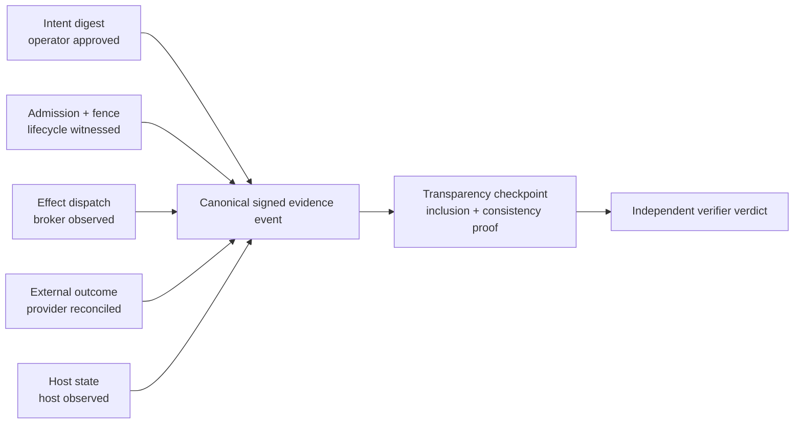

# P2 — Anchor, Evidence, and Verification

Status: sealed Round 1 position · `SOURCE_PRESENT` + `PROPOSED`

## Thesis

Anchor belongs beneath Drydock as its evidence substrate: canonical bytes,
content-addressed inputs, append-only receipts, body-generation fencing,
key-scoped signatures, and independently checkable commitments. Anchor must not
turn “signed” into “true,” nor a Merkle root into “non-equivocating.”

The source already distinguishes host, broker, provider, guest, model, replay,
and human witnesses. Static validators establish internal fixture integrity;
they do not establish a VM, provider, broker, or operator observation. Dynamic
claims remain `BLOCKED_BY_HALT`.

## Strongest design

Use a field-level evidence ledger rather than a generic receipt blob:

Every consequential field states its witness class, witness identity, capture
method, artifact digest, time bounds, and verifier result. A terminal verdict is
derived from this vector. It is not merely signed by the subject, controller,
or UI that benefits from the result.

Canonical bytes are necessary because independent signature verification needs
a stable representation. RFC 8785 supplies a JSON canonicalization scheme. But
canonical bytes prove only that one key signed those bytes. They do not prove
that the key was outside the guest, that an observation happened, that the VM
lacked a network device, or that a provider charged nothing.

Merkle commitments fit two surfaces: ordered evidence events and immutable
artifact inventories. Inclusion proves a leaf is committed to a tree;
consistency proves one head extends another. Neither proves truth, completeness,
fork prevention, custody, or semantic correctness. Port Daddy's current
odd-leaf-duplication Merkle construction should be explicitly versioned as its
own protocol. It must not be described as RFC 6962/9162 compatible unless the
tree algorithm actually matches.

A publisher can privately sign two futures. Non-equivocation therefore needs
independently witnessed checkpoints, durable publication, and head comparison
or gossip. Drydock should support bilateral receipts: a signed request or
decision from the issuer and an independently observed acceptance, execution,
rejection, or reconciliation from the counterparty. Broker dispatch and
provider reconciliation stay distinct. Lifecycle fencing, host process/VM
witness, and broker lease rejection stay distinct.

Define a closed `EvidenceEventV1` with:

- run, work-node, durable-agent, and body-generation identifiers;
- predecessor event digest;
- exact subject, controller, policy, capability, and plan digests;
- `fieldAssertions[]`;
- signer envelope and key-scope reference;
- transparency checkpoint references; and
- explicit later-outcome links rather than mutation.

Each assertion contains `field`, `valueDigest`, `witnessClass`,
`witnessIdentity`, `captureArtifactDigest`, `observedAt`, `verificationMethod`,
and `verificationVerdict`. Policy declares the allowed witness classes for each
claim. A guest probe may supplement “no host network route,” but only a host
witness can satisfy it. A broker reservation may supplement “financial loss was
capped,” but only provider reconciliation can satisfy it.

The adjudicator is separate from the worker, broker, controller, and UI. It
validates canonical bytes and signatures, verifies the event chain and
transparency receipts, checks witness-class admissibility, recomputes invariants,
and emits its own verdict. Existing task receipts should be upgraded from
author-asserted hashes, paths, and booleans to verified artifact digests,
witness classes, and replayable verifier results.

SCITT is relevant but must be named accurately. RFC 9943 standardizes an
architecture for signed statements registered in a transparency service and
returned with verifiable receipts. The 2026 Agent Action Capsule work closely
matches Drydock's may/did distinction and append-only later outcomes, but it is
an individual Internet-Draft, not an adopted standard. It is research input,
not authority.

## Non-negotiables

1. A signature binds a signer to bytes, not a witness class to reality.
2. Every high-consequence field has an allowed witness class and an independent
   verification path.
3. New body generations receive fresh, narrowed grants; authority does not
   follow identity automatically.
4. Every commitment claims only its exact cryptographic property.
5. No component requests, authorizes, executes, and certifies the same effect.

## Falsification tests

- Produce two validly signed futures from one head; prove independent
  checkpoint comparison exposes the fork before claiming non-equivocation.
- Let a guest sign “network absent” without host evidence; verdict must be
  `INCOMPLETE`.
- Let a fenced predecessor attempt an effect; broker and host receipts must
  establish rejection before dispatch.
- Delete an adverse middle event and re-sign a new chain; verification must
  fail against a previously witnessed head.
- Submit a schema-valid receipt with a missing or digest-mismatched artifact;
  verification must fail rather than lint successfully.
- Delay provider settlement past local reservation; the system may claim
  bounded protocol authority but not bounded financial loss.

## Impossible combinations

- Guest-signed containment proof and hostile-guest containment.
- A sole controller witness and independent proof.
- Merkle-root non-equivocation without externally observed heads.
- Provider spend custody based only on an internal ledger.
- Two effect-capable generations of one durable identity.
- Runtime-ready claims while the named runtime witness is prohibited.
- RFC transparency interoperability with a different, unnamed tree algorithm.

## Skill findings

- `agent-work-receipt-designer` needs verified artifact bytes, witness classes,
  signer verification, and chain/checkpoint references.
- `focus-receipt-proof-gate` must replace author-supplied “testable against
  daemon truth” booleans with evidence-policy references and verifier results.
- `agent-visual-evidence-manifest` needs activation tests, artifact-byte hashes,
  capture identity, event inclusion proof, and independent live-source verdicts.
- `provable-action-adjudicator` should remain research routing until its
  citations, mediation scope, policy schema, and adversarial bypass evaluations
  are real.
- The core Drydock evidence vocabulary is strong; the missing layer is a
  canonical independent verifier and dynamic witness evidence.

## Missing skills

### `witness-class-receipt-adjudication`

Activate for consequential receipts, promotion verdicts, attestations, provider
reconciliation, or “independently verified” claims. **NOT for** merely hashing
or signing an artifact, receipt-card UX, or operating the halted runtime.

### `transparency-fork-accountability`

Activate for append-only history, inclusion, consistency, non-equivocation,
checkpoint publication, or cross-harbor reconciliation. **NOT for** a local
Merkle inclusion function or a signature presented as execution evidence.

## Confidence and unknowns

Confidence is high in the separation of cryptographic, observational, and
semantic claims. Unknowns include future checkpoint operators, gossip topology,
trust-root custody, provider reconciliation, and whether external transparency
services should be mandatory or only one admissible witness route.

Primary references: [RFC 8785](https://www.rfc-editor.org/rfc/rfc8785.html),
[RFC 9162](https://www.rfc-editor.org/rfc/rfc9162.html),
[RFC 9943](https://datatracker.ietf.org/doc/rfc9943/), and the explicitly
non-normative [Agent Action Capsule draft](https://datatracker.ietf.org/doc/html/draft-mih-scitt-agent-action-capsule-02).
