# P3 — Identity, Resurrection, and Ambiguous Effects

Status: sealed Round 1 position · `SOURCE_PRESENT` + `PROPOSED`

## Thesis

The person may survive; authority does not. Drydock should treat resurrection
as a constrained transfer of stewardship, never a process restart. A durable
identity is the party that still owes the work. Every body, provider session,
model, process, context window, and credential is disposable.

When an old body dies, becomes stale, or becomes ambiguous, it loses authority.
A successor may inherit verified obligations and cited evidence, but it receives
newly compiled capability, a new generation-fenced lease, and a reconciled
effect frontier.

Source already separates durable actor history from temporary bodies and
defines guarded continuation/handoff concepts. These are foundations, not a
complete operational lifecycle. Dynamic resurrection remains
`BLOCKED_BY_HALT`.

## Core distinction

```text
same durable AgentNode != same authority instance
```

A successor is the same durable person only in the operational sense that it
remains accountable for the same accepted work episode, outcome history, and
obligations. It cannot replay the predecessor's powers. Native provider-session
continuity is not permission continuity. A transcript is evidence, not a system
instruction stream. A capsule is typed, cited, and quarantinable data, not a
trusted prompt blob.

## Strongest design: the Rebody Saga

The saga has five durable records:

1. `AgentNode` and `WorkEpisode`: durable identity and bounded obligation.
2. `BodyLease`: agent, generation, fence, host witness, expiry, and state.
3. `EffectSlot`: deterministic logical effect identity and state
   `prepared | dispatched | confirmed | failed | unknown | resolved`.
4. `CapsuleRevision`: content-addressed context, trust classes, citations,
   omissions, scanner verdict, and policy digest.
5. `RebodyIntent`: idempotency key, predecessor generation, target shape,
   effect high-water mark, capability-intent digest, capacity reservation, and
   terminal receipt.

The external lifecycle writer first changes the predecessor from `active` to
`fenced`. Every effect ticket embeds the generation fence and every brokered
operation checks it at redemption. A late predecessor may still compute or
write its private scratch disk; it cannot cause a consequential effect.

Next reconcile every outstanding effect. Confirmed effects become history.
Confirmed failures may be retried only under explicit policy. An unknown effect
is never replayed automatically. The system seeks an external receipt, provider
idempotency status, or operator decision. Exactly-once execution across
arbitrary external systems is an overclaim. Drydock can promise exactly-once
intent identity, durable uncertainty, and no automatic replay of ambiguity.

Only after fencing and reconciliation does the capability compiler issue fresh,
short-lived, generation-bound tickets. Raw provider tokens, OAuth artifacts,
Keychain values, credential directories, inherited environment, and ambient
sockets never cross the body boundary. The successor gets an operation manifest
such as “create one PR from this exact worktree under this approval before this
expiry,” not general GitHub authority.

The capsule separates:

- immutable operator intent and approved plan;
- verified facts with artifact hashes;
- untrusted historical model and tool text;
- durable obligations and unresolved effect slots;
- explicit omissions and unavailable evidence; and
- a non-authoritative display digest.

Only intent and verified facts may influence successor system framing or tool
policy. Historical text is quoted data. It cannot instruct the successor to
ignore policy, expose secrets, widen capability, or select a worktree.

The lifecycle writer has one canonical durable store and a recoverable event
log. Projections cannot independently declare a body active. A local SQLite
implementation may use one serialized writer with WAL readers, but migration
history is not proof of crash correctness. [SQLite's WAL mode still allows only
one writer at a time](https://www.sqlite.org/wal.html).

Admission of a successor is one compare-and-swap over the predecessor fence,
effect-ledger high-water mark, capsule digest, workspace identity, target
backend, capability-manifest digest, and capacity reservation. A mismatch means
`QUARANTINED`, not a fallback body.

```mermaid
flowchart LR
    Fence["Fence predecessor"] --> Capsule["Seal + scan capsule"]
    Capsule --> Effects["Reconcile every effect slot"]
    Effects --> Capacity["Reserve native capacity"]
    Capacity --> Compile["Compile fresh least privilege"]
    Compile --> Lease["CAS successor body lease"]
    Lease --> Tickets["Issue generation-bound tickets"]
    Tickets --> Witness["Externally witness first heartbeat"]
```



## Non-negotiables

1. Durable identity is never a bearer credential, PID, provider session, alias,
   or role label.
2. Exactly one body generation holds consequential capability for an AgentNode
   and WorkEpisode.
3. Fence first, reconcile effects second, mint successor capability last.
4. Unknown external effects are durable uncertainty, never automatic replay.
5. Capsules carry cited data and omissions, never ambient authority.

## Falsification tests

- Kill the predecessor immediately before and after fencing; no old ticket may
  reach the broker.
- Drop an external-effect acknowledgement; the successor records `unknown` and
  cannot replay it.
- Inject policy-override text and credential-shaped strings into a capsule;
  scanning and quarantine must prevent authority influence.
- Replay one rebody request concurrently; exactly one successor lease and one
  ticket set may emerge.
- Reuse a PID, alter the workspace witness, or change backend after reservation;
  admission rejects.
- Lose the lifecycle store between fence and successor birth; the identity
  remains fenced rather than silently reopening.
- Supply a stale capacity observation; no capability issues.
- Claim an effect completed without an external receipt; the slot stays open.

This position would change if an independently controlled broker demonstrated
two overlapping body generations safely performing disjoint effects through a
stronger per-effect exclusivity mechanism, or if a provider exposed durable
session identity with externally auditable generation-scoped authority.

## Impossible combinations

- One durable person with two simultaneously effect-capable bodies.
- Cross-provider continuity that transparently preserves native authority.
- No credential copying with inherited environment, sockets, or token stores.
- No lost side effects with replay of unknown outcomes.
- Full transcript inheritance with context-poisoning resistance.
- Autonomous recovery without durable admission, reservation, and breaker.
- Retention that deletes evidence needed to settle an ambiguous effect.

## Skill findings

- `agent-resurrection-and-body-continuity` needs a cross-system unknown-effect
  oracle and stronger parent-plan join semantics.
- `mcp-trust-broker` needs generation-fenced ticket-redemption tests.
- `fleet-event-spawn-trust` needs a full bundle: schema, activation cases,
  adversarial fixtures, changelog, and controller-issued lease integration.
- `circuit-breakers-and-retries` needs a resurrection storm and stale-successor
  race evaluation.
- `agent-work-receipt-designer` needs receipt types for `unknown`, effect
  reconciliation, and fence rejection.
- `db-retention-and-compaction` needs a protected class for unresolved
  obligation/effect evidence.

## Missing skill

`drydock-effect-reconciliation-and-fencing`

Activate when a durable worker loses, replaces, or overlaps a body while any
consequential action might be prepared, dispatched, acknowledged late, retried,
or externally unobservable. **NOT for** general identity design, generic memory,
ordinary retry, capability-manifest authoring, or contained execution.

The skill must produce a schema-validated rebody/effect ledger and an adversarial
matrix for lost acknowledgements, stale fences, concurrent successors, and
unknown external outcomes.

## Confidence and unknowns

Confidence is high in the fence/reconcile/remint ordering. The central unknown
is whether future controller, broker, and provider adapters enforce the fence at
the real effect boundary. No static artifact proves that.
