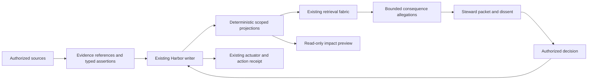
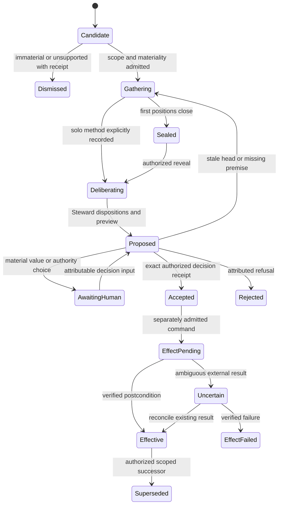

# Architecture and Contracts

Proposed v0.1; no service in this document is activated by this specification.
Current implementation baseline and its limits are in the [inventory](../research/current-system-inventory.md).

## Placement and ownership

The institutional event family belongs to the existing Harbor authority.
The roadmap remains the planning authority during its authorized cutover.
AgentNode identifies durable principals; a session identifies an embodiment.
ResourceScope supplies jurisdiction and disclosure boundaries. Commitments
represent obligations. Parley is the bounded convening mechanism. The retrieval
fabric nominates authorized candidates. Porthole supplies permission-bound
observations. No part of this design requires a second canonical store.



The diagram is a proposed dependency graph. Only local packet validation and
the static preview are implemented by this slice.

## Object model

All identifiers are opaque and scoped; display labels confer no permission.

| Object | Required domain fields |
| --- | --- |
| EvidenceRef | source kind/identity, immutable source revision, observation and collection time, integrity descriptor, collector principal/embodiment, transformations, scope, grant revision, expiry/retention, verification state |
| Proposition | normalized predicate, typed arguments, polarity, quantifier, modality, applicable interval, jurisdiction; original text reference; normalization method/version and uncertainty |
| Assertion | proposition, asserting principal, embodiment, warrant class, asserted/valid time, confidence if calibrated, basis refs, withdrawal/supersession refs |
| Goal | owner, beneficiary, measurable outcome, priority authority and interval |
| Intention | principal, intended action digest, preconditions, expected consequences, expiry, withdrawal; never an execution grant |
| Commitment | existing obligation id, debtor, beneficiary, goal/decision links, due condition, oracle and closure receipt |
| Argument | premise refs, warrant ref/type, conclusion ref, support/rebut/undercut/undermine target, method version, verifier result and uncertainty |
| ValueConcern | affected stakeholder or authorized representative, declared value, hard constraint or preference, owner of tradeoff, acceptable alternatives; no inferred private psychology |
| UnresolvedCase | allegations, materiality, affected scope, Steward, required participants, evidence gaps, deadline, escalation rule and closure criteria |
| Decision | authority principal, policy/grant revision, exact proposal digest, required approvals, rationale, alternatives, dissent, effective interval, supersession targets and appeal rule |
| EffectReceipt | decision ref, exact command digest, idempotency key, actuator, requested/observed time, terminal status, external receipt and verified postcondition |

Warrant class is `hypothesis | verified_observation | policy_norm |
value_preference | blocking_gate`. It is independent of lifecycle and severity.
A model proposing `verified_observation` must identify the observation and
verification procedure; the label alone is not verification.

## Canonical event envelope

The proposed events carry:

```json
{
  "schemaVersion": "pe-event-v1",
  "eventId": "opaque-id",
  "harborId": "opaque-harbor",
  "writerEpoch": 7,
  "sequence": 418,
  "causalParents": ["event-417"],
  "eventType": "decision.accepted",
  "principalId": "opaque-principal",
  "embodimentId": "historical-session-id",
  "roleCharterRevision": "charter-digest",
  "recordedAt": "2026-09-08T00:00:00Z",
  "validFrom": "2026-09-09T00:00:00Z",
  "validUntil": null,
  "scopeRef": "scope-revision",
  "authorizationReceiptRef": "grant-check-receipt",
  "payloadRef": "protected-payload-id",
  "idempotencyKey": "opaque-command-key"
}
```

This is an illustrative envelope, not a valid signed record. Production
canonicalization, signing and lease validation reuse the existing authority
contract. Event hashes/signatures never substitute for semantic verification.

Event families: evidence.registered/invalidated/payload-purged;
assertion.made/withdrawn/superseded; intention.declared/withdrawn;
argument.proposed/verified/challenged; case.opened/review-sealed/revealed;
disposition.proposed; decision.accepted/rejected/superseded/appealed;
effect.requested/confirmed/failed/uncertain; budget.reserved/settled;
execution.halted/operator-released. Existing commitment events are referenced,
not duplicated with a competing lifecycle.

## Temporal projection and consistency

Each read supplies `asOfSequence` (what was recorded) and `effectiveAt` (what
applied). This supports both “what did the project decide then?” and “what do
we now know applied then?” Late evidence does not rewrite an earlier view.

Projectors consume a contiguous sequence within an epoch and checkpoint the
last fully applied event. Gaps, unknown schemas and incompatible epochs mark
the projection stale. Rebuild from authorized source events; do not silently
skip unrecognized decisions. Payload erasure changes readable history and
must propagate into derivative invalidation and replay metadata.

An offline client may prepare a proposal against sequence N. It cannot assign
a canonical sequence or authorize an effect. On reconnection the writer checks
all preconditions and returns `STALE_STATE` if relevant state changed. Unrelated
events may be accepted only under a declared dependency-set validation policy.

For overlapping decisions, a scoped supersession edge and authorized interval
determine applicability. Concurrent contradictory decisions with no valid
priority relation yield an unresolved projection; there is no latest-text rule.

## Proposed API boundary

These are proposed semantic operations on existing authorized service surfaces,
not installed endpoints or a new daemon to run during the halt.

| Operation | Input | Result and boundary |
| --- | --- | --- |
| append evidence/assertion | envelope, source refs, expected scope revision | admission receipt; no automatic institutional acceptance |
| query state | scope, `asOfSequence`, `effectiveAt`, projection version | authorized objects, supporting event refs, completeness/frontier |
| open case | normalized propositions, exact change digest, impact allegation | deduplicated case id with preserved contributing refs |
| seal contribution | case/round, envelope digest, protected contribution | sealed receipt, only author and authorized sealing service can read |
| reveal round | round id, expected participants/timeout disposition | authorized shared view; timeout remains missing evidence |
| propose disposition | finding ids, reasons, dissent refs, preview digest | Steward proposal; no state effect |
| accept decision | proposal/preview digests, expected sequence/epoch, authority proof | immutable decision receipt after all jurisdiction checks |
| request effect | decision, exact command, idempotency key, budget reservation | accepted request followed by terminal effect receipt |
| appeal/supersede | exact predecessor, scope, rationale, required authority | new event preserving original state and appeal/stay rules |

All mutations validate payload size, declared type, references, scope,
authorization and causality. Reusing an idempotency key with different content
is `IDEMPOTENCY_CONFLICT`; repeating identical accepted content returns its
receipt. An ambiguous result is queried before retry, including after restart.
Errors use stable codes with minimal authorized explanation:
`NOT_AUTHORIZED`, `STALE_SCOPE`, `STALE_STATE`, `EVIDENCE_UNAVAILABLE`,
`REVIEW_INCOMPLETE`, `VALUE_DECISION_REQUIRED`, `HALTED`, `BUDGET_UNSETTLED`.
Unauthorized and nonexistent protected resources have indistinguishable public
responses under the applicable threat model.

## Authorization matrix

Every “yes” below also requires resource scope and an explicit action grant.

| Action | Contributor | Steward | Authorized decider | Actuator | Operator |
| --- | --- | --- | --- | --- | --- |
| Read shared evidence | granted subset | granted subset | granted subset | minimum for command | granted subset |
| Read sealed initial review | own only | after reveal | after reveal unless authorized adjudicator | no | no automatic blanket access |
| Assert own belief | yes | yes | yes | only own observation | yes |
| Rewrite another belief | no | no | no | no | no |
| Propose disposition | comment | yes | may request changes | no | may request changes |
| Accept scoped policy change | no | no by role alone | yes | no | where authorized |
| Execute accepted command | no | no by role alone | no by role alone | exact granted command | through approved actuator |
| Lift operator spend halt | no | no | no by project role | no | explicit authenticated release only |

A role is never the identity root. Preserve AgentNode and historical worker
labels; replacing either loses accountability or execution context. Cross-team
and cross-project comparisons require authority covering inputs and outputs.

## Case and effect state machines



An operator halt prevents entry into every paid or effect-producing transition.
It does not erase accepted decisions, cancel external effects already performed,
or mark them successful. Those remain auditable and uncertain until lawfully
reconciled. Manual preparation can proceed from `Gathering` to `Deliberating`
with a solo-method label, without an invented sealing ceremony.

## Detector design

1. Check corpus policy, grants, freshness, execution halt and remaining budget.
2. Apply exact structural candidates: shared resource ids, declared dependencies,
   conflicting typed constraints, temporal supersession and changed decisions.
3. Retrieve additional candidates through approved BM25+dense+lineage fusion.
   Compare dense vectors only within identical immutable `spaceId` descriptors.
4. Extract candidate typed propositions and arguments. Original text, offsets,
   source revision and model/profile revision remain attached.
5. Expand consequence paths under explicit depth, branching, node, time and
   aggregate cost limits. Memoize by scoped source revision and rule-set digest.
6. Verify premises and inference rules. A deterministic rule can establish
   entailment only inside its declared formal fragment; a model judgment stays
   a defeasible allegation with uncertainty. Reject cycles as self-support.
7. Compare aligned predicates/intervals/modalities. Distinguish hard contradiction,
   scoped exception, temporal supersession, duplication, resource collision,
   predicted consequence conflict and value tension.
8. Group equivalent scoped allegations, attach both paths and the search frontier,
   then choose no-op, evidence gathering, bounded deliberation or human preview.

Starting design limits, **not deployment authorization**: depth 4, 100 candidates,
200 expanded nodes, 20 material findings per case, one bounded verification pass.
The experiment must vary these limits and report missed collisions beyond them.
No scalar model confidence admits a canonical mutation or blocking review gate.

## Worked paths

**Database exception.** D1 forbids additional transactional databases. D2 permits
ClickHouse for analytics only. An agent proposes deleting ClickHouse based on
an older broad ADR. The correct result is scoped exception/supersession, with
the analytics commitment at risk. It is not evidence that D1 was always false.

**Encrypted replay.** Replay requires durable evidence; a proposed indexing job
decrypts that evidence in a hosted service. A policy forbids server-readable
transcripts. The verified conflict is the decryption step under that policy.
Remote ciphertext storage with client-held keys does not by itself conflict.
If no authorized index can meet the latency requirement, a human chooses the
feature tradeoff without the model inventing a privacy waiver.

**Paid review.** A useful unresolved finding prompts another reviewer while an
operator spending halt applies. The finding remains unresolved; admission is
blocked. Local evidence organization continues. The halt survives new role,
session, queue, process and day boundaries. A requested budget field is not
proof that all downstream provider charges were bounded.

## Cost, observability and abuse

Budgeting needs an aggregate reservation ledger outside model discretion, with
atomic parent/child accounting and provider reconciliation. Hold worst-case
authorized charges before admission; account for retries, minimum billing,
tools and publication-triggered work. Stop before sending a request whose
worst-case cost is unknown. Crash recovery preserves reservations until terminal
usage is reconciled; it never treats missing usage as zero. Operator halt checks
belong at admission and immediately before each paid/effect-producing request.
This is a required future enforcement contract, not proof of the existing cap.

Measure attributable evidence quality, temporal accuracy, valid-path recall,
false allegations, missed material outcomes, correction rate, operator active
minutes, interruption count, unresolved budget and escaped effects. Keep raw
evidence outside broadly shared metrics. Protect labels and low-cardinality
counts that reveal protected cases. Audit authorization decisions and derivative
invalidation with retention compatible with the underlying disclosure policy.

| Attack/failure | Required defense and probe |
| --- | --- |
| Forged role or duplicate reviewer principal | verified identity plus charter; expose correlated seats |
| Prompt injection in source | inert source data; grants never derived from document instructions |
| Private premise leaked through ranking/counts | prefilter plus output/existence policy; paired noninterference fixtures |
| Stale/revoked permission | scope revision precondition and recheck at effect; revocation race fixture |
| Fake majority or manufactured support graph | unique attributable findings; no vote gate; verify each warrant |
| Alert and cost flood | atomic aggregate admission, deduplication and interrupt budget; concurrent retry storm test |
| Silent daemon death | persistent uncertain effects and reservations; replay gap prevents false green |
| Mutable PR comment erases objection | append-only finding history plus replaceable comment projection |
| Stale preview accepts new consequence | bind preview and acceptance to same proposal/state digest |
| Retention leaves derived secrets | lineage invalidation and purge receipts; retrieval after deletion test |

No runtime route, database schema, native app or provider integration is changed
by this slice. The offline auditor validates declared packet invariants only.
