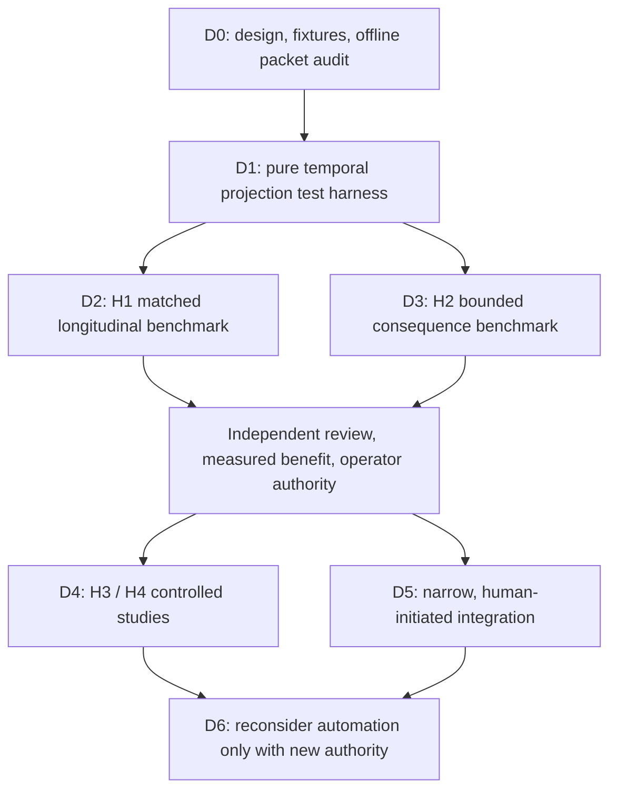

# Delivery plan and evidence gates

Status: proposed implementation sequence, not permission to execute it.
The operator halt remains in force. No node authorizes a daemon, paid inference,
agent launch, publication, deployment or workflow trigger.

## Sequence

The arrows are dependencies, not a runtime orchestration topology. D0 is this
package; every later node is deferred. Completion evidence is in
[validation](validation.md), not inferred from this diagram.

| Node | Bounded deliverable | Acceptance gate | Explicit exclusions |
| --- | --- | --- | --- |
| D0 | Constitution, guide, architecture, dissent, three-case preview, structured packet auditor | Local tests, responsive checks, link checks; honest method and limitation labels | No production authorization, proof engine or event store |
| D1 | Pure event-folding module against synthetic fixtures | Deterministic replay; bitemporal queries; gap/unknown-schema rejection; supersession and exception tests | No daemon; no remote corpus; no canonical writes |
| D2 | H1 evaluation with frozen chronological splits and matched retrieval | Preregistered temporal correctness and stale-policy error results, paired uncertainty, attention and cost accounting | No invented performance claim; no hindsight leakage |
| D3 | H2 evaluation of latent cross-artifact collisions | Held-out human-labeled outcomes; false-alarm and proof-premise validity results; bounded expansion | No open-ended inquiry or semantic ranking over unauthorized data |
| D4 | H3 independent/shared/controlled-synthesis and H4 provenance ablations | Independent review inputs actually isolated; contamination audit; equal budgets; retention consent | No personas passed off as independent reviewers |
| D5 | One human-initiated case type integrated through existing Harbor contracts | Threat model, authority/revocation tests, redaction replay, spend admission and ambiguous-effect recovery | No parallel canonical authority, duplicate retrieval engine or autonomous publication |
| D6 | A separately authorized automation decision | Net measured benefit, aggregate hard caps, operator controls, incident recovery and independent review | No self-release of halt or self-granted recurring work |

## D1's first fixtures

Use the three invented cases in the preview plus adversarial mutations. A
fixture stores event order and valid time separately, with expected as-of
answers and explicit authorized audiences. At minimum test:

- a policy followed by a scoped exception, then an uninformed stale proposal;
- an exception recorded later but effective earlier;
- revoked authority and a conflicting claim from the former role holder;
- a duplicate event, missing sequence and unsupported event version;
- a source correction that invalidates a derived claim but not every policy;
- two append requests based on the same prior state, one rejected as stale;
- retention expiry that removes content while preserving a safe audit skeleton;
- an accepted decision followed by an ambiguous external effect;
- a halt during inquiry, before reservation, and after a reserved action began.

Keep the corpus synthetic until disclosure, retention and research use are
explicitly authorized. A local fixture passing does not prove that the live
system enforces the same boundary.

## Research promotion policy

The [experimental protocol](../research/experimental-protocol.md) defines H1–H4,
baselines, ablations and measures. The first funded study should preregister a
small number of primary endpoints before any held-out evaluation. Do not tune
thresholds on the test set or combine correlated events as independent samples.
Use project-level paired or clustered analysis where the sample supports it;
an underpowered result is inconclusive, not evidence of equivalence.

Promotion has three distinct gates:

1. **Contract gate:** no known authority/disclosure violations in the adversarial
   corpus; malformed or stale inputs fail closed. This is finite test evidence,
   not a security proof.
2. **Utility gate:** a preregistered practically meaningful benefit on the
   primary endpoint, with uncertainty, false-positive burden, human minutes
   and total compute reported. Select the minimum effect with the operator
   before running the study. No fabricated numeric target is a research result.
3. **Authority gate:** a current, attributable operator decision authorizing
   the next scope and cost. A positive experiment does not itself grant it.

Report material conflicts caught, missed conflicts, false alarms, interruption
count, human minutes and compute dollars separately. If using the attachment's
ratio, define the unit conversion for lambda in advance and report the raw
numerator and denominator; a zero denominator is undefined, not infinite
utility. Include false-positive adjudication and delayed harm in sensitivity
analysis. Prefer paired net-benefit comparisons over optimizing a ratio alone.

## Ownership and integration boundaries

Associate the work with the existing `chartroom-grand-harbor-authority-cutover`
roadmap item. This is a historical association, not a current assignment or a
roadmap mutation. The named durable owner must reconcile it after normal
operations are explicitly restored. Do not open a competing canonical roadmap.

Production integration reuses the existing identity, resource-scope, event,
commitment, retrieval and execution-evidence boundaries described in the
[architecture](architecture.md). Source presence is not installed capability.
The current slice does not modify Chartroom, Relay publishers, session recovery,
retrieval, Porthole, the website, FleetBar or pd-console runtime.

Before future publication, inspect whether its route triggers paid reviews or
workflows and obtain authority for those effects. The [publication packet](publication-packet.md)
is local material for that later decision, not a request to wake a bot now.
