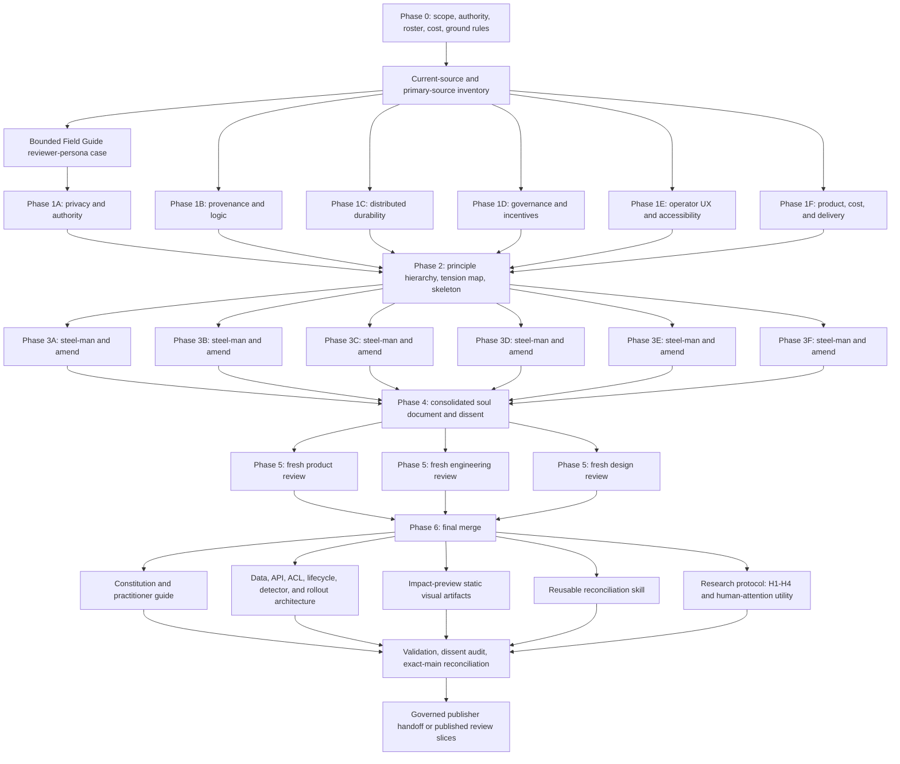
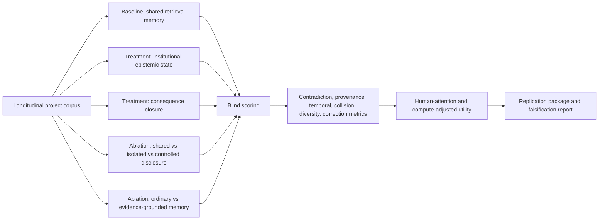

# Research and Synthesis DAG

## Phase gates

| Gate | Required evidence |
| --- | --- |
| P0 | scope, non-goals, six distinct positions, fresh-eyes quarantine, cost cap, roadmap anchor |
| P1 | six independent papers, each with principles, tensions, concrete structure, and ranked priorities |
| P2 | every paper represented; convergence tiers; explicit tension classification; structural skeleton |
| P3 | six steel-man sections; specific amendments; fundamental dissent flagged |
| P4 | every amendment accepted or rejected with reasons; coherent document; dissent and scope preserved |
| P5 | PM, engineering, and design verdicts with P0/P1 demands; no prior-process contamination |
| P6 | every P0/P1 demand addressed or explicitly rejected; final outputs stand alone |
| Publish | citations valid; accessibility and artifact checks pass; skill validates; current-main and ownership rechecked; governed identity available |

## Experimental sub-DAG

## Dependency and ownership boundary

This research is a specification child of `chartroom-grand-harbor-authority-cutover`. It depends on the existing remote append-only authority, provider-neutral retrieval fabric, authenticated resource scopes, durable AgentNode roles, Porthole evidence contracts, and governed Fleetbot publication. It owns only the new research, visual concept, and skill artifacts named in the process log. It does not own those dependencies or change their roadmap projections.
