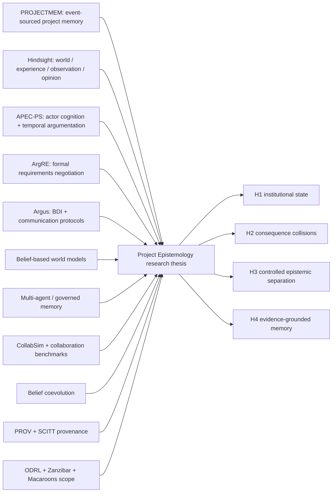

# Literature and Novelty Map

Status: bounded primary-source map, not a systematic review  
Search window: focused verification on 2025–2026 neighbors plus foundational standards  
Follow-up verification: September 8, 2026, for PROJECTMEM, Hindsight, APEC-PS and ArgRE
Rule: no priority or “first” claim is authorized by this artifact

## Narrow claim

The candidate contribution is **not** append-only project memory, agent memory, fact/opinion separation, multi-agent debate, formal argumentation, BDI protocols, or scoped retrieval by itself. Each exists in adjacent work.

The research contribution worth testing is their governed composition for software projects:

> an authority-scoped, actor-indexed institutional state that keeps evidence, beliefs, goals, intentions, commitments, arguments, values, and unresolved questions distinct; detects bounded consequence collisions; preserves independent inquiry through controlled disclosure; and produces accountable decisions optimized for prevented harm per unit of human attention.

That is a hypothesis, not a novelty verdict. A real priority claim requires a documented systematic search, inclusion/exclusion protocol, dual review, and citation graph.

## Neighbor graph

This is a concept-adjacency map for the bounded review, not bibliometric proof of novelty or an assertion that every work cites every other work.

## Direct neighbors

The last column identifies this program's evaluation scope, not a demonstrated
absence from each neighboring system. Reported results retain the authors'
experimental conditions; this map is not an independent replication.

| Work | What the authors propose or report | Direct overlap | Dimensions this program would evaluate |
| --- | --- | --- | --- |
| [PROJECTMEM](https://arxiv.org/abs/2606.12329) (2026) | local-first append-only typed events, deterministic projections, MCP summaries, and a pre-action judgment gate for coding agents | event-sourced project memory and memory-as-governance | multi-principal beliefs, institutional authority transitions, argument/value structures, controlled disclosure, and cross-project ACL composition |
| [Hindsight](https://aclanthology.org/2026.acl-demo.27/) (ACL 2026) | world, experience, observation, and opinion networks; temporal and hybrid recall | fact/belief separation and structured long-term memory | authority-owned project decisions, multiple durable principals, value conflicts, consequence paths, and software-control-plane enforcement |
| [A collaborative argumentation framework for goal-oriented reasoning (APEC-PS)](https://link.springer.com/article/10.1007/s00766-026-00461-0) (2026) | actor cognitive states, temporal proof-events, goals, premises/warrants/conclusions, support and attack moves | strongest formal neighbor to actor-indexed project epistemology | operational storage, ACLs, software evidence receipts, authoritative institutional transitions, retrieval and production observability |
| [ArgRE](https://arxiv.org/abs/2604.23124) (2026) | specialized-agent requirements negotiation with Dung-style argumentation and explicit acceptance/rejection | formal conflict resolution over software requirements | longitudinal project state, execution provenance, identity/authority, privacy boundaries, consequences and human-attention utility |
| [Argus](https://www.sciencedirect.com/science/article/pii/S0004370225001171) (AIJ 2025) | operational semantics connecting BDI cognition with communication protocols and message-integrity checks | belief/desire/intention plus protocol discipline | collective/institutional state, provenance-backed decisions, project consequence analysis and governed disclosure |
| [Towards a Belief-Based World Model for LLM Agents](https://arxiv.org/abs/2609.00455) (2026) | exposing known/uncertain current-state beliefs improves decisions under partial observability | explicit belief state and uncertainty | multi-actor provenance, institutional authority, arguments and longitudinal supersession |
| [Multi-Agent Memory from a Computer Architecture Perspective](https://arxiv.org/abs/2603.10062) (2026) | shared/distributed memory hierarchy; consistency and structured access-control gaps | multi-agent memory consistency and ACL framing | semantic distinctions among evidence/belief/decision/value, adjudication and project-specific consequence closure |
| [Governed Memory](https://arxiv.org/abs/2603.17787) (2026) | typed facts, governance routing, entity isolation and progressive context delivery | governed retrieval, isolation and context efficiency | authoritative decision transitions, dissent, actor reasoning lineage and software outcome conflicts |

## Coordination, herding and values

| Work | Relevant finding or method | Design consequence |
| --- | --- | --- |
| [CollabSim](https://www.microsoft.com/en-us/research/publication/collabsim-a-cscw-grounded-methodology-for-investigating-collaborative-competence-of-llm-agents-through-controlled-multi-agent-experiments/) (2026) | evaluates common ground, shared task understanding, incentives, and repair of misalignment under controlled conditions | measure coordination separately from task success; log disclosure and repair events |
| [The Collaboration Gap](https://www.microsoft.com/en-us/research/publication/the-collaboration-gap/) (COLM 2026) | strong solo performance does not guarantee strong collaboration in heterogeneous pairs | do not infer synthesis quality from model quality; benchmark pairings and order effects |
| [Benchmarking Open-Ended Multi-Agent Coordination](https://openreview.net/pdf/5b5a6ceaa1bb1738f9956351446f224ceea1a27d.pdf) (2026) | evaluates coordination when agents must align communication and behavior in open-ended tasks | include communication efficiency, independent discoveries and failed coordination, not only final correctness |
| [Belief Coevolution](https://arxiv.org/abs/2607.27512) (2026) | persona prompting and network shape affect individual revisions, while underlying specialist heterogeneity has the stronger population effect | reviewer names are not epistemic diversity; use different evidence access, methods and oracles, and measure correlated error |
| [Human Values Matter](https://www.microsoft.com/en-us/research/publication/human-values-matter-investigating-how-misalignment-shapes-collective-behaviors-in-llm-agent-communities/) (2026) | value misspecification can accumulate into group-level failures in controlled multi-agent simulations | values and affected humans must be first-class; value conflicts require human escalation |
| [Navigating Rifts in Human-LLM Grounding](https://www.microsoft.com/en-us/research/publication/navigating-rifts-in-human-llm-grounding-study-and-benchmark/) (ACL 2025) | early failures to establish common ground predict later interaction breakdown | make unresolved terms, assumptions and scope visible before synthesis |

## Standards and durable mechanisms

| Source | Adopted concept | Constraint on this design |
| --- | --- | --- |
| [W3C PROV Overview](https://www.w3.org/TR/prov-overview/) | entities, activities, agents, derivations and responsibility | evidence lineage should be interoperable; provenance still does not certify truth |
| [W3C ODRL Information Model 2.2](https://www.w3.org/TR/odrl-model/) | permission, prohibition, duty, constraint and explicit conflict strategy | disclosure and action policy must be explicit and default-invalid on unresolved conflict |
| [Zanzibar](https://research.google/pubs/zanzibar-googles-consistent-global-authorization-system/) | relationship-based authorization with consistency requirements | ACL decisions need causally appropriate relationship state, not stale search results |
| [Macaroons](https://research.google/pubs/macaroons-cookies-with-contextual-caveats-for-decentralized-authorization-in-the-cloud/) | attenuable credentials with contextual caveats | downstream consumers receive narrowed authority, never broad ambient access |
| [Reciprocal Rank Fusion](https://doi.org/10.1145/1571941.1572114) | robust rank fusion across retrieval systems | lexical, dense and lineage channels may nominate candidates; none becomes logical proof |
| [RFC 9943: SCITT Architecture](https://www.rfc-editor.org/rfc/rfc9943.html) | signed statements, append-only transparency services and receipts | receipts support auditability; sensitive claims still require confidentiality and disclosure policy |

## Adoption ledger

### Adopt

- Hindsight's semantic separation of externally grounded state and subjective opinion.
- APEC-PS's actor-indexed cognitive state, temporal events, premises/warrants/conclusions, and distinct rebuttal/undercut/undermine moves.
- ArgRE's explicit argument acceptance instead of implicit aggregation.
- PROJECTMEM's deterministic projections and pre-action gate, but against the existing Harbor authority rather than a new local log.
- CollabSim-style controlled experiments and the collaboration-gap warning that task competence is not coordination competence.
- Belief Coevolution's warning that prompt personas do not constitute independent expertise.
- PROV-style derivation, ODRL-style explicit policy conflict, existing Port Daddy resource scopes, and provider-neutral hybrid retrieval.

### Reject or constrain

- a universal shared context presented before independent inquiry;
- majority vote as epistemic resolution;
- one scalar confidence or reputation score;
- embeddings as proof of contradiction or implication;
- opaque summaries without exact evidence zoom;
- reviewer “personality” as identity, authority, or evidence quality;
- a local event store that competes with Harbor/Chartroom authority;
- copying raw Porthole or transcript material into a broadly searchable memory;
- novelty claims based on this bounded search.

## Falsifiable research program

| Hypothesis | Baseline | Treatment | Primary measures | Failure condition |
| --- | --- | --- | --- | --- |
| H1 institutional state | authorized shared RAG over Git/issues/ADRs/chat | typed actor-indexed state + authority-owned projections | temporal-state accuracy, provenance correctness, stale-decision violations, answer latency | no material gain after attention and compute cost |
| H2 consequence closure | file/claim overlap + semantic similarity | typed action→capability→commitment→stakeholder→outcome paths | collision recall, false-conflict rate, proof-path validity, lead time | high-severity false positives or no earlier detection |
| H3 controlled separation | immediate shared-context deliberation | independent retrieval/position, then reciprocal steel-man and adjudication | unique evidence, correlated error, premature consensus, final correctness | separation only adds latency/cost or reduces correction |
| H4 grounded memory | ordinary summaries and agent memory | Porthole/API evidence refs with source identity and temporal validity | causal accuracy, source attribution, stale-belief propagation, correction rate | proof collection adds burden without reducing false project state |

## Systematic-review requirement before external research claims

1. Register search strings, databases, dates and inclusion criteria.
2. Include software-engineering, CSCW, argumentation, truth-maintenance, provenance, organizational memory, multi-agent systems and information-governance venues.
3. Use two independent screeners for direct neighbors and disagreements.
4. Build a citation graph and forward/backward snowball from APEC-PS, ArgRE, PROJECTMEM, Hindsight and Argus.
5. Extract tasks, unit of state, actor model, authority, temporality, privacy, evaluation, implementation and limitations.
6. Publish negative and null evidence; distinguish priority, novelty, implementation, and evaluation claims.
