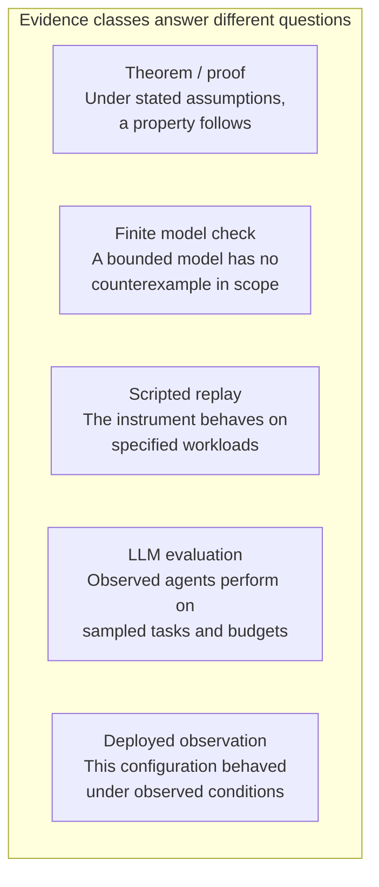

# Evidence classes

The five classes are parallel categories, not a maturity ladder. Their evidence supports different claim scopes.

```mermaid
flowchart LR
  subgraph classes["Evidence classes answer different questions"]
    direction LR
    T["Theorem / proof<br/>Under stated assumptions,<br/>a property follows"]
    F["Finite model check<br/>A bounded model has no<br/>counterexample in scope"]
    S["Scripted replay<br/>The instrument behaves on<br/>specified workloads"]
    L["LLM evaluation<br/>Observed agents perform on<br/>sampled tasks and budgets"]
    D["Deployed observation<br/>This configuration behaved<br/>under observed conditions"]
  end
```
