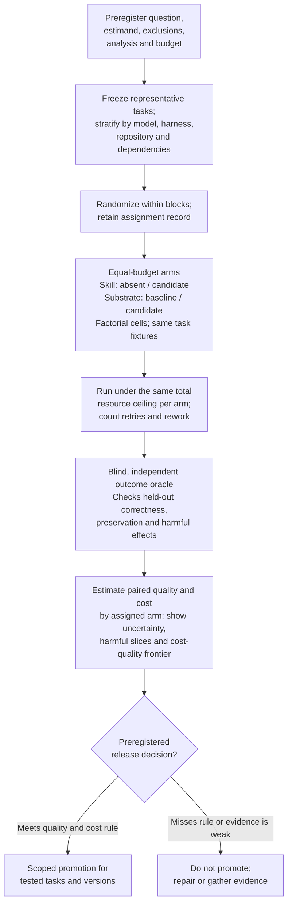

# Matched-budget evaluation

This is a proposed protocol, not a report of a completed experiment.

```mermaid
flowchart TD
  A["Preregister question,<br/>estimand, exclusions,<br/>analysis and budget"] --> B["Freeze representative tasks;<br/>stratify by model, harness,<br/>repository and dependencies"]
  B --> C["Randomize within blocks;<br/>retain assignment record"]
  C --> X["Equal-budget arms<br/>Skill: absent / candidate<br/>Substrate: baseline / candidate<br/>Factorial cells; same task fixtures"]
  X --> R["Run under the same total<br/>resource ceiling per arm;<br/>count retries and rework"]
  R --> O["Blind, independent outcome oracle<br/>Checks held-out correctness,<br/>preservation and harmful effects"]
  O --> E["Estimate paired quality and cost<br/>by assigned arm; show uncertainty,<br/>harmful slices and cost-quality frontier"]
  E --> G{"Preregistered<br/>release decision?"}
  G -->|"Meets quality and cost rule"| P["Scoped promotion for<br/>tested tasks and versions"]
  G -->|"Misses rule or evidence is weak"| N["Do not promote;<br/>repair or gather evidence"]
```
