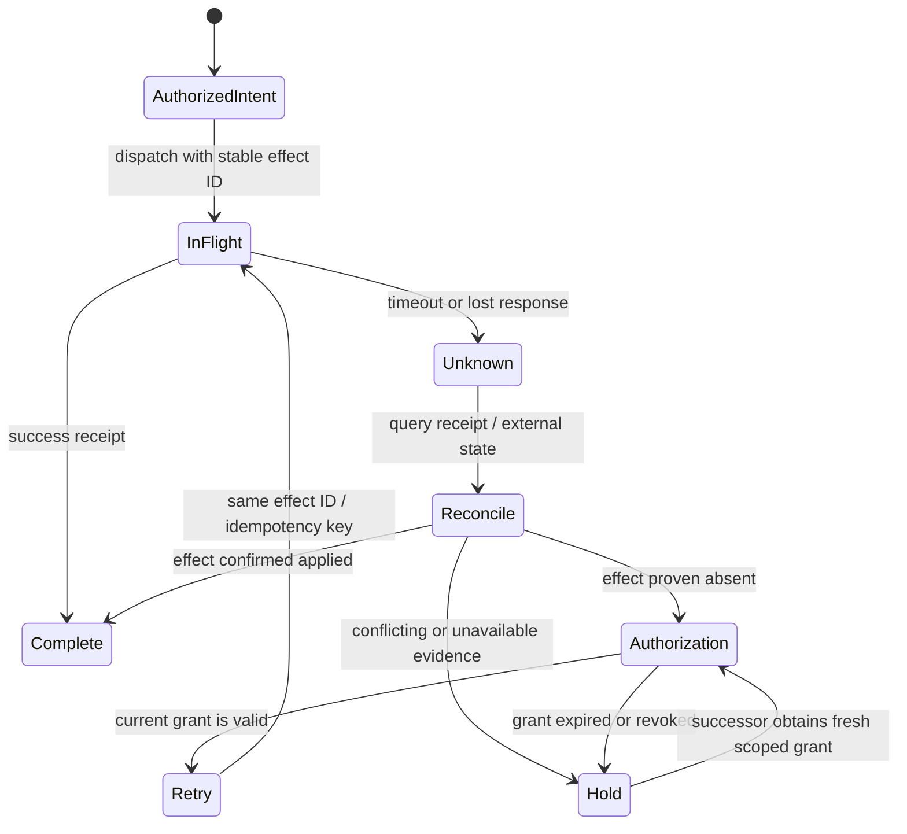

# Uncertain-effect recovery

Timeout is unknown; reconciliation precedes retry. A successor needs current authority.

```mermaid
stateDiagram-v2
  [*] --> AuthorizedIntent
  AuthorizedIntent --> InFlight: dispatch with stable effect ID
  InFlight --> Complete: success receipt
  InFlight --> Unknown: timeout or lost response
  Unknown --> Reconcile: query receipt / external state
  Reconcile --> Complete: effect confirmed applied
  Reconcile --> Authorization: effect proven absent
  Reconcile --> Hold: conflicting or unavailable evidence
  Authorization --> Retry: current grant is valid
  Retry --> InFlight: same effect ID / idempotency key
  Authorization --> Hold: grant expired or revoked
  Hold --> Authorization: successor obtains fresh scoped grant
```
