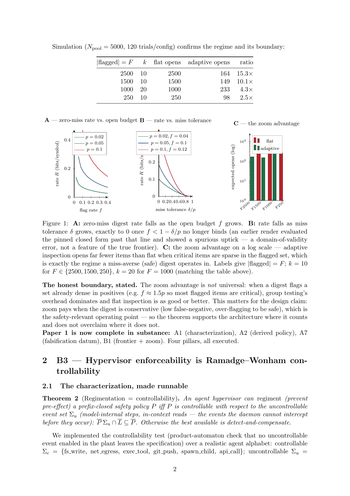

# Harbor PDF build repair

The prior recipe could mask a failed TeX pass, copied stale build outputs, and
let wall-clock dates change PDFs on every run. The workflow now checks out the
event head, derives an epoch from renderer-source author history, builds twice
from empty directories, and compares hashes and the 19 declared output names.
The 14 historical PDFs outside that build target are preserved and excluded
from the fresh-render claim. Publication retries require the original head's
ancestry, identical source inputs, and an identical source epoch.

Four regression cases cover metadata-only epoch stability, changed/reverted
source bytes with a newer epoch, invalid refs, and a failed compiler pass that
a later successful pass would otherwise mask. The whole research-library suite
passes 460 tests. [Validation and input hashes](validation.json) distinguish
local evidence from the hosted build still required at this checkpoint.

Fail-fast compilation exposed a pre-existing pgfplots style error in execution
report 2. Plot-owned keys are qualified, and logarithmic mode is applied directly
in the sole bar chart's axis options. The intended logarithmic comparison and
plotted data are preserved. The parent inspected the actual report page below.
The local BasicTeX installation then reaches `review.tex` and stops because
`titlesec.sty` is absent; the pinned hosted TeX image must complete the full
corpus and repeated-hash check before publication is considered verified.

