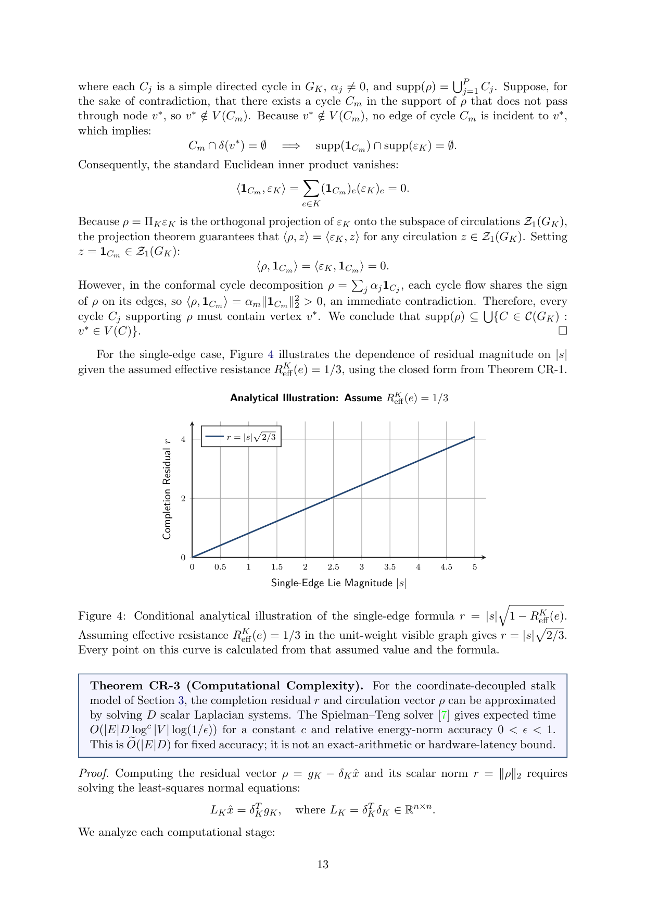
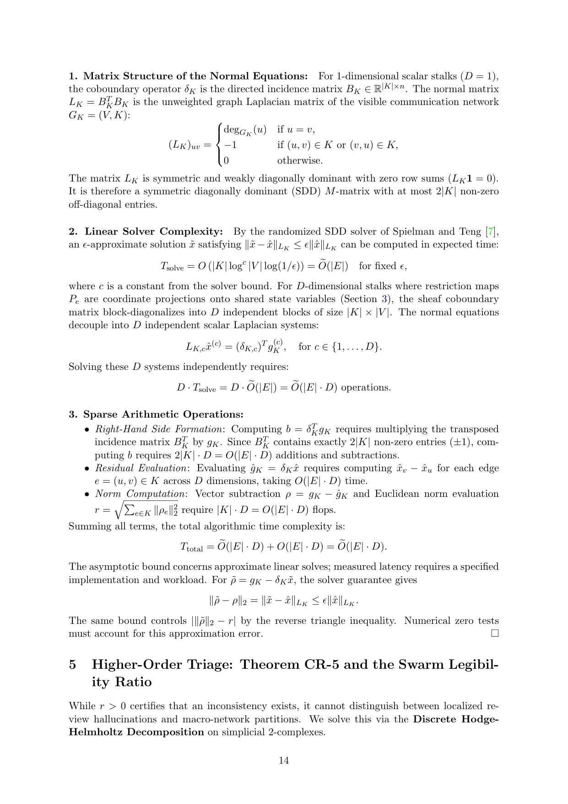
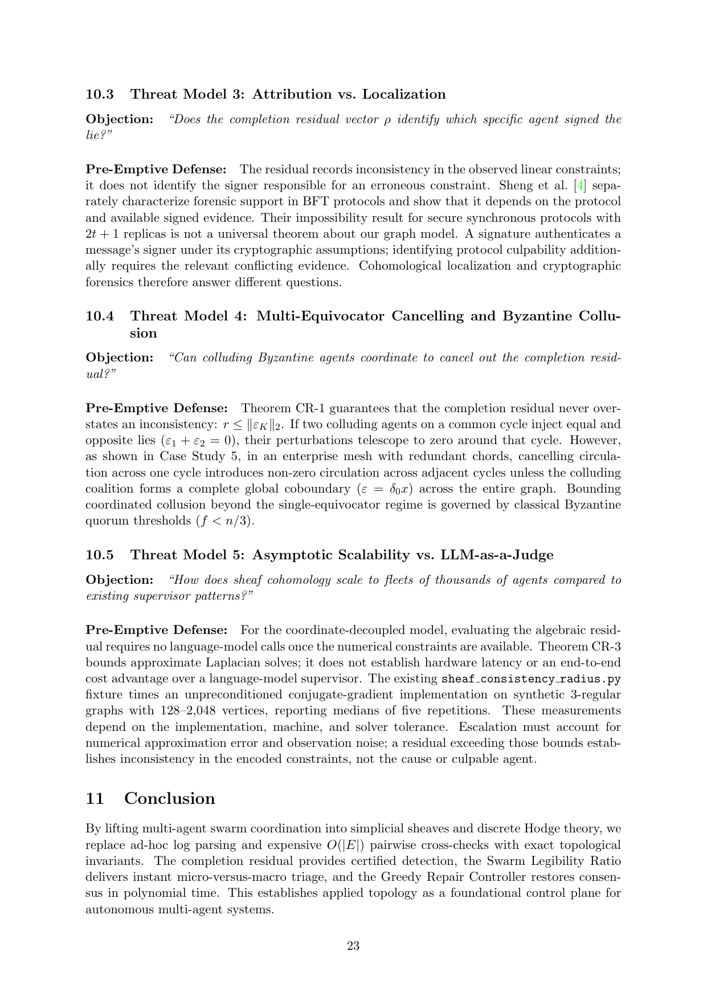
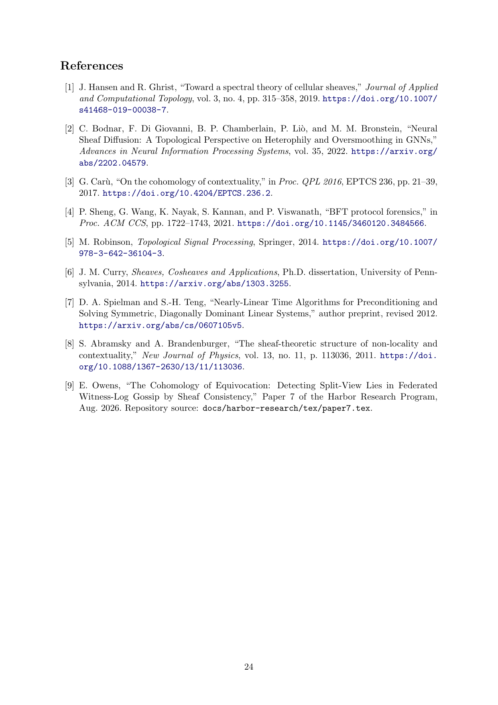

# Paper 8 citation repair

The inherited bibliography failure is repaired. The earlier base reproduction
remains a historical receipt, not the final disposition. Nine verified entries
now support specific claims in the paper; one unlocated, unused proposal entry
was removed. No checker exemption or synthetic citation was added.

| Entry | Disposition and primary record |
| --- | --- |
| Hansen–Ghrist | Cited for cellular-sheaf spectral theory and Hodge structure; removed the unsupported historical priority claim. [Record](https://doi.org/10.1007/s41468-019-00038-7). |
| Bodnar et al. | Corrected title/authors and cited neural sheaf diffusion. [Paper](https://arxiv.org/abs/2202.04579). |
| Carù | Replaced the erroneous 2024 consensus attribution with the actual 2017 contextuality paper and limited the claim accordingly. [Paper](https://doi.org/10.4204/EPTCS.236.2). |
| Sheng et al. | Replaced the erroneous sensor-mesh record with *BFT Protocol Forensics*, CCS 2021; describes protocol-specific forensic results. [Paper](https://doi.org/10.1145/3460120.3484566). |
| Robinson | Cited the actual sheaf-based signal-processing context. [Book](https://doi.org/10.1007/978-3-642-36104-3). |
| Curry | Cited cellular-sheaf construction and supplied missing identity/composition conditions. [Thesis](https://arxiv.org/abs/1303.3255). |
| Spielman–Teng | Corrected the record to the versioned solver preprint. The paper now states expected approximate complexity, accuracy dependence, and residual error; removed an unsupported microsecond implication. [Preprint](https://arxiv.org/abs/cs/0607105v5). |
| Abramsky–Brandenburger | Cited the contextuality/global-section obstruction. [Paper](https://doi.org/10.1088/1367-2630/13/11/113036). |
| Owens R6 | Retained the repository's actual Paper 7 as prior work. |
| Owens hypertrees proposal | Removed the unused entry, whose referenced proposal could not be located; no body claim depended on it. |

The corrected source compiles in two pdflatex passes to 24 A4 pages. The final
pass has no LaTeX errors, undefined references, or undefined citations. Eight
changed/relevant pages were rendered at 150 dpi and visually inspected. The
eight underfull boxes and one 3.345pt overfull box also occur in the baseline;
no visible clipping or overlap was found. See the [build receipt](build-receipt.json).

The same PDF is committed in the research library and website publication
paths, and the website's page/size metadata matches it. Hosted TeX builds may
produce different binary bytes; their results must be read back separately.

This repair checks the cited records and the claims directly affected by them.
It does not certify every mathematical or implementation claim in Paper 8.
The affected timing panel had hard-coded values without a reproducible run
receipt and contradicted the approximation qualification. It is replaced by an
explicit conditional analytical curve; the unsupported hardware latency and
competitor cost comparisons are removed from the corresponding prose.
