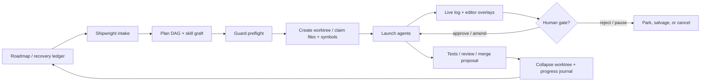

# App-Native Development Cockpit

**Status:** product sketch - 2026-04-29
**Anchor surfaces:** Fleet Control Center, FleetBar, Shipwright, Sorties, Tube, Coordination Guard
**Thesis:** Port Daddy should become the app you develop inside, not a dashboard you check after the real work happened elsewhere.

## Opinion

Yes. This is the right center of gravity.

The product should not be "launch agents from a Mac app." That is too small. The product should be:

> Pick work from the roadmap, let Port Daddy plan it, skill-graft the right agent abilities, launch bounded agents across local and hosted backends, enforce coordination before mutation, and leave a perfect evidence trail of what changed, who touched it, what was merged, what was collapsed, and where the human had to decide.

The current repo already has the pieces: roadmap ledgers, Fleet Control Center, FleetBar, `pd spawn`, the `pd agent` registry/inbox namespace, Tube, file and symbol claims, salvage, backend readiness, Cloudflare/Codex/Claude backends, and Jury-rig skills. The next product step is to make those pieces feel like one operating room.

## The Core Loop



The user should be able to stay in the app for the whole loop:

- choose a roadmap item or ask "what should move next?"
- inspect the proposed plan and agent roster
- approve spend, backend, worktree, and mutation scope
- watch files, functions, tests, logs, costs, and decisions update live
- accept, amend, or reject merge proposals
- read a day-over-day progress journal that is sourced from actual activity, not summary vibes

## Product Shape

### 1. Roadmap Intake

The first screen should be a work queue, not a blank prompt box.

Inputs:

- `.cartographer/status.md`
- `docs/recovery/CURRENT-WORK.md`
- `docs/recovery/UNIFIED-ROADMAP.md`
- `docs/recovery/IDEAS-TROVE.md`
- `docs/recovery/DOGFOOD-FEEDBACK.md`
- open dogfood feedback
- raw Spark/Spider residue through `pd ideas search --include-raw`, never as direct backlog authority
- active sessions, salvage, claims, stale worktrees, and recent commits
- fleet readiness and backend blockers

Output:

- "ready to run" work cards
- blocked work cards with exact blockers
- stale or contested work cards
- cheap "ask Shipwright to plan this" action
- expensive "execute this with agents" action

Each work card should show:

- source of truth and evidence link
- expected files or subsystems
- likely skills
- likely backend tier
- budget ceiling
- HITL points
- current owners and claims

### 2. Idea Lab

There should be a place to work out ideas before they become roadmap items.

The repo already has the governance shape:

- `docs/recovery/IDEAS-TROVE.md` is the canonical ideation index, dedupe surface, and curated backlog
- `docs/recovery/DOGFOOD-FEEDBACK.md` is the curated pain/bug/product-feedback lane
- `.spark/ideas/` and `.spider/connections/` are local provenance and research exhaust
- `pd ideas list|search|show` is the CLI surface over the curated trove, with optional raw-source federation

The app should make that visible as an Idea Lab:

- inbox for new Spark ideas, Spider connections, notes, tuples, and human scraps
- dedupe against existing trove slugs and duplicate families
- classify as `now`, `backlog`, `parked`, `merge`, or `discard`
- show provenance without letting raw markdown become backlog truth by accident
- let the operator promote an idea into `CURRENT-WORK.md`, a roadmap item, a sortie draft, or a Shipwright proposal
- let Spark/Spider extend an existing idea with `EXTENDS`, `MERGE_INTO`, or `DUPLICATE_OF` instead of minting another parallel concept

The elevation rule should be simple:

> Raw Spark/Spider output can inspire work. It becomes Port Daddy truth only when promoted into the trove, then into current work, roadmap, code, tests, or docs.

### 3. Skill-Grafted Planning

Before any agent launches, Port Daddy should run a real planning pass:

1. classify the task and halt on ambiguity
2. decompose into 3-7 nodes
3. narrow skills through the Jury-rig MCP skill search path
4. call `pd jury-rig query` for every executable node
5. attach the selected skill, runner-up skills, references, output contract, and failure pre-mortem to the node
6. store the plan as a sortie proposal, not loose prose

The app should render this as a DAG with inspectable node cards:

- goal
- input contract
- output contract
- selected skill and grafted references
- backend/model policy
- files and symbols expected to be touched
- guard requirements
- human gate, if any

This keeps skills from being ornamental. If a node says it uses a skill, the operator can inspect exactly which skill was grafted and why.

### 4. Fierce Coordination Guard

The guard should become the app's mutation law.

No agent should write without:

- active session
- worktree identity
- budget ceiling
- backend readiness
- telemetry policy
- file or symbol claim
- no known conflicting owner
- route to salvage if interrupted
- planned validation

For code edits, the default should be symbol-level claims:

- file tree heat map for active files
- function/class overlays in the editor
- line-range claims only when no stable symbol identity exists
- whole-file claims only for docs, generated artifacts, migrations, or unavoidable spans

The app should make violations obvious before launch:

- "This node wants `lib/sessions.ts::claimFiles`, but another live session owns it."
- "This backend is ready, but exact telemetry is not available, so launch is blocked."
- "This worktree is dirty from another branch; create a clean worktree first."

### 5. Multi-Backend Launch Matrix

The cockpit should treat backends as capabilities, not just model names.

| Backend path | Best use | App contract |
|---|---|---|
| Cloudflare Workers AI | cheap remote summarization, classification, planning, retrieval-adjacent review | requires account/key readiness, AI Gateway/cost policy later, no local file mutation unless paired with a local executor |
| Codex CLI | local code changes, tests, patching, repo-aware execution | runs through `codex exec`, captures final message, enforces workdir/worktree/guard |
| Claude SDK | exact hosted text reasoning and review where tool use is not required | exact telemetry and rate required |
| Claude CLI | full local tool use through Claude Code auth | explicit allowed tools, workdir, guard, and budget envelope |
| Tube adapters | conversational bridge to Claude Chat, ChatGPT, or another human/agent shell | messages are logged, threaded, and claim-aware; not trusted as mutation authority without a body lease |
| Ollama/Aider/custom | local or specialized execution | advertised only when readiness and telemetry policy are honest |

The app should show "why this backend" for every node. It should also let the operator swap a backend before launch without losing the plan.

### 6. Worktree Lifecycle Ledger

Worktrees should be visible as first-class objects.

For each mission:

- base branch and commit
- created worktree path
- owning sortie/session/agent
- file and symbol claims over time
- commits made
- tests run
- merge proposal
- collapse outcome: merged, cherry-picked, archived, rejected, or salvaged
- leftover artifacts

The collapse view matters. The user should be able to answer:

- what worktrees were made today?
- which ones still contain unique work?
- which were merged?
- which were discarded and why?
- which agents touched the same file or function?

### 7. Editor As Coordination Surface

The in-app editor should not try to be a generic IDE first. It should be a coordination-aware editor.

Required overlays:

- file heat
- symbol claims
- active owners
- planned mutation from the current node
- uncommitted changes by agent/worktree
- test failures linked to functions/files
- open HITL asks related to the file
- "open in external editor" and "open in Finder" fallbacks

Nice first version:

- Monaco or CodeMirror for read/edit
- AST outline from existing symbol index
- claim overlay gutter
- per-function mini timeline
- button to claim current symbol before editing
- button to ask Shipwright for a local plan against the selected symbol

### 8. Human-In-The-Loop As A Protocol

Human gates should not be comments in a log.

They should be typed objects:

- `approve_plan`
- `approve_spend`
- `choose_strategy`
- `approve_file_mutation`
- `approve_test_skip`
- `approve_merge`
- `pause_or_cancel`
- `supply_secret_or_key`
- `resolve_conflict`

Every gate needs:

- asker
- sortie/node
- deadline
- default behavior
- options
- evidence
- consequences
- final answer and rationale

The Fleet Control Center should have one attention queue at the top. Distress and human asks belong there, not buried inside an agent row.

### 9. Perfect Log

The log should be queryable evidence, not a stream of text.

Core event classes:

- roadmap item selected
- plan created
- skill grafted
- backend chosen
- worktree created
- claim created/released
- file touched
- symbol touched
- command/test run
- agent message
- Tube message
- HITL ask/answer
- commit created
- worktree collapsed
- salvage event
- deployment/promotion

Views:

- mission timeline
- file timeline
- function timeline
- agent timeline
- worktree timeline
- daily progress report

The daily report should answer:

- what moved?
- what got stuck?
- what changed in source?
- what did agents learn?
- what needs the human?
- what should run tomorrow?

## System Objects

```ts
interface CockpitMission {
  id: string;
  projectDir: string;
  sourceRoadmapItem?: string;
  status: 'draft' | 'planned' | 'blocked' | 'running' | 'waiting' | 'reviewing' | 'completed' | 'failed' | 'cancelled';
  planDagId: string;
  harborId: string;
  worktreeId?: string;
  budgetUsd: number;
  nodes: CockpitNode[];
  humanGates: HumanGate[];
  evidence: EvidenceRef[];
}

interface CockpitNode {
  id: string;
  goal: string;
  skillGraft: {
    skillId: string;
    references: string[];
    runnerUps: string[];
    rationale: string;
  };
  backendPolicy: {
    backend: 'cloudflare' | 'codex' | 'claude' | 'claude-cli' | 'ollama' | 'aider' | 'custom';
    model?: string;
    tier?: 'low' | 'mid' | 'high';
    budgetUsd: number;
  };
  expectedClaims: ClaimTarget[];
  outputContract: string;
  validation: string[];
}

interface ClaimTarget {
  path: string;
  symbolPath?: string;
  startLine?: number;
  endLine?: number;
}
```

## App Navigation

The Fleet Control Center should gain a cockpit surface without splitting the product:

- `Flow`: current project/fleet topology
- `Roadmap`: source-backed queue and feedback
- `Ideas`: trove curation, Spark/Spider promotion, duplicate family review
- `Cockpit`: selected mission, plan DAG, editor, attention queue, logs
- `Agents`: live/dormant agents, spawned runs, salvage ghosts
- `Worktrees`: birth/death/collapse ledger
- `Claims`: file/symbol ownership map
- `Tube`: threaded chat pipes
- `Memory`: tuples, episodes, and graph evidence
- `Resources`: budgets, backend readiness, telemetry gates

FleetBar should stay compact:

- attention count
- running missions
- waiting decisions
- latest touched files
- open full cockpit deep link

## First Shippable Slice

Do not start with "all agents execute everything." Start with the smallest credible cockpit.

1. Add a `Cockpit` surface in Fleet Control Center.
2. Read roadmap/current-work/salvage/claims into a work queue.
3. Let the user select one item and create a draft mission plan.
4. Render plan nodes with selected skill graft placeholders and backend readiness.
5. Create a clean worktree and session from the app.
6. Claim a file or symbol from the app.
7. Launch exactly one Codex or Claude CLI node through existing spawn infrastructure.
8. Show touched files, notes, command output, cost, and human asks in one timeline.
9. Collapse the worktree through an explicit merge/archive/reject decision.
10. Write the mission outcome back to the roadmap and daily progress ledger.

That proves the loop. Multi-agent Cloudflare/Codex/Claude fanout can come after the single-node loop is honest.

## Non-Negotiables

- No hidden mutation. Every edit is tied to a session, worktree, claim, and mission.
- No fake readiness. Backend cards must show missing keys, missing dependencies, and telemetry blockers.
- No unbudgeted execution. Every launch has a visible ceiling and exact-or-blocked telemetry policy.
- No text-only completion. Touched files, commits, tests, and worktree collapse are first-class evidence.
- No flattened agents. Fleet agents, ad hoc agents, spawned runs, sorties, and Tube participants remain distinct.
- No app-only truth. CLI, SDK, MCP, FleetBar, and docs must read the same mission/claim/event model.

## Open Product Questions

- Should the cockpit be a new top-level `surface=cockpit`, or should it be the evolved `sorties` surface?
- What is the first honest `pd jury-rig query` storage shape in Port Daddy: tuple, mission-node field, or both?
- Should ChatGPT/Claude Chat via Tube be read-only collaborators by default, or can they receive attenuated mutation authority through a local body lease?
- What is the minimum viable worktree collapse operation: merge only, or merge/cherry-pick/archive from the first slice?
- How aggressive should automatic roadmap assignment be before the user explicitly approves a mission plan?

## Bet

The thing that will make this feel magical is not the agent launch. The launch is a commodity.

The magic is the invariant:

> At any moment, the app can explain what is happening, why it is allowed, what it will cost, what files and functions it touches, who is responsible, what changed, and what decision the human needs to make next.

That is Port Daddy as a development environment.
