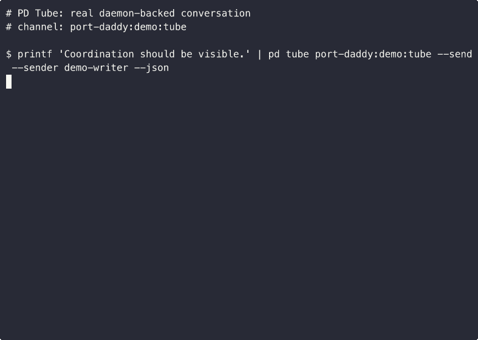

# PD Tube Tutorial

PD Tube turns a Port Daddy channel into a durable conversation pipe. The point
is not to replace notes or pub/sub. The point is to give agents a simple,
scriptable way to say: here is the message, here is the reply id, here is the
cursor, and here is the live daemon output proving it happened.

## Send

```bash
printf 'Coordination should be visible.' \
  | pd tube port-daddy:demo:tube --send --sender demo-writer --json
```

The command reads stdin to EOF and publishes a `tube.msg` envelope through the
daemon's message channel.

## Reply

```bash
printf 'Replying with proof from the same channel.' \
  | pd tube port-daddy:demo:tube --reply=42 --sender demo-reviewer --json
```

Replies carry `inReplyTo` metadata in the tube envelope. The underlying daemon
message stays ordinary channel history.

## Resume

```bash
pd tube port-daddy:demo:tube --since=41 --once --json
```

Use `--since` for explicit cursors. Use `--once` for scripts. Use `--no-history`
for fixtures and demos when you do not want the local cursor file to advance.

## Chat Bridge

`pd tube chat` listens to the same threaded channel, launches one backend run for
each new top-level message, and posts the result back as an in-thread reply.
This is the quick bridge for "PD Tube plus Codex/Claude/Gemini/Cloudflare"
experiments while keeping the transcript inside Port Daddy channel history.

```bash
pd tube chat port-daddy:demo:tube \
  --backend codex \
  --tier low \
  --budget 5 \
  --once
```

Use `--model` when you need an exact model, or `--tier low|mid|high` when the
backend's built-in ladder is enough. The bridge skips its own replies by
default so it does not loop on itself.

## Proof Artifacts

The checked-in demo artifacts are generated from real commands against the live
Port Daddy daemon:

- `examples/pd-tube/demo.sh`
- `demos/pd-tube/pd-tube-real-output.cast`
- `demos/pd-tube/pd-tube-real-output.gif`
- `demos/pd-tube/pd-tube-real-output.tape`
- `demos/pd-tube/pd-tube-vhs.gif`



Regenerate them from the repo root with:

```bash
asciinema rec --overwrite -c "examples/pd-tube/demo.sh" demos/pd-tube/pd-tube-real-output.cast
agg demos/pd-tube/pd-tube-real-output.cast demos/pd-tube/pd-tube-real-output.gif
vhs demos/pd-tube/pd-tube-real-output.tape
```
