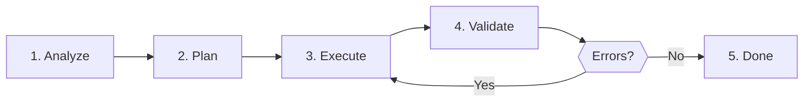

# Tikz Diagram Craft

[One sentence purpose]

## When to Use

✅ **Use for**:
- [Specific trigger A]
- [Specific trigger B]
- [Specific trigger C]

❌ **NOT for**:
- [Exclusion D]
- [Exclusion E]
- [Exclusion F]

---

## Output Format

- Final answer follows the reusable structure documented below.
- Use `examples/expected-output.md` as the concrete quality bar for finished work.
- Use `templates/output-template.md` when producing repeatable structured output.

---
## Core Process

### Step 1: [First Step]

[Instructions]

### Step 2: [Second Step]

[Instructions]

### Step 3: [Third Step]

[Instructions]

---

## Anti-Patterns

### Anti-Pattern: [Pattern Name]

**Novice**: "[Wrong assumption]"
**Expert**: [Why it's wrong + correct approach]
**Timeline**: [When this changed, if temporal]

---

## References

Consult these for deep dives — they are NOT loaded by default:

| File | Consult When |
|------|-------------|
| `references/guide.md` | [Specific situation] |
| `examples/expected-output.md` | Consult for a concrete finished-output example |
| `templates/output-template.md` | Reuse when this skill emits a structured deliverable |
