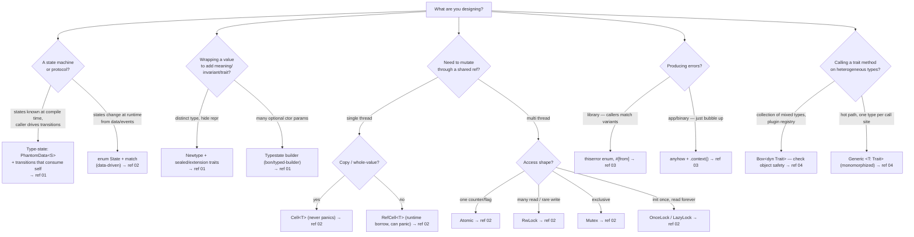

# Advanced Rust Patterns

The patterns here share one thesis: **push correctness into the type system so the
compiler rejects misuse, then make the abstraction cost nothing at runtime.** A
type-state builder makes a missing required field a *compile error*, not a runtime
`panic`. A sealed trait lets you add methods later without breaking downstream. A
newtype `NodeId(String)` makes "passing a DAG id where a skill id is expected" stop
compiling. None of it shows up in the generated assembly. This skill is for **API
design and idiom**, not for fighting the borrow checker (that is
`rust-with-claude-code`) — it assumes you already write compiling Rust and want it to
be *unmistakable*.

## When to Use

✅ **Use for**:
- Designing a library's public surface: traits, newtypes, builders, error types
- Encoding a state machine or protocol so invalid transitions don't compile
- Choosing interior mutability (`Cell` vs `RefCell` vs `Mutex`/`RwLock` vs atomics vs `OnceLock`)
- Deciding `dyn Trait` vs `<T: Trait>` (object safety, dispatch cost) — e.g. a `Box<dyn Pane>` registry
- Error architecture: `thiserror` enum for a library vs `anyhow` for a binary
- Reaching for `impl Trait` / GATs / RPITIT and knowing the API-compatibility footguns
- Reviewing Rust for idiom ("is this `Deref` a smart pointer or fake inheritance?")

❌ **NOT for**:
- Borrow-checker errors, async lifetime puzzles, `cargo`/`clippy`/test workflow → `rust-with-claude-code`
- GPUI rendering, Taffy layout, pane/Block contract in `core/pd-console` → `gpui-rust-console`
- Shipping/signing/notarizing a macOS Rust app → `rust-app-distribution`
- Generic "how do I learn Rust" — this is expert idiom, not a tutorial

## Decision Points



## Core Capabilities

| Pattern | Use it to… | Replaces the anti-pattern… | Ref |
|---------|-----------|----------------------------|-----|
| **Type-state** | Make invalid call *order* a compile error | Runtime `assert!(self.initialized)` | 01 |
| **Newtype** | Give a primitive identity + invariants | Passing bare `String`/`u64` everywhere (stringly-typed) | 01 |
| **Sealed trait** | Add trait methods later, non-breaking | A trait downstream can implement, freezing your API | 01 |
| **Extension trait** | Add methods to a foreign type | A free `fn` that reads worse at the call site | 01 |
| **Typestate builder** | Force required fields at compile time | `Default` + runtime "field X was None" panic | 01 |
| **RAII guard** | Tie cleanup to scope exit | Manual `unlock()`/`close()` you can forget | 02 |
| **Interior mutability** | Mutate through `&self`, the right way | Reaching for `unsafe` or `Arc<Mutex>` reflexively | 02 |
| **Enum state machine** | Model runtime states exhaustively | A pile of `bool`s + `Option`s (illegal combos) | 02 |
| **thiserror / anyhow** | Match the error tool to lib vs app | `Box<dyn Error>` everywhere, or `.unwrap()` | 03 |
| **dyn vs generic** | Trade dispatch cost vs code size knowingly | Cargo-culting `Box<dyn>` into a hot loop | 04 |
| **impl Trait / GAT** | Name unnameable types; lend borrows | Boxing a closure/iterator you didn't need to | 04 |
| **Deref (smart ptr)** | Transparent pointer-like wrapper | `Deref` as fake inheritance (deref polymorphism) | 04 |

## Anti-Patterns (Novice vs Expert)

### Stringly-typed / primitive-obsessed IDs
**Novice**: `fn run(node_id: String, dag_id: String)` — two `String`s, easy to swap.
**Expert**: `NodeId(String)` and `DagId(String)` newtypes. `run(dag, node)` vs `run(node, dag)`
now fails to compile. Zero runtime cost; the wrapper is erased. (In a gpui pane registry,
`PaneId(u16)` vs a raw nav index prevents the classic "NAV slot != producer slot" bug from
even type-checking.) See ref 01.
**Detection**: public functions taking ≥2 same-typed primitive params that mean different things.

### `Arc<Mutex<T>>` as the reflexive answer to "shared mutable state"
**Novice**: wrap everything in `Arc<Mutex<T>>` so "any thread can touch it."
**Expert**: walk the decision tree. Single thread? `Cell`/`RefCell` — no lock at all. One
integer across threads? `AtomicU64`. Read-mostly? `RwLock`. Init-once-read-forever? `OnceLock`.
A `Mutex` held across an `.await` or a render call is the canonical multi-agent / GPUI stall.
See ref 02.
**Detection**: `Mutex`/`RwLock` chosen before the access pattern (Copy? read/write ratio? thread count?) was named.

### `Deref` to fake inheritance ("deref polymorphism")
**Novice**: `impl Deref for Wrapper { type Target = Inner; … }` so `wrapper.inner_method()` "just works."
**Expert**: `Deref` means *smart pointer* — "what's inside the box." Using it for inheritance is
implicit magic with no true subtyping: trait bounds on `Inner` do **not** apply to `Wrapper`, and
inside `Inner::method` `self` is `Inner`, not `Wrapper`, so nothing overrides. Use a real method or
trait. The std docs themselves warn to implement `Deref` "only when deref coercion is desirable."
See ref 04.
**Detection**: a `Deref` impl whose `Target` is not a thing the type *contains-as-a-pointer*.

### `Option<T>` to "make a builder field optional" (with `typed-builder`)
**Novice**: assumes wrapping a field in `Option` makes the builder skip it.
**Expert**: in `typed-builder`, fields are **required by default** — `Option<T>` is still required
unless you write `#[builder(default)]`. (In `bon`, `Option<T>` *is* auto-optional — the two crates
differ, and assuming the wrong one is a real bug.) The whole point of a typestate builder is that
`.build()` **does not exist as a method** until every required slot is set. See ref 01.
**Detection**: a `#[derive(TypedBuilder)]` field that's `Option<T>` with no `#[builder(default)]` and the author expected it optional.

## Quality Gates

```
□ No public fn takes two same-typed primitives meaning different things (newtype them) — ref 01
□ Traits meant to stay closed are sealed (private::Sealed supertrait) — ref 01
□ State machines: compile-time order → typestate; runtime data → enum + exhaustive match — ref 01/02
□ Interior mutability picked from the access pattern, not by habit (Cell/RefCell/Atomic/RwLock/Mutex/OnceLock) — ref 02
□ No lock (Mutex/RwLock guard, RefCell borrow) held across .await or a render/notify call — ref 02
□ Drop order understood: struct fields drop in declaration order; locals in REVERSE — ref 02
□ Never call .drop() (E0040); use std::mem::drop(x) — ref 02
□ Library errors = thiserror enum (matchable, #[from] for ?); binary errors = anyhow + .context() — ref 03
□ No anyhow::Error in a library's PUBLIC return type (callers can't match) — ref 03
□ dyn vs generic chosen on object-safety + dispatch cost, not reflex; check dyn-compatibility rules — ref 04
□ Deref implemented ONLY for smart-pointer-like wrappers, never for inheritance — ref 04
□ Any type with an unused generic/lifetime param carries the right PhantomData marker (variance/dropck/Send) — ref 01
□ cargo clippy -- -W clippy::pedantic is clean on the new API surface
```

## Worked Example — A typestate connection that can't be misused

A `Connection` that must be opened before a request is sent, and where calling
`request()` on a closed connection is a **compile error**, not a runtime check.

```rust
use std::marker::PhantomData;

// Uninhabited markers: no value of these can ever exist — state is purely type-level.
enum Closed {}
enum Open {}

struct Connection<S> {
    socket: TcpStream,
    _state: PhantomData<S>,
}

impl Connection<Closed> {
    fn connect(addr: &str) -> std::io::Result<Connection<Open>> {
        let socket = TcpStream::connect(addr)?;
        Ok(Connection { socket, _state: PhantomData })
    }
}

impl Connection<Open> {
    // request() exists ONLY in the Open state.
    fn request(&mut self, body: &[u8]) -> std::io::Result<Vec<u8>> { /* ... */ }

    // close() consumes self -> the Open handle is gone, so you cannot request() after.
    fn close(self) -> Connection<Closed> {
        Connection { socket: self.socket, _state: PhantomData }
    }
}
```

**What the novice would do**: a `bool is_open` field and `if !self.is_open { panic!("closed") }`
at the top of `request()`. That defers the error to runtime and to whoever hits that path in prod.

**What the expert gets**: `Connection::<Closed>` literally has no `request` method, and `close(self)`
moves the `Open` handle away, so use-after-close fails at compile time. The `PhantomData<S>` is
zero-sized — `size_of::<Connection<Open>>() == size_of::<Connection<Closed>>()`. The pattern shows
up in `bon`/`typed-builder` (states = "which required fields are set yet") and in protocol clients.
Full walkthrough, including the builder application and the variance table, in ref 01.

## Reference Files

| File | Consult When |
|------|--------------|
| `references/01-type-state-and-newtypes.md` | Typestate state machines, newtype + sealed + extension traits, typestate builders (bon/typed-builder), PhantomData & variance |
| `references/02-interior-mutability-and-raii.md` | Cell/RefCell/Mutex/RwLock/Atomic/OnceLock decision tree, RAII guards, Drop ordering & `mem::drop`, enum-driven runtime state machines |
| `references/03-error-architecture.md` | thiserror vs anyhow, error enums, `?`/`From` desugaring, `.context()`, library-vs-app boundary |
| `references/04-dispatch-and-traits.md` | dyn vs generic dispatch, object safety / dyn-compatibility rules, monomorphization tradeoffs, impl Trait / GAT / RPITIT, Deref for smart pointers + the anti-pattern |

## Examples

| Example | Walks Through |
|---------|---------------|
| `examples/typestate_request.rs` | Compilable type-state HTTP request builder — invalid order won't compile |
| `examples/error_architecture.rs` | thiserror library enum flowing into an anyhow application boundary via `?` + `.context()` |

## Sources

Every snippet in this skill is traceable to an official or canonical source — the Rust
API Guidelines, the Rust Reference, the Rustonomicon, the `std` docs, the rust-unofficial
*Rust Design Patterns* book, `docs.rs` crate docs (`thiserror`, `anyhow`, `bon`,
`typed-builder`), and the Rust release blog (GATs 1.65, RPITIT 1.75). Each reference file
carries inline URLs at the point of use.
