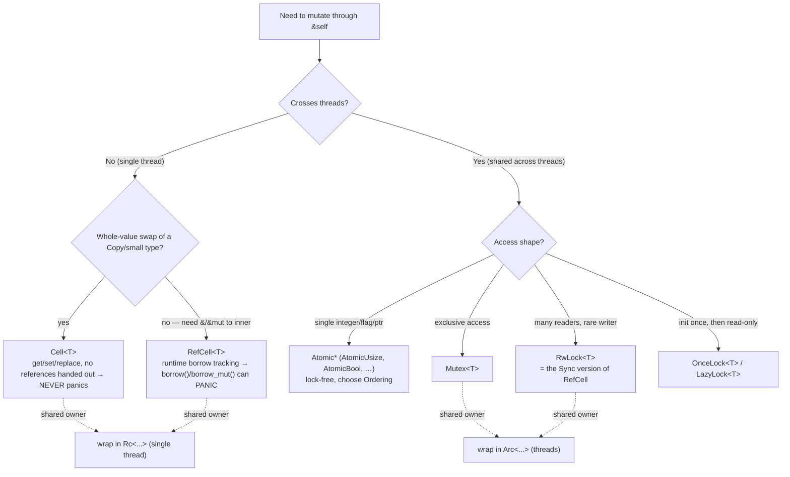

# Interior Mutability, RAII Guards, Drop Ordering, Enum State Machines

> Code is verbatim from the cited `std`/Reference/patterns pages unless flagged.

---

## 1. The interior-mutability decision tree

**What**: mutate a value through a shared reference (`&self`), the safe way. Rust's default
is *inherited* mutability (you need `&mut` to mutate); interior mutability is the controlled
exception.

**When to use**: graph/observer structures, caches, lazily-initialized globals, shared
counters — anywhere you genuinely need `&self`-mutation. The std docs are blunt:
"inherited mutability is preferred, and interior mutability is something of a last resort."
Source: <https://doc.rust-lang.org/std/cell/>

**Anti-pattern it replaces**: reaching for `unsafe`, or reflexively wrapping everything in
`Arc<Mutex<T>>` before you've named the access pattern.



| Primitive | Hands out `&`? | Fails how | Thread-safe | Use for |
|-----------|----------------|-----------|-------------|---------|
| `Cell<T>` | no (moves values in/out) | **never panics** | `!Sync` | small `Copy` values, flags |
| `RefCell<T>` | yes (`Ref`/`RefMut`) | **runtime panic** on bad borrow | `!Sync` | single-thread graphs/caches needing `&`/`&mut` |
| `Atomic*` | no | — | yes | counters, flags, lock-free state |
| `Mutex<T>` | yes (guard) | blocks / poisons | yes | exclusive cross-thread |
| `RwLock<T>` | yes (guard) | blocks / poisons | yes | read-mostly cross-thread |
| `OnceLock`/`LazyLock` | yes (`&T`) | — | yes | init-once globals |

`Cell` (verbatim): "a `&T` to the inner value can never be obtained" — that's *why* it never
panics. `RefCell` (verbatim): "dynamic borrowing … tracked at *runtime*"; "The corresponding
`Sync` version of `RefCell<T>` is `RwLock<T>`." Source: <https://doc.rust-lang.org/std/cell/>

### RefCell's runtime panic (verbatim)

```rust
use std::cell::RefCell;
let c = RefCell::new(5);
let m = c.borrow_mut();
let b = c.borrow(); // this causes a panic
```

Source: <https://doc.rust-lang.org/std/cell/struct.RefCell.html>. `borrow()`: "Panics if the
value is currently mutably borrowed. For a non-panicking variant, use `try_borrow`."

**GOTCHA**: `RefCell` moves the borrow checker to **runtime**. A bad overlap panics
(`already borrowed: BorrowMutError` / `BorrowError`) instead of failing to compile. Reach for
`try_borrow`/`try_borrow_mut` (which return `Result`) when overlap is *possible by design*.
`Cell` sidesteps the whole problem by never handing out a reference. (Caveat: the exact panic
*message strings* are documented in the Book ch.15 and issue reports, not on the rustdoc page.)

### OnceLock — init once, read forever (verbatim)

```rust
use std::sync::OnceLock;
let cell = OnceLock::new();
let value = cell.get_or_init(|| 92);
assert_eq!(value, &92);
let value = cell.get_or_init(|| unreachable!());
assert_eq!(value, &92);
```

Source: <https://doc.rust-lang.org/std/sync/struct.OnceLock.html>. `LazyLock<T>` wraps the
same idea with a closure fixed at construction — the modern replacement for `lazy_static!`
and `once_cell::sync::Lazy` (stable since 1.80).

**THE multi-agent / GPUI gotcha**: never hold a `MutexGuard`/`RwLockReadGuard` or a
`RefCell` `Ref`/`RefMut` across an `.await`, a render, or a `cx.notify()`. A lock held across
a suspension point can deadlock or stall the render loop. In the `gpui-rust-console` skill
this is *the* #1 perf bug — the producer thread *owns* its panes and `mpsc`s snapshots rather
than sharing `Arc<Mutex<State>>`. Choosing the primitive is half the job; *scoping the guard*
is the other half (see §2).

---

## 2. RAII guards

**What**: tie a resource's release to a value's `Drop`, so cleanup happens automatically when
the guard leaves scope — even on early return or panic.

**When to use**: locks (`MutexGuard`), file/socket handles, transactions, "restore this state
when I'm done," temp directories, spans/timers.

**Anti-pattern it replaces**: manual `unlock()`/`close()`/`commit()` calls you can forget,
skip on an early `return`, or leak on a panic.

```rust
impl<T> Mutex<T> {
    fn lock(&self) -> MutexGuard<T> {
        // Lock the underlying OS mutex.
        MutexGuard { data: self }
    }
}
impl<'a, T> Drop for MutexGuard<'a, T> {
    fn drop(&mut self) {
        // Unlock the underlying OS mutex.
    }
}
impl<'a, T> Deref for MutexGuard<'a, T> {
    type Target = T;
    fn deref(&self) -> &T { self.data }
}
```

Source: <https://rust-unofficial.github.io/patterns/patterns/behavioural/RAII.html>. Note this
is also the *legitimate* use of `Deref` (§ref 04): a guard genuinely *is* a smart pointer to
the locked data.

**Drop-guard idiom**: when you must release *early* (before scope end), move the guard into
`std::mem::drop`:

```rust
let guard = self.lock.lock().unwrap();
let value = *guard;
drop(guard);            // release the lock NOW
do_expensive_thing_without_holding_lock(value);
```

---

## 3. Drop ordering — the asymmetry that bites

The two rules are *different*, which is the trap:

- **Struct fields** drop in **declaration order** (first field first). Verbatim: "The fields
  of a struct are dropped in declaration order." Same for the active enum variant and tuples.
- **Local variables** drop in **reverse** order of declaration. Verbatim: "When control flow
  leaves a drop scope all variables associated to that scope are dropped in reverse order of
  declaration (for variables) or creation (for temporaries)."

Source: <https://doc.rust-lang.org/reference/destructors.html>

So sibling `let a; let b;` drop `b` then `a`, but `struct S { a, b }` drops `a` then `b`. If a
field must outlive another at drop time (e.g. a logger field that a connection field uses in
*its* `Drop`), **field order in the struct is critical** — reorder and you get
use-during-drop bugs.

### You cannot call `.drop()` manually

`std::mem::drop` is literally (verbatim): `pub fn drop<T>(_x: T) {}`
Source: <https://doc.rust-lang.org/std/mem/fn.drop.html>

**GOTCHAs**:
- `x.drop()` is compile error **E0040** ("explicit use of destructor method"). Use
  `std::mem::drop(x)` — it works simply by *moving* `x` into a no-op function, so `x`'s real
  destructor runs at the end of that call.
- On a `Copy` type, `drop(x)` is a **no-op** (a *copy* is moved in; the original lives on);
  the compiler warns. Dropping a `Copy` value to "free" it is a bug-shaped expectation.
- `Drop` types can't be moved-out-of field-by-field; if you need to deconstruct, take fields
  by `std::mem::take`/`replace` or restructure.

---

## 4. Enum-driven (runtime) state machines

**What**: when states are determined by *runtime data/events* (not a compile-time-fixed call
order), model them as an `enum` and `match` exhaustively. This is the runtime sibling of
type-state (§ref 01): typestate for caller-driven compile-time order, enums for data-driven
runtime transitions.

**When to use**: a parser/connection/UI whose next state depends on input; anything where you
*receive* events rather than *call* transitions in a known order.

**Anti-pattern it replaces**: a bag of `bool is_open, bool is_authed, Option<Session>` fields
that admit illegal combinations (`is_open == false` but `session.is_some()`), each checked ad
hoc.

```rust
enum Conn {
    Disconnected,
    Connecting { since: Instant },
    Connected { session: Session },
    Failed { error: ConnError },
}

impl Conn {
    fn on_event(self, ev: Event) -> Conn {
        match (self, ev) {
            (Conn::Disconnected, Event::Open) => Conn::Connecting { since: Instant::now() },
            (Conn::Connecting { .. }, Event::Ack(session)) => Conn::Connected { session },
            (Conn::Connecting { .. }, Event::Err(error)) => Conn::Failed { error },
            (state, _) => state, // ignore irrelevant events; stay put
        }
    }
}
```

**Why it's better**: each state carries *exactly* the data valid in that state
(`Connected` has a `Session`, `Disconnected` cannot). Illegal field combinations are
unrepresentable, and a non-exhaustive `match` is a **compile error** — add a state and the
compiler lists every transition you forgot.

**GOTCHA**: take `self` by value in the transition (`fn on_event(self, …) -> Conn`) and return
the new state, mirroring the typestate move discipline. Mutating in place (`&mut self`) with a
`mem::replace` dance works but is easier to get wrong; the by-value form makes "you must
produce a next state" explicit. For larger machines, the `typestate` crate or `#[derive]`
macros can generate the transition table, but a hand-written `match` on `(state, event)` is the
honest baseline and stays exhaustive.
