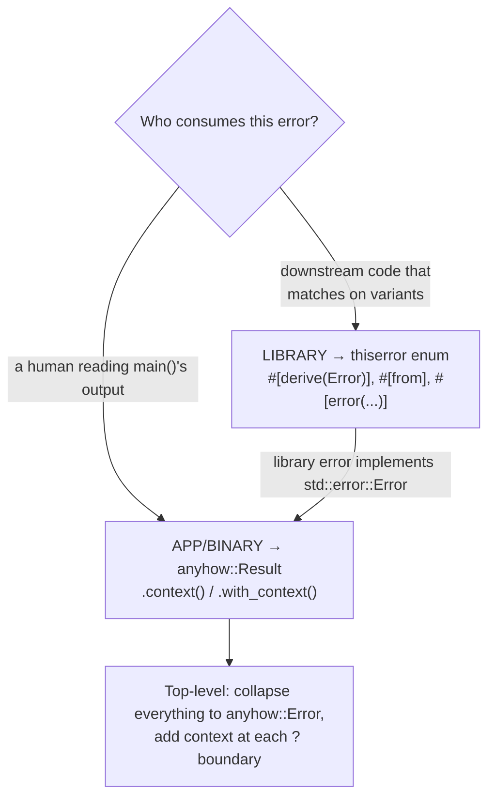

# Error Architecture: thiserror vs anyhow, `?`, and Context

> thiserror/std snippets verbatim from docs.rs/the Reference; anyhow snippets from the
> canonical `dtolnay/anyhow` README (docs.rs returned HTTP 500 at fetch time — content is
> identical).

---

## The one-line rule

> **Use `thiserror` if you are a *library* designing your own dedicated error type(s).
> Use `anyhow` if you are an *application/binary* and don't care what error type your
> functions return.**

Source: <https://github.com/dtolnay/anyhow> (rendered at <https://docs.rs/anyhow/>).

The reason is the consumer: a **library's** caller wants to `match` on specific failures to
handle them, so the library must expose a *typed, matchable* enum. A **binary's** `main`
just wants to bubble everything up with context and print it, so a single type-erased
`anyhow::Error` is ideal. They compose — a `thiserror` enum implements
`std::error::Error`, so it flows *into* `anyhow::Error` automatically.



---

## thiserror — the library tool

**What**: a derive macro that generates `Display` (from `#[error("...")]`), `From` (from
`#[from]`), and `Error::source()` for a custom error enum/struct. Zero runtime deps beyond
the derive; the generated code is what you'd write by hand.

**When to use**: any crate whose public functions return `Result<_, YourError>` and whose
callers need to distinguish failure kinds.

**Anti-pattern it replaces**: hand-writing `impl Display`/`impl Error`/`impl From` for every
variant (tedious, drifts), or returning `Box<dyn Error>` from a library (callers can't
match), or `.unwrap()` (panics on recoverable errors).

```rust
use thiserror::Error;

#[derive(Error, Debug)]
pub enum DataStoreError {
    #[error("data store disconnected")]
    Disconnect(#[from] io::Error),
    #[error("the data for key `{0}` is not available")]
    Redaction(String),
    #[error("invalid header (expected {expected:?}, found {found:?})")]
    InvalidHeader {
        expected: String,
        found: String,
    },
    #[error("unknown data store error")]
    Unknown,
}
```

Source: <https://docs.rs/thiserror/latest/thiserror/>

What the macro generates:
- `#[error("...")]` → the `Display` impl. `{0}` interpolates a tuple field; `{expected}`,
  `{found:?}` interpolate named fields (with format specs).
- `#[from]` → a `From<io::Error>` impl for that variant **and** wires `Error::source()` to it.
  The `#[from]` variant must contain **only** the source (plus an optional backtrace) — no
  extra fields — so the conversion path is unambiguous.
- `#[error(transparent)]` (not shown) → forward both `Display` and `source` to the inner
  error, for a "pass-through" variant that adds no message of its own.

**GOTCHAs**:
- `#[from]` makes the `?` operator work for that source type (it generates exactly the `From`
  impl `?` needs — see below). But you can have **only one** `#[from]` per source type per
  enum, and the variant can't carry extra context fields. When you need context *and*
  conversion, use a named-field variant with `#[source]` and convert explicitly.
- Don't use `#[from]` to flatten *unrelated* errors into one variant just to make `?`
  compile — that erases which operation failed. One variant per *meaningful* failure mode.

---

## anyhow — the application tool

**What**: a single `anyhow::Error` type that any `std::error::Error` converts into, plus a
`Context` extension trait to attach human-readable context as the error propagates.

**When to use**: binaries, `main`, integration glue, scripts, tests — code at the top of the
stack that aggregates many error types and just needs to report.

```rust
use anyhow::{Context, Result};

fn get_cluster_info() -> Result<ClusterMap> {
    let config = std::fs::read_to_string("cluster.json")?;
    let map: ClusterMap = serde_json::from_str(&config)?;
    Ok(map)
}

// attach context at the failure boundary:
let content = std::fs::read(path)
    .with_context(|| format!("Failed to read instrs from {}", path))?;
```

Source: <https://github.com/dtolnay/anyhow>. `anyhow::Result<T>` is an alias for
`Result<T, anyhow::Error>`. A blanket `From<E: std::error::Error + Send + Sync + 'static>`
means heterogeneous errors (`io::Error`, `serde_json::Error`, your `thiserror` enum) all
collapse into `anyhow::Error` through `?` with no per-type glue.

**GOTCHAs**:
- **Never put `anyhow::Error` in a library's public return type.** It's type-erased — the
  caller can't `match` on what went wrong, only print it. That's the exact line between the
  two crates. Libraries return their own enum; binaries return `anyhow`.
- Prefer `with_context(|| …)` (lazy closure) over `context(format!(…))` when the context
  string is built with `format!` — the eager form allocates on every call even on the `Ok`
  path.
- `.context()` adds a *layer*; the chain is walkable via `Error::chain()`. Don't stuff the
  whole story into one string — one short context per `?` boundary reads best.

---

## The `?` operator and `From` — what actually happens

`expr?` on a `Result` desugars (roughly) to:

```rust
match expr {
    Ok(v) => v,
    Err(e) => return Err(From::from(e)),   // <-- the key line
}
```

So `?` automatically calls `From::from` on the error to convert it to the function's declared
error type. This is the hinge that ties everything together:
- `thiserror`'s `#[from]` **generates that `From` impl**, so `some_io_op()?` inside a function
  returning `Result<_, DataStoreError>` just works.
- `anyhow`'s blanket `From` makes `?` convert *any* `std::error::Error` into `anyhow::Error`.

(Reference for `?`/`Try`: <https://doc.rust-lang.org/reference/expressions/operator-expr.html#the-question-mark-operator>.)

**GOTCHA**: if `?` "doesn't compile," it's almost always a *missing `From` impl* between the
source error and your function's error type — not a syntax problem. The fix in a library is a
`#[from]` variant (or a manual `impl From`); in a binary it's switching the function's return
to `anyhow::Result`.

---

## Putting it together (the seam)

A library defines `DataStoreError` (thiserror). The binary calls it and adds context:

```rust
// in the binary:
use anyhow::{Context, Result};

fn run() -> Result<()> {
    let info = get_cluster_info()                  // returns Result<_, DataStoreError>
        .context("loading cluster config")?;       // DataStoreError -> anyhow::Error
    // ...
    Ok(())
}

fn main() {
    if let Err(e) = run() {
        eprintln!("{e:?}");   // anyhow's {:?} prints the full context chain + source
        std::process::exit(1);
    }
}
```

The `thiserror` enum stays matchable for any *library* consumer; the *binary* erases it into
`anyhow::Error` exactly where it stops caring about the variant. See the worked example
`examples/error_architecture.rs` for a compile-checked version.
