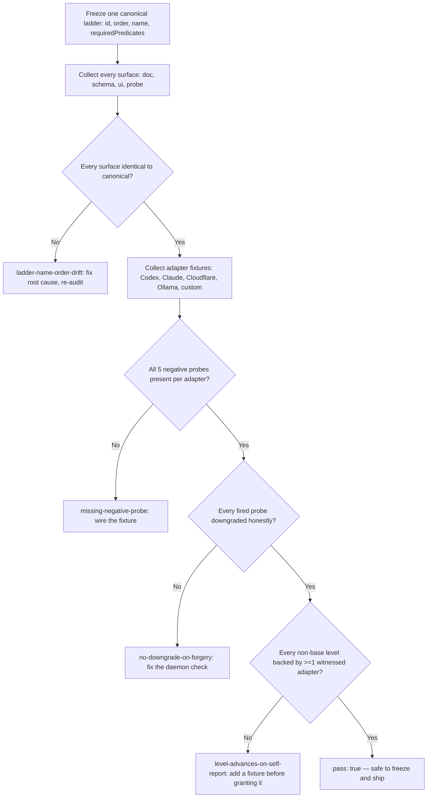

# Agent Compliance Conformance

Decide whether a compliance-ladder design and its adapter fixtures actually prove what they claim, or just perform compliance theater.

## Use This For

- Freezing a compliance ladder (C0-C6) or transcript-fidelity ladder (T0-T5) before any surface ships a numeric badge.
- Auditing whether doc, schema, UI, and probe surfaces genuinely agree on every level's id, order, name, and required predicates.
- Designing or reviewing an adapter conformance probe suite across Codex, Claude Code, Cloudflare, Ollama/LM Studio, and custom stdio/HTTP agents.
- Deciding whether a forged-capability, MCP-bypass, disabled-hook, forged-heartbeat, or observed-to-controlled attack is actually caught, not just documented as a risk.
- Investigating why a level advanced when nothing daemon-witnessed backs the claim.

## Do Not Use This For

- Adversarial review of a cryptographic protocol or whitepaper's soundness (`redteam-review`).
- Writing or verifying TLA+/formal invariants for a daemon monitor process (`runtime-verification-for-agents`).
- Agent identity, successor/predecessor linkage, or reputation decay across restarts (`agent-identity-continuity-reputation`).

## Decision Model

1. **Freeze one canonical ladder per axis.** Compliance (C0-C6) and transcript fidelity (T0-T5) are separate axes — see `references/compliance-and-fidelity-ladders.md`. A level needs an id, an order, a display name, and a `requiredPredicates` array of structured predicate strings, never prose.
2. **Enumerate every surface that declares the ladder.** Doc, schema, UI, and probe form each need their own entry; a ladder with zero entries for one of the four is an incomplete freeze, not yet a drift bug.
3. **Diff every surface against the canonical ladder.** Same id must mean the same order, the same name, and the same predicate set everywhere — the binder's own docs disagree on C3's name today, which is exactly the bug this step exists to catch.
4. **Enumerate the five required negative probes per adapter fixture**, per `references/negative-probe-catalog.md`: `forged-level`, `direct-mcp-bypass`, `disabled-hook-after-launch`, `forged-heartbeat`, `observed-to-controlled`.
5. **Verify each probe is `present`** — an actual, daemon-exercised fixture, not a stubbed or planned one — and, if fired, that it **`downgraded`** the adapter's effective level. An absent `downgraded` flag is never assumed true.
6. **Verify every non-base level has a witness.** A level with `order > 0` and zero adapters backed by a present, correctly-downgrading probe is reachable by self-report alone.
7. **Fail closed.** Pass only when there are zero critical findings and the score clears the bar — never treat an empty findings array from incomplete auditing as the same thing as a clean one from thorough auditing.

## Output Contract

A frozen, ship-safe ladder design carries:

- `ladders`: canonical id/order/name/`requiredPredicates` for every level on every axis in scope.
- `surfaces`: a doc, schema, ui, and probe declaration per ladder, each identical to canonical.
- `adapters`: one fixture per backend, each with all five negative probes `present` and `downgraded`.
- Zero `critical` findings and `score >= 75` from the audit.

Use `scripts/conformance_audit.mjs` to audit a conformance-spec JSON payload and return `{ pass, score, findings, recommendations }`.

## Anti-Patterns

### Ladder Drift Across Surfaces

**Novice**: Ship a compliance badge because "the compliance plan doc says C3 is Suggestible" without checking that the UI component, the JSON schema, and the probe implementation agree — they don't, and now three surfaces silently mean three different things by the same number.
**Expert**: Treat the ladder as frozen only once doc, schema, UI, and probe all declare the exact same id, order, name, and `requiredPredicates` for every level — diff them structurally, don't eyeball them.
**Detection**: `conformance_audit.mjs` fires `ladder-name-order-drift` (critical) when any surface's level disagrees with or omits a canonical level, and `incomplete-surface-coverage` (medium) when a ladder is missing a doc, schema, ui, or probe declaration entirely.

### Self-Report Without a Falsifiable Probe

**Novice**: Let an adapter claim C5 because the body's own status report says so, with no fixture that ever tried to forge or disprove that claim.
**Expert**: Treat a level as earned only when a real, daemon-exercised negative-probe fixture exists for it — a documented risk with no wired fixture is a checkbox, not evidence.
**Detection**: `conformance_audit.mjs` fires `missing-negative-probe` (critical) when a required probe kind is absent or not `present` for an adapter, and `level-advances-on-self-report` (critical) when a non-base level has zero adapters backed by any witnessed, correctly-downgrading probe.

### Forgery That Slips Through

**Novice**: Build the `direct-mcp-bypass` or `observed-to-controlled` attack fixture, run it, watch it succeed, and ship anyway because "at least we tested it."
**Expert**: A probe that fires and isn't caught is worse than no probe at all — it proves the exact bypass works. Fix the daemon-side check before the level can be granted, and never assume an untested `downgraded` outcome is safe.
**Detection**: `conformance_audit.mjs` fires `no-downgrade-on-forgery` (critical) when a `present: true` probe has `downgraded` false or absent — fail-closed, not fail-open.

## References

| File | Load When |
| --- | --- |
| `references/compliance-and-fidelity-ladders.md` | Need the canonical C0-C6 / T0-T5 level definitions, or the exact source of the C3 naming contradiction. |
| `references/negative-probe-catalog.md` | Need the five required probe kinds, or the exact meaning of `present` vs `downgraded`. |
| `examples/expected-output.md` | Need to see a drifted, self-attesting ladder audited, then the same design frozen and passing. |
| `templates/output-template.md` | Need a reusable ladder-freeze decision template to fill in. |
| `schemas/conformance-spec.schema.json` | Need to validate a conformance-spec JSON payload's structure before auditing it. |
| `scripts/conformance_audit.mjs` | Need deterministic scoring of a ladder design's readiness to freeze. |
| `agents/openai.yaml` | Need a subagent descriptor for delegated conformance auditing. |

<!-- BEGIN BUNDLE INDEX (auto: index_references.py) -->

## Skill Bundle Index

*Every file in this skill, and when to open it. Auto-generated; run `scripts/index_references.py --fix`.*

**root**
- [`CHANGELOG.md`](CHANGELOG.md) — Agent Compliance Conformance — Changelog — - Initial skill creation - Compliance ladder (C0-C6) and transcript-fidelity ladder (T0-T5) freeze process defined - Deterministic `conforma
- [`README.md`](README.md) — Agent Compliance Conformance — Audit a compliance-ladder design (C0-C6) and transcript-fidelity ladder (T0-T5), plus their adapter conformance fixtures, for cross-surface 

**`agents/`**
- [`agents/openai.yaml`](agents/openai.yaml) — openai (data/schema)

**`examples/`**
- [`examples/expected-output.md`](examples/expected-output.md) — Example Output: Agent Compliance Conformance — Scenario: a team ships a `compliance-ladder` design where the `doc` surface renamed C3 from "Suggestible" to "Controllable," the `schema` su
- [`examples/sample-input.json`](examples/sample-input.json) — sample input (data/schema)
- [`examples/weak-input.json`](examples/weak-input.json) — weak input (data/schema)

**`references/`**
- [`references/compliance-and-fidelity-ladders.md`](references/compliance-and-fidelity-ladders.md) — Compliance Ladder And Transcript Fidelity Ladder — Use this when you need the canonical level definitions to compare a doc, schema, UI, or probe surface against, or when you need to know whic
- [`references/negative-probe-catalog.md`](references/negative-probe-catalog.md) — Negative Probe Catalog — Use this when you need to know which hostile fixtures a compliance-conformance suite must run against every adapter, or need the exact meani

**`schemas/`**
- [`schemas/conformance-spec.schema.json`](schemas/conformance-spec.schema.json) — conformance spec.schema (data/schema)

**`scripts/`**
- [`scripts/conformance_audit.mjs`](scripts/conformance_audit.mjs)

**`templates/`**
- [`templates/output-template.md`](templates/output-template.md) — Compliance Ladder Freeze Decision — Fill in every section before letting any C-badge or T-fidelity label ship.

<!-- END BUNDLE INDEX -->
