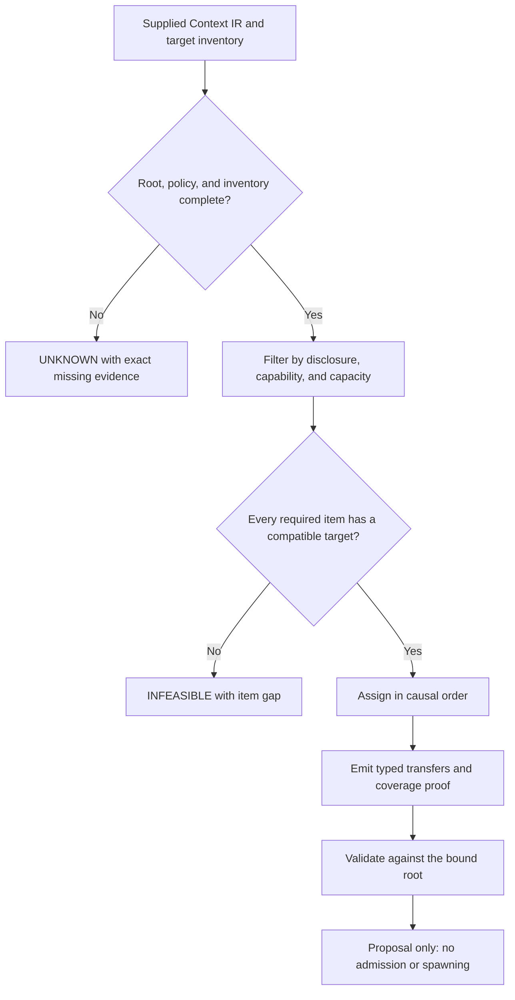

# Feasibility before partition choice

```mermaid
flowchart TD
  A[Supplied Context IR and target inventory] --> B{Root, policy, and inventory complete?}
  B -->|No| U[UNKNOWN with exact missing evidence]
  B -->|Yes| C[Filter by disclosure, capability, and capacity]
  C --> D{Every required item has a compatible target?}
  D -->|No| I[INFEASIBLE with item gap]
  D -->|Yes| E[Assign in causal order]
  E --> F[Emit typed transfers and coverage proof]
  F --> G[Validate against the bound root]
  G --> H[Proposal only: no admission or spawning]
```
