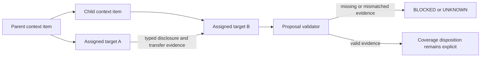

# Cross-target dependency requires an explicit transfer

```mermaid
flowchart LR
  P[Parent context item] --> A[Assigned target A]
  P --> C[Child context item]
  C --> B[Assigned target B]
  A -->|typed disclosure and transfer evidence| B
  B --> V[Proposal validator]
  V -->|missing or mismatched evidence| X[BLOCKED or UNKNOWN]
  V -->|valid evidence| O[Coverage disposition remains explicit]
```
