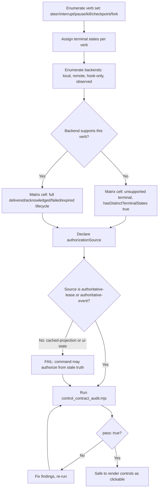

# Agent Control Command Contract

Decide whether a set of operator controls over live agent bodies is safe to render as clickable, or whether it is collapsed verbs and stale-state authorization wearing a control panel.

## Use This For

- Designing the verb set (`steer`, `interrupt`, `pause`, `kill`, `checkpoint`, `fork`) for an operator control panel so each verb is a distinct claim, not a shared "stop" button.
- Reviewing a daemon's `control_commands` schema for a complete `delivered`/`acknowledged`/`failed`/`expired` lifecycle per verb.
- Auditing whether command authorization reads authoritative lease/event state instead of the roster projection the UI already has in memory.
- Building an honest verb x backend support matrix so a backend that cannot perform a verb says `unsupported` instead of hanging, no-op'ing, or hiding the button.
- Preparing the control-command contract a live operator control panel (or the daemon behind it) must satisfy before "Interrupt," "Pause," "Kill," "Checkpoint," or "Fork" ships as a real button.

## Do Not Use This For

- Designing DAG approval/gate routing UX — what to show a human reviewer and how their decision routes back into the DAG (`human-gate-designer`).
- Worktree isolation, file locking, or claims coordination between concurrently running agents (`multi-agent-coordination`).
- Swarm IPC mechanics, message-passing protocols, or invocation surfaces between agents (`swarm-invocation-designer`).

## Contract Model

1. **Enumerate the verb set explicitly.** List `steer`, `interrupt`, `pause`, `kill`, `checkpoint`, and `fork` (or whatever subset the product ships) as named entries — never a generic "control" or "stop" claim that stands in for several of them.
2. **Assign terminal states per verb.** Every verb needs `delivered`, `acknowledged`, `failed`, and `expired` at minimum; add `queued` if the daemon has a queueing stage and `unsupported` wherever any backend cannot perform the verb.
3. **Enumerate every backend a command might target** — local same-UID process, remote body, hook-only session, observed import — and list which verbs each one actually supports, not which verbs the product wishes it supported.
4. **Build the full matrix.** For every verb x backend pair, prove (don't assume) whether that combination has a distinct, tracked terminal-state sequence. An absent cell is a gap, not a pass.
5. **Declare the authorization source** the command handler actually re-checks at the moment of authorization: `authoritative-lease` or `authoritative-event` only. If the honest answer is "the roster projection" or "whatever the UI has," that's `cached-projection`/`ui-state` and must fail.
6. **Run `scripts/control_contract_audit.mjs --input <spec>.json`** and fix every critical finding before wiring the verb to a clickable control.
7. **Re-run after any backend or verb change.** Adding a new backend, or letting an existing one gain/lose a capability, reopens every finding class — a passing contract from last quarter is not evidence about today's adapters.

## Output Contract

The audited spec carries:

- `verbs[]`: `{ name, terminalStates[] }` — one entry per distinct control claim, `terminalStates` a subset of `queued`/`delivered`/`acknowledged`/`failed`/`expired`/`unsupported`.
- `backends[]`: `{ name, supportedVerbs[] }` — which verb names each backend can actually execute.
- `authorizationSource`: `'authoritative-lease' | 'authoritative-event' | 'cached-projection' | 'ui-state'` — where the command handler re-checks truth before delivering.
- `matrix[]`: `{ verb, backend, hasDistinctTerminalStates }` — proof (or disproof) for every verb x backend combination.

Run `scripts/control_contract_audit.mjs --input <spec>.json` for a deterministic `{ pass, score, findings, recommendations }`.

## Anti-Patterns

### One Generic Stop Button

**Novice**: Ship a single `control` (or `stop`) verb that covers interrupt, pause, and kill, distinguished only by a string argument the backend may or may not honor — and give it a two-state `queued`/`delivered` lifecycle because "it either worked or it didn't."
**Expert**: Model each verb as its own claim with its own full terminal-state lifecycle. `kill`'s "acknowledged" (the process is dead) and `pause`'s "acknowledged" (the process is alive but idle) are different facts about the world and must be tracked separately.
**Detection**: `control_contract_audit.mjs` fires `collapsed-verbs` (critical) when `interrupt`/`pause`/`kill`/`steer` are missing as distinct verb names, or when a matrix cell for one of those four reports `hasDistinctTerminalStates: false`; it fires `verb-missing-terminal-states` (critical) when a verb's `terminalStates` lacks `delivered`, `acknowledged`, `failed`, or `expired`.

### Silent Backend Overclaim

**Novice**: Wire an observed-only import or a capability-limited remote body into the same control matrix as a fully governed local process, and let the "Interrupt" button just do nothing (or hang) when that backend can't actually interrupt.
**Expert**: Every verb a backend cannot perform gets an explicit `unsupported` terminal, proven by a matrix cell — the control panel disables the button with a stated reason instead of rendering a false affordance.
**Detection**: `control_contract_audit.mjs` fires `backend-verb-no-unsupported-state` (critical) when a backend's `supportedVerbs` omits a verb but no matrix cell proves an `unsupported` terminal for that pair.

### Authorizing From A Pretty But Stale Pane

**Novice**: Wire the `Interrupt`/`Pause`/`Kill` buttons to check the same roster projection the session list already renders, because "the data's right there" — and it usually is, until the projection freezes mid-rebuild or falls behind a reconnect.
**Expert**: Command authorization re-checks an authoritative lease or the appended event log at the moment of authorization. A pane may display stale data and label it stale; a command must never be authorized from it.
**Detection**: `control_contract_audit.mjs` fires `authorizes-from-stale-projection` (critical) when `authorizationSource` is `cached-projection` or `ui-state` rather than `authoritative-lease`/`authoritative-event`.

## References

| File | Load When |
| --- | --- |
| `references/verb-state-machine.md` | Need the six terminal states, why each verb is a separate claim, and per-verb examples of a backend supporting one but not another. |
| `references/authorization-sources.md` | Need to decide whether a specific authorization check is authoritative or a stale projection, and why display-time staleness labels don't satisfy command authorization. |
| `examples/expected-output.md` | Need a weak control contract audited (pass:false), then the same contract fixed and passing. |
| `examples/sample-input.json` | Need a complete spec that already passes the audit, as a starting fixture. |
| `templates/output-template.md` | Need a fill-in-the-blank verb/backend/authorization contract template. |
| `schemas/control-contract.schema.json` | Need to validate a control-contract spec's structure before running the audit. |
| `scripts/control_contract_audit.mjs` | Need deterministic scoring of a control-command contract. |
| `agents/openai.yaml` | Need a subagent descriptor for delegated control-contract review. |

<!-- BEGIN BUNDLE INDEX (auto: index_references.py) -->

## Skill Bundle Index

*Every file in this skill, and when to open it. Auto-generated; run `scripts/index_references.py --fix`.*

**root**
- [`CHANGELOG.md`](CHANGELOG.md) — Agent Control Command Contract — Changelog — - Initial skill creation - Core process defined: enumerate verbs, assign terminal states, build backend matrix, declare authorization source
- [`README.md`](README.md) — Agent Control Command Contract — Audit whether operator control verbs over live agent bodies — steer, interrupt, pause, kill, checkpoint, fork — are each modeled as a distin

**`agents/`**
- [`agents/openai.yaml`](agents/openai.yaml) — openai (data/schema)

**`examples/`**
- [`examples/expected-output.md`](examples/expected-output.md) — Example Output: Agent Control Command Contract — Scenario: a control-panel team ships a single generic `control` verb that covers interrupt/pause/kill for local same-UID bodies, adds `steer
- [`examples/sample-input.json`](examples/sample-input.json) — sample input (data/schema)

**`references/`**
- [`references/authorization-sources.md`](references/authorization-sources.md) — Authorization Sources: Authoritative State vs. Stale Projections — Use this when you need to decide whether a control panel is allowed to authorize a command from the data it's currently displaying, or wheth
- [`references/verb-state-machine.md`](references/verb-state-machine.md) — Verb State Machine: Six Terminal States, Six Distinct Claims — Use this when you need to decide what terminal states a control verb needs, or whether two verbs are actually the same claim wearing differe

**`schemas/`**
- [`schemas/control-contract.schema.json`](schemas/control-contract.schema.json) — control contract.schema (data/schema)

**`scripts/`**
- [`scripts/control_contract_audit.mjs`](scripts/control_contract_audit.mjs)

**`templates/`**
- [`templates/output-template.md`](templates/output-template.md) — Control Command Contract Template — Fill in every section before wiring a verb to a clickable operator control.

<!-- END BUNDLE INDEX -->
