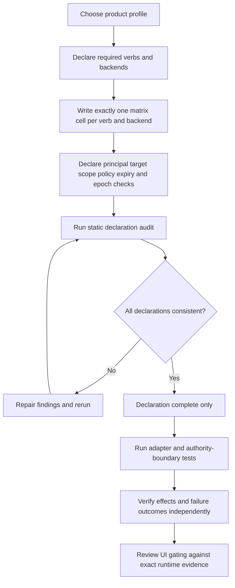
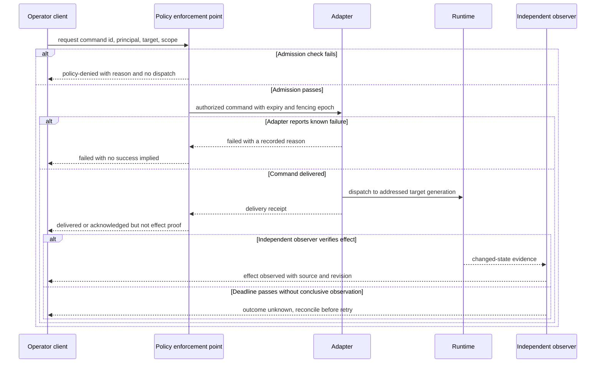

# Agent Control Command Contract

Use this skill to declare the control commands a particular product profile offers and to find inconsistencies before runtime testing. The audit deliberately reports declaration completeness only. It does not execute a command, prove that the declared policy source is authoritative, or establish that an operator interface may enable a control.

## Choose an explicit profile

Start with a profile whose origin is reviewable: an operator workflow, product requirement, or adapter contract. Put only the required verbs in `profile.requiredVerbs`. The first-party iOS vocabulary and Harbor control-panel documents name `steer`, `interrupt`, `pause`, `kill`, `checkpoint`, and `fork`; that list describes a product profile and does not make all six mandatory for every product. A subset is valid when its product contract says so.

Do not infer support from a verb name, UI mock, ADR, backend label, or self-report. The sample uses anonymous constructed backends and explicitly says no adapter was probed. It makes no claim about Cloudflare or another provider.

## Method

1. **Scope the contract.** Give the profile an ID, name, basis, and required-verb list. Add a verb row for each required verb, plus other verbs actually declared by the profile. A generic `control` row is not a substitute for distinct behavior when the profile itself promises distinct actions.
2. **Name the backends.** List the adapters in scope and the verbs each declares as supported. Keep measured support evidence outside this static declaration and link it in the product's test record.
3. **Complete the matrix.** Include exactly one row for every declared verb × backend pair. A supported row declares how the lifecycle can represent request, policy denial, delivery, acknowledgement, observed effect, failure, pre-delivery expiry, and an unknown outcome. An unsupported row must say `unsupported` and must not claim delivery or effect.
4. **Bind authorization.** Declare the fields resolved for the principal, target resource, operation scope, policy revision, expiry, and fencing epoch. State that each is rechecked at command admission. A label such as `lease-store` or `event-store` is not itself proof of freshness or authority.
5. **Run the static audit and inspect each finding.** It rejects missing, duplicate, contradictory, or unreferenced matrix rows and malformed typed values. A declaration pass is a prerequisite to testing, not a clickable-control decision.
6. **Test the actual boundary separately.** Exercise allow, deny, stale policy, wrong principal/target/scope, expired authorization, lower fencing epoch, duplicate command ID, transport acknowledgement without effect, effect read-back, expiry before delivery, and expiry after delivery with unavailable observation. Join evidence to the exact backend and profile version.

## Declaration flow

## Command lifecycle trace

## Interpret the result conservatively

`node scripts/control_contract_audit.mjs --input examples/sample-input.json` emits `declarationPass`, findings, and an explicit static-scope statement. The script exits nonzero for invalid input or any declaration failure. It always sets `safeToRenderControls: false`: runtime permission, adapter behavior, independent effect evidence, and UI gating are outside its scope.

The audit checks that a required verb exists and has at least one declared supporting backend; it does not force every backend to support every verb. Each backend's positive `supportedVerbs` list must match the `supported`/`unsupported` matrix exactly. Every declared pair needs one row. Duplicate names, duplicate pairs, unknown references, numeric verbs, missing cells, contradictory support, and missing lifecycle distinctions fail.

`acknowledged` means only that the receiver reported receiving or processing the command under the declared protocol. `effect-observed` requires a separate read-back source. `policy-denied` is an authorization outcome before dispatch. `unsupported` means the target adapter declares no capability for that verb. If a command may have been delivered but there is no reliable effect observation, report `outcome-unknown`; expiry alone does not prove that the effect did not happen.

## Worked contract review

The sample profile requires only `steer` and `interrupt`. One anonymous constructed adapter declares those verbs; an observer-only example declares neither. Each pair is present once. The supported cells include effect observation and the unknown-outcome path; the unsupported cells do not pretend to deliver. Running the sample demonstrates a consistent *declaration*, not a measured adapter or a production authorization test.

To adapt the sample for a real system:

- Replace its anonymous names and descriptive placeholders with versioned local values.
- Build the support matrix from adapter tests, not guesses or copied provider examples.
- Capture policy, identity, target, scope, expiry and authority-epoch evidence from the command path.
- Preserve an outcome-unknown record after send/observer loss; reconcile it before retrying non-idempotent actions.
- Keep an operator control disabled until separate tests demonstrate its exact admission, delivery, effect, denial and timeout behavior.

## Reference routing

- Read [`references/verb-state-machine.md`](references/verb-state-machine.md) for lifecycle meaning and per-verb distinctions.
- Read [`references/authorization-sources.md`](references/authorization-sources.md) for current authority and stale-view handling.
- Read [`references/evidence-scope.md`](references/evidence-scope.md) for source depth, NIST scope, and constructed examples.
- Read [`references/admission-and-effect-evidence.md`](references/admission-and-effect-evidence.md) for the worked PDP/PEP attribute method and positive/negative fixtures.
- Use [`schemas/control-contract.schema.json`](schemas/control-contract.schema.json) for structure and [`scripts/control_contract_audit.mjs`](scripts/control_contract_audit.mjs) for semantic declaration checks.
- Use [`templates/output-template.md`](templates/output-template.md) to write a new profile. [`examples/expected-output.md`](examples/expected-output.md) records positive and negative fixtures.

## Source and claim boundary

The first-party control vocabulary and UI needs are derived from the Harbor control-plane work packet, its `Session List`/control flow, binder chapters 13 and 15, and the iOS surface design. They are design inputs, not evidence that any specific runtime currently implements them. NIST SP 800-162 supports the narrower ABAC vocabulary described in the evidence reference; it does not prove this schema or any adapter is secure.
