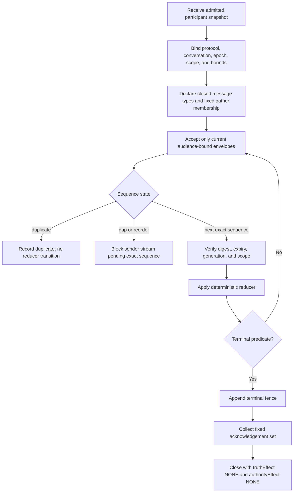

# Agent Conversation Protocols

## Source and implementation boundary

The local trace contract borrows vocabulary from external interaction protocols
only where the referenced source establishes it. It is not a wire-conformance
claim, and trace identifiers are neither business-operation identifiers nor
identity or effect authority. See
[`references/fipa-a2a-mcp-boundary.md`](references/fipa-a2a-mcp-boundary.md).

Design a finite protocol over identities and authority supplied by other systems. A valid trace says which messages were accepted and why. It never creates a principal, body, lease, capability, truth verdict, or permission to cause an effect.

## Use this skill when

- already admitted bodies need a request/response, critique, handoff, or gather protocol;
- duplicate, stale, reordered, missing, or replayed messages must fail deterministically;
- a fixed participant set must converge to a closed terminal;
- a transcript must replay to the same semantic state;
- a terminal fence and explicit acknowledgement set are required.

## Do not use it for

- choosing, spawning, admitting, resurrecting, or paying agents;
- deciding star, mesh, tree, or runtime placement;
- ordinary human discourse or conflict mediation;
- serialization, queues, sockets, or transport deployment;
- adjudicating claim truth or granting action authority.

## Protocol design procedure



1. **Bind the snapshot.** Record exact participant principals, body generations, audience labels, protocol epoch, scope, deadline, and message ceiling. This skill does not admit them.
2. **Close the language.** Enumerate message kinds and payload types. Unknown kinds fail closed.
3. **Sequence per sender.** Sequence numbers start at 1 and are contiguous inside one epoch and body generation. A duplicate is idempotent only when its full envelope digest matches; otherwise it is equivocation.
4. **Filter before reduce.** Reject stale epoch/generation, wrong scope/audience, invalid verification receipt, expired message, and unresolved causation before changing semantic state.
5. **Freeze gathers.** Membership and reducer are fixed when the gather opens. Silence, timeout, majority, and acknowledgement do not imply assent, truth, or authority.
6. **Fence termination.** Exactly one terminal fence closes semantic mutation. Required participants acknowledge the fence; an acknowledgement means receipt only.
7. **Replay semantically.** Replaying the accepted envelopes in canonical order must reproduce the state digest and terminal record.

## Non-authority invariants

- Messages transport assertions; they do not mint identity, body continuity, admission, leases, capabilities, or permissions.
- `ACK` proves only protocol receipt by the named participant generation.
- `GATHER_RESULT` is a deterministic reduction of declared inputs, not a truth verdict.
- A protocol terminal does not prove an external effect stopped, succeeded, failed, or settled.
- Every terminal has `truthEffect: NONE` and `authorityEffect: NONE`.

## Ordering and replay rules

| Condition | Required disposition |
|---|---|
| exact next sender sequence | validate, then reduce |
| byte-identical duplicate | record duplicate, no second reduction |
| same identity/sequence with different digest | `E_EQUIVOCATION` |
| sequence gap or later message first | `E_SEQUENCE_GAP` |
| stale epoch or body generation | `E_STALE_EPOCH` / `E_STALE_GENERATION` |
| wrong audience or scope | `E_AUDIENCE_SCOPE` |
| unknown causation parent | `E_CAUSATION_GAP` |
| message after terminal fence | `E_POST_TERMINAL_MESSAGE` |
| terminal missing required acknowledgements | valid `BLOCKED`, never complete |

## Gather rules

- `membership` is a sorted, nonempty list of participant refs and cannot change.
- `ALL` waits for one accepted contribution from every member.
- `QUORUM` requires an explicit integer threshold and preserves every dissenting contribution.
- `FIRST_SUCCESS` is permitted only for inert candidate production and must use a deterministic tie-break; it cannot decide truth or authority.
- Timeout yields an explicit partial/blocked result. It never fabricates missing input.
- Reducers consume typed message IDs and return a digest-bound semantic value plus unresolved members.

## Terminals

`COMPLETED`, `BLOCKED`, `TIMED_OUT`, `CANCELLED`, and `DISSENT_RECORDED` are the only terminals. `COMPLETED` means only that the protocol's declared semantic predicate was met. Any external lifecycle or effect claim requires independent evidence.

## Anti-patterns

### Ack means done

**Wrong:** treat delivery acknowledgement as task completion or stopped process.

**Right:** receipt, semantic closure, lifecycle state, and external effect state remain separate.

### Majority mints truth

**Wrong:** collapse a quorum result into fact or permission.

**Right:** preserve inputs and dissent; pass the candidate to an independent evaluator or authority.

### Dynamic gather membership

**Wrong:** add a friendly voter after seeing early results.

**Right:** freeze membership and epoch before contributions.

### Replay by timestamp

**Wrong:** trust wall-clock order across senders.

**Right:** verify per-sender sequence and explicit causation, then use a canonical tie-break only for concurrent events.

## Validator coverage boundary

The bundled validator checks the local JSON shape, closed enums, participant and
gather joins, supplied message ordering, causation references, acknowledgement
sets, and digest format. It does not verify cryptographic receipts, payload bytes,
reducer output, delivery, storage, identity, canonical concurrency order, runtime
liveness, or external effects. A valid `stateDigest` is format-checked input, not
a recomputed semantic result. See [the terminal-fence sequence](diagrams/01_terminal-fence.md)
and [the supplied-sequence boundary](diagrams/02_replay-order.md).

## Output contract

Emit a JSON trace conforming to [`schemas/conversation-trace-v2.schema.json`](schemas/conversation-trace-v2.schema.json). Validate it with:

```bash
node skills/agent-conversation-protocols/scripts/validate-conversation-trace.mjs \
  skills/agent-conversation-protocols/examples/valid-trace.json

node skills/agent-conversation-protocols/scripts/test-bundle.mjs
```

## Load only when needed

- [`references/INDEX.md`](references/INDEX.md) — short routing for the protocol references.
- [`references/envelope-and-ordering.md`](references/envelope-and-ordering.md) — exact envelope fields, duplicate handling, and canonical replay.
- [`references/gathers-and-terminals.md`](references/gathers-and-terminals.md) — fixed gathers, reducers, terminal fences, and acknowledgements.
- [`references/pattern-selection-boundary.md`](references/pattern-selection-boundary.md) — select a conversation pattern before instantiating this closed protocol; a pattern does not grant authority or settle an effect.
- [`references/fipa-a2a-mcp-boundary.md`](references/fipa-a2a-mcp-boundary.md) — external protocol vocabulary and local-trace boundary.
- [`diagrams/INDEX.md`](diagrams/INDEX.md) — terminal fence and supplied-sequence diagrams.
- [`examples/valid-trace.json`](examples/valid-trace.json) — canonical closed trace used by the validator.
- [`scripts/validate-conversation-trace.mjs`](scripts/validate-conversation-trace.mjs) — closed-shape and semantic validator.
- [`scripts/test-bundle.mjs`](scripts/test-bundle.mjs) — valid fixture plus adversarial mutation suite.
- [`tests/activation.md`](tests/activation.md) — positive and negative activation corpus.

## Truth posture

This skill statically validates supplied traces. It does not prove transport delivery, durable storage, independent identity, runtime liveness, containment, or external effects.
